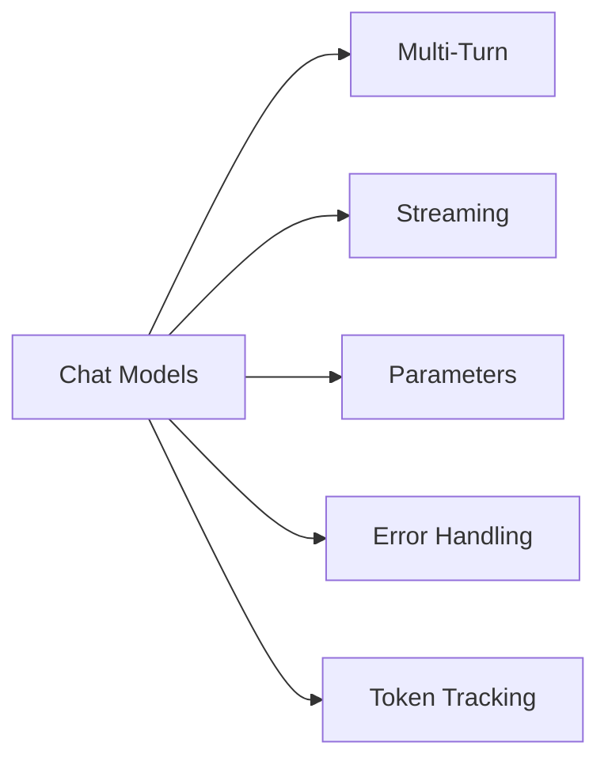

# Chapter 2: Chat Models & Basic Interactions

In this chapter, you'll master the art of having natural conversations with AI models. You'll learn how to maintain conversation context across multiple exchanges, stream responses in real-time for better user experience, and handle errors gracefully with retry logic. You'll also explore key parameters like temperature to control AI creativity and understand token usage for cost optimization.

## Prerequisites

- Completed [Chapter 1](../01-introduction/README.md)

## 🎯 Learning Objectives

By the end of this chapter, you'll be able to:

- ✅ Have multi-turn conversations with AI
- ✅ Stream responses for better user experience
- ✅ Handle errors gracefully
- ✅ Control model behavior with parameters
- ✅ Understand token usage

---

## 📖 The Knowledgeable Friend Analogy

**Imagine you're having coffee with a knowledgeable friend.**

When you talk to them:
- 💬 **You have a back-and-forth conversation** (not just one question)
- 🧠 **They remember what you said earlier** (conversation context)
- 🗣️ **They speak as they think** (streaming responses)
- 😊 **They adjust their tone** based on your preferences (model parameters)
- ⚠️ **Sometimes they need clarification** (error handling)

**Chat models work the same way!**

Unlike the simple one-off questions in Chapter 1, chat models excel at:
- Multi-turn conversations
- Maintaining context
- Streaming responses in real-time
- Adapting their behavior

This chapter teaches you how to have natural, interactive conversations with AI.

---

## 💬 Multi-Turn Conversations

In Chapter 1, we sent single messages. But real conversations have multiple exchanges.

### How Conversation History Works

Chat models don't actually "remember" previous messages. Instead, you send the entire conversation history with each new message.

**Think of it like this**: Every time you send a message, you're showing the AI the entire conversation thread so far.

---

### Message Types in LangChain

LangChain provides four message types for building conversations. Each type serves a specific purpose:

#### 1. SystemMessage - Setting the AI's Behavior

Establishes initial instructions that shape how the model responds throughout the conversation.

```typescript
const systemMsg = new SystemMessage("You are a helpful coding tutor who gives clear, concise explanations.");
```

**Use for**: Setting tone, defining roles, establishing response guidelines

---

#### 2. HumanMessage - User Input

Represents messages from the user. This is your input to the AI.

```typescript
const userMsg = new HumanMessage("What is TypeScript?");
```

**Use for**: User questions, requests, conversation input

---

#### 3. AIMessage - Model Responses

Represents the AI's responses. Contains the response text plus useful metadata.

```typescript
const response = await model.invoke(messages);
// response is an AIMessage with these key fields:
// - content: The actual text response
// - usage_metadata: Token usage information (see Example 6)
// - id: Unique message identifier
// - tool_calls: Tool invocations (empty array if none - see Chapter 5)
```

**Use for**: Storing AI responses in conversation history

---

#### 4. ToolMessage - Tool Results

Represents results from tool execution. You'll learn about this in Chapter 5.

```typescript
const toolResult = new ToolMessage({
  content: "Result from tool",
  tool_call_id: "call_123"
});
```

**Use for**: Feeding tool execution results back to the AI (covered in Chapter 5)

---

**In this chapter**, you'll primarily work with **SystemMessage**, **HumanMessage**, and **AIMessage** to build multi-turn conversations.

---

### Creating Messages: Two Approaches

LangChain supports multiple ways to create messages:

**1. Message Classes** (Recommended for this course - most explicit):

```typescript
import { SystemMessage, HumanMessage, AIMessage } from "langchain";

const messages = [
  new SystemMessage("You are helpful"),
  new HumanMessage("Hello!")
];
```

**2. Dictionary Format** (Alternative - more concise):

```typescript
const messages = [
  { role: "system", content: "You are helpful" },
  { role: "user", content: "Hello!" }
];
```

**3. String Shortcut** (For single HumanMessage):

```typescript
// These are equivalent:
const response = await model.invoke("Hello!");
const response = await model.invoke(new HumanMessage("Hello!"));
```

**Why we use message classes in this course**:

- ✅ More explicit and easier to understand
- ✅ Better type safety and autocomplete
- ✅ Clear which message type you're creating
- ✅ Easier to add metadata later

The dictionary format works identically but is less clear for learning. You can use either approach in your own code.

---

### Example 1: Multi-Turn Conversation

The following example shows you how to maintain conversation context across multiple exchanges by storing message history and referencing previous interactions.

**Code**: [`code/01-multi-turn.ts`](./code/01-multi-turn.ts)
**Run**: `tsx 02-chat-models/code/01-multi-turn.ts`

```typescript
import { ChatOpenAI } from "@langchain/openai";
import { HumanMessage, AIMessage, SystemMessage, type BaseMessage } from "langchain";
import "dotenv/config";

async function main() {
  console.log("💬 Multi-Turn Conversation Example\n");

  const model = new ChatOpenAI({
    model: process.env.AI_MODEL,
    configuration: { baseURL: process.env.AI_ENDPOINT },
    apiKey: process.env.AI_API_KEY,
  });

  // Start with system message and first question
  const messages: BaseMessage[] = [
    new SystemMessage("You are a helpful coding tutor who gives clear, concise explanations."),
    new HumanMessage("What is TypeScript?"),
  ];

  console.log("👤 User: What is TypeScript?");

  // First exchange
  const response1 = await model.invoke(messages);
  console.log("\n🤖 AI:", response1.content);
  messages.push(new AIMessage(String(response1.content)));

  // Second exchange - AI remembers the context
  console.log("\n👤 User: Can you show me a simple example?");
  messages.push(new HumanMessage("Can you show me a simple example?"));

  const response2 = await model.invoke(messages);
  console.log("\n🤖 AI:", response2.content);

  // Third exchange - AI still remembers everything
  console.log("\n👤 User: What are the benefits compared to JavaScript?");
  messages.push(new AIMessage(String(response2.content)));
  messages.push(new HumanMessage("What are the benefits compared to JavaScript?"));

  const response3 = await model.invoke(messages);
  console.log("\n🤖 AI:", response3.content);

  console.log("\n\n✅ Notice how the AI maintains context throughout the conversation!");
  console.log(`📊 Total messages in history: ${messages.length}`);
}

main().catch(console.error);
```

> **🤖 Try with [GitHub Copilot](https://github.com/features/copilot) Chat:** Want to explore this code further? Open this file in your editor and ask Copilot:
> - "Why do we need to push AIMessage to the messages array after each response?"
> - "How would I implement a loop to keep the conversation going with user input?"
> - "What happens if I don't include the SystemMessage at the beginning?"

### Expected Output

When you run this example with `tsx 02-chat-models/code/01-multi-turn.ts`, you'll see a three-exchange conversation:

```
💬 Multi-Turn Conversation Example

👤 User: What is TypeScript?

🤖 AI: [Detailed explanation of TypeScript]

👤 User: Can you show me a simple example?

🤖 AI: [TypeScript code example with explanation]

👤 User: What are the benefits compared to JavaScript?

🤖 AI: [Explanation of TypeScript benefits]

✅ Notice how the AI maintains context throughout the conversation!
📊 Total messages in history: 6
```

Notice how each response references the previous context - the AI "remembers" because we send the full message history with each call!

### How It Works

**Key Points**:
1. **Messages array holds the entire conversation** - We create an array that stores all messages (system, human, and AI)
2. **Each response is added to the history** - After getting a response, we push it to the messages array
3. **The AI can reference earlier messages** - When we ask "Can you show me a simple example?", the AI knows we're talking about TypeScript from the first exchange
4. **Full history is sent each time** - With every `invoke()` call, we send the complete conversation history

**Why this matters**: The AI doesn't actually "remember" anything. It only knows what's in the messages array you send. This is why maintaining conversation history is crucial for multi-turn conversations.

---

## ⚡ Streaming Responses

When you ask a complex question, waiting for the entire response can feel slow. [Streaming](../GLOSSARY.md#streaming) sends the response word-by-word as it's generated.

**Like watching a friend think out loud** instead of waiting for them to finish their entire thought.

### Example 2: Streaming

In this example, you'll learn how to stream AI responses in real-time, displaying words as they're generated instead of waiting for the complete response.

**Code**: [`code/02-streaming.ts`](./code/02-streaming.ts)
**Run**: `tsx 02-chat-models/code/02-streaming.ts`

```typescript
import { ChatOpenAI } from "@langchain/openai";
import "dotenv/config";

async function main() {
  const model = new ChatOpenAI({
    model: process.env.AI_MODEL,
    configuration: { baseURL: process.env.AI_ENDPOINT },
    apiKey: process.env.AI_API_KEY
  });

  console.log("🤖 AI (streaming): ");

  // Stream the response
  const stream = await model.stream("Explain how the internet works in 3 paragraphs.");

  for await (const chunk of stream) {
    process.stdout.write(chunk.content);
  }

  console.log("\n\n✅ Stream complete!");
}

main().catch(console.error);
```

> **🤖 Try with [GitHub Copilot](https://github.com/features/copilot) Chat:** Want to explore this code further? Open this file in your editor and ask Copilot:
> - "How does the 'for await...of' loop work with the stream?"
> - "Can I collect all chunks into a single string while streaming?"
> - "Why does process.stdout.write not add newlines between chunks?"

### Expected Output

When you run this example with `tsx 02-chat-models/code/02-streaming.ts`, you'll see the response appear word-by-word:

```
🤖 AI (streaming):
The internet is a global network of interconnected computers that communicate using standardized protocols, primarily TCP/IP. When you visit a website, your device sends a request to a server, which responds with the data needed to display the page. This data travels through multiple routers and networks before reaching you.

At its core, the internet works through a system of addresses called IP addresses, which uniquely identify each device. Domain names (like bing.com) are translated to IP addresses by DNS servers. When you type a URL, your browser contacts these DNS servers to find the right destination.

Data on the internet is broken into small packets that travel independently and are reassembled at the destination. This packet-switching method makes the internet resilient and efficient, allowing information to take different routes if one path is blocked or congested.

✅ Stream complete!
```

You'll notice the text appears progressively, word by word, rather than all at once!

### How It Works

**What's happening**:
1. We call `model.stream()` instead of `model.invoke()`
2. This returns an async iterable that yields chunks as they're generated
3. We loop through each chunk with `for await...of`
4. Each chunk contains a piece of the response (usually a few words)
5. We use `process.stdout.write()` to display text without newlines, creating the streaming effect

**Benefits of Streaming**:
- Better user experience (immediate feedback)
- Feels more responsive - users see progress immediately
- Users can start reading while AI generates the rest
- Perceived performance improvement even if total time is the same

**When to Use**:

- ✅ Long responses (articles, explanations, code)
- ✅ User-facing chatbots and interactive applications
- ✅ When you want to display progress to users
- ❌ When you need the full response first (parsing, validation, post-processing)

> **💡 Note**: The actual file [`02-streaming.ts`](./code/02-streaming.ts) includes additional timing measurements and a comparison between streaming and non-streaming approaches to demonstrate the performance benefits. The code above shows the core streaming concept for clarity.

> **💡 Advanced**: To track token usage with streaming, some providers support `streamOptions: { includeUsage: true }` which includes usage metadata in the final chunk. This is provider-dependent - check your provider's documentation for availability.

---

## 🎛️ Model Parameters

You can control how the AI responds by adjusting parameters.

### Key Parameters

#### Temperature (0.0 - 2.0)

[Temperature](../GLOSSARY.md#temperature) controls randomness and creativity:

- **0.0 = Deterministic**: Same question → Same answer
  - Use for: Code generation, factual answers
- **1.0 = Balanced** (default): Mix of consistency and variety
  - Use for: General conversation
- **2.0 = Creative**: More random and creative
  - Use for: Creative writing, brainstorming

#### Max Tokens

**What are tokens?** [Tokens](../GLOSSARY.md#token) are the basic units of text that AI models process. Think of them as pieces of words - roughly 1 token ≈ 4 characters or ¾ of a word. For example, "Hello world!" is about 3 tokens.

Limits response length:

- Controls how long responses can be
- Setting `maxTokens: 100` limits the response to approximately 75 words
- Prevents runaway costs by capping output length

### Example 3: Model Parameters

This sample compares AI responses at different temperature settings (0, 1, 2) to help you understand how parameters control creativity and randomness.

**Code**: [`code/03-parameters.ts`](./code/03-parameters.ts)
**Run**: `tsx 02-chat-models/code/03-parameters.ts`

```typescript
import { ChatOpenAI } from "@langchain/openai";
import "dotenv/config";

async function compareTemperatures() {
  const prompt = "Write a creative opening line for a sci-fi story.";

  const temperatures = [0, 1, 2];

  for (const temp of temperatures) {
    console.log(`\n🌡️ Temperature: ${temp}`);
    console.log("─".repeat(60));

    const model = new ChatOpenAI({
      model: process.env.AI_MODEL,
      configuration: { baseURL: process.env.AI_ENDPOINT },
      apiKey: process.env.AI_API_KEY,
      temperature: temp
    });

    const response = await model.invoke(prompt);
    console.log(response.content);
  }
}

compareTemperatures().catch(console.error);
```

> **🤖 Try with [GitHub Copilot](https://github.com/features/copilot) Chat:** Want to explore this code further? Open this file in your editor and ask Copilot:
> - "What temperature value should I use for a customer service chatbot?"
> - "How do I add the temperature and maxTokens parameters to the ChatOpenAI constructor?"
> - "Why might a response be cut off when using maxTokens?"

### Expected Output

When you run this example with `tsx 02-chat-models/code/03-parameters.ts`, you'll see how temperature affects creativity:

```
🌡️ Temperature: 0
────────────────────────────────────────────────────────────
"In the year 2157, humanity had finally broken free from the confines of Earth."

🌡️ Temperature: 1
────────────────────────────────────────────────────────────
"The stars whispered secrets through the observation deck's reinforced glass, but Captain Reeves had stopped listening years ago."

🌡️ Temperature: 2
────────────────────────────────────────────────────────────
"Zyx-9 flickered into existence at precisely the wrong moment—right between the temporal rift and Dr. Kwan's morning coffee."
```

Notice how temperature 0 is straightforward, temperature 1 is more interesting, and temperature 2 is quite creative and unexpected!

### How It Works

**What's happening**:
1. We use the same prompt with three different temperature settings (0, 1, 2)
2. Temperature 0 produces the most predictable, "safe" response
3. Temperature 1 (default) balances consistency with creativity
4. Temperature 2 produces more unusual and creative variations

**Temperature Scale Explained**:
- **0.0**: Almost no randomness - model picks the most likely tokens every time
  - Same input → nearly identical output
  - Best for: Code generation, factual Q&A, structured data extraction
- **1.0**: Balanced - some randomness but still coherent
  - Good for: General conversation, explanations, most use cases
- **2.0**: High randomness - model explores less likely options
  - More creative and unpredictable
  - Best for: Creative writing, brainstorming, generating unique ideas

**Pro tip**: Run the same prompt multiple times at temperature 2 and you'll get very different results each time!

---

## 🛡️ Error Handling with Built-In Retries

API calls can fail due to rate limits, network issues, or temporary service problems. LangChain provides built-in retry logic with exponential backoff.

### Common Errors You'll Encounter

- **429 Too Many Requests**: [Rate limit](../GLOSSARY.md#rate-limit) exceeded (most common for free tiers)
- **401 Unauthorized**: Invalid API key
- **500 Server Error**: Temporary provider issues
- **Network timeout**: Connection problems

### Using Built-In Retry Logic

Instead of implementing manual retry logic, use LangChain's `withRetry()` method which handles exponential backoff automatically:

**Code**: [`code/05-error-handling.ts`](./code/05-error-handling.ts)
**Run**: `tsx 02-chat-models/code/05-error-handling.ts`

```typescript
import { ChatOpenAI } from "@langchain/openai";
import "dotenv/config";

async function main() {
  const model = new ChatOpenAI({
    model: process.env.AI_MODEL,
    configuration: { baseURL: process.env.AI_ENDPOINT },
    apiKey: process.env.AI_API_KEY,
  });

  // Use built-in retry logic - automatically handles 429 errors
  const modelWithRetry = model.withRetry({
    stopAfterAttempt: 3,  // Max retry attempts
  });

  try {
    console.log("Making API call with automatic retry...\n");
    const response = await modelWithRetry.invoke("What is LangChain.js?");
    console.log("✅ Success!");
    console.log(response.content);
  } catch (error: any) {
    console.error("❌ Error:", error.message);

    // Handle specific error types
    if (error.message.includes("429")) {
      console.log("\n💡 Rate limit hit. Try again in a few moments.");
    } else if (error.message.includes("401")) {
      console.log("\n💡 Check your API key in .env file");
    }
  }
}

main().catch(console.error);
```

> **🤖 Try with [GitHub Copilot](https://github.com/features/copilot) Chat:** Want to explore this code further? Open this file in your editor and ask Copilot:
> - "How does withRetry() implement exponential backoff?"
> - "What's the difference between withRetry() and manual retry logic?"
> - "Can I customize the retry delay with withRetry()?"

### How It Works

**Built-in Retry Benefits**:
- ✅ **Automatic exponential backoff**: Waits longer between each retry (1s, 2s, 4s...)
- ✅ **Works with all LangChain components**: Compatible with agents, RAG, and chains
- ✅ **Handles 429 errors gracefully**: Automatically retries rate limit errors
- ✅ **Less code**: No manual retry loop needed

**What's happening**:
1. `withRetry()` wraps the model with retry logic
2. If a request fails (429, 500, timeout), it automatically retries
3. Exponential backoff increases wait time between retries
4. After max attempts, it throws the error for you to handle

**Why use built-in retries?**
- Simpler code - no manual loops
- Production-tested - handles edge cases
- Works seamlessly when you advance to agents and RAG in later chapters
- Standardized across LangChain ecosystem

> **💡 Advanced**: LangGraph provides even more sophisticated retry policies with `retryPolicy` for complex agent workflows. You'll learn about this in advanced courses.

> **⚠️ Known Limitation**: `withRetry()` currently has issues with streaming (`.stream()`). Retry logic works correctly with `.invoke()` but may not execute with `.stream()`. For critical operations requiring retry logic, use `.invoke()` instead of `.stream()`.

---

## 📊 Token Tracking and Costs

Tokens power AI models, and they directly impact cost and performance. Let's track them!

### Example 6: Tracking Token Usage

This example shows you how to track token usage for cost estimation and monitoring, helping you optimize your AI application expenses.

**Code**: [`code/06-token-tracking.ts`](./code/06-token-tracking.ts)
**Run**: `tsx 02-chat-models/code/06-token-tracking.ts`

```typescript
import { ChatOpenAI } from "@langchain/openai";
import "dotenv/config";

async function trackTokenUsage() {
  const model = new ChatOpenAI({
    model: process.env.AI_MODEL,
    configuration: { baseURL: process.env.AI_ENDPOINT },
    apiKey: process.env.AI_API_KEY
  });

  console.log("📊 Token Usage Tracking Example\n");

  // Make a request
  const response = await model.invoke(
    "Explain what TypeScript is in 2 sentences."
  );

  // Extract token usage from metadata (v1 uses usage_metadata)
  const usage = response.usage_metadata;

  if (usage) {
    console.log("Token Breakdown:");
    console.log(`  Prompt tokens:     ${usage.input_tokens}`);
    console.log(`  Completion tokens: ${usage.output_tokens}`);
    console.log(`  Total tokens:      ${usage.total_tokens}`);
  }

  console.log("\n📝 Response:");
  console.log(response.content);
}

trackTokenUsage().catch(console.error);
```

> **🤖 Try with [GitHub Copilot](https://github.com/features/copilot) Chat:** Want to explore this code further? Open this file in your editor and ask Copilot:
> - "How can I track token usage across multiple API calls in a conversation?"
> - "What's the difference between promptTokens and completionTokens?"
> - "How would I calculate the cost based on token usage?"

### Expected Output

When you run this example with `tsx 02-chat-models/code/06-token-tracking.ts`, you'll see:

```
📊 Token Usage Tracking Example

Token Breakdown:
  Prompt tokens:     16
  Completion tokens: 216
  Total tokens:      232

📝 Response:
TypeScript is a typed superset of JavaScript that adds optional static types, interfaces,
enums, and modern language features, and is compiled (transpiled) to plain JavaScript that
runs in browsers and Node.js. By enabling compile-time type checking and richer tooling
(auto-complete, refactoring), it helps catch bugs earlier and makes large codebases easier
to read and maintain.
```

### How It Works

**What's happening**:
1. **Make API call**: Send a prompt to the model
2. **Extract metadata**: Get `response.usage_metadata`
3. **Calculate costs**: Multiply tokens by provider rates
4. **Track spending**: Monitor costs per request

**Key insights**:
- **Prompt tokens**: Your input (question + conversation history)
- **Completion tokens**: AI's output (the response)
- **Total tokens**: Sum of both (what you pay for)

**Why track tokens?**
- 💰 **Cost monitoring**: Understand your API spending
- ⚡ **Performance**: More tokens = slower responses
- 📊 **Optimization**: Identify expensive queries
- 🎯 **Budgeting**: Predict costs for production

---

### Cost Optimization Strategies

- **Use the right model for the task**
- **Limit response length**
```typescript
const model = new ChatOpenAI({
  model: process.env.AI_MODEL,
  configuration: { baseURL: process.env.AI_ENDPOINT },
  apiKey: process.env.AI_API_KEY,
  maxTokens: 1000 // Cap the response length
});
```

- **Trim conversation history**
```typescript
// Keep only the last 10 messages
const recentMessages = messages.slice(-10);
const response = await model.invoke(recentMessages);
```

- **Cache responses for common queries**
```typescript
const cache = new Map();

async function getCachedResponse(prompt: string) {
  if (cache.has(prompt)) {
    return cache.get(prompt); // Free!
  }

  const response = await model.invoke(prompt);
  cache.set(prompt, response);
  return response;
}
```

- **Batch process when possible**
```typescript
// Process multiple items in one call instead of separate calls
const prompt = `Summarize each of these articles:
1. ${article1}
2. ${article2}
3. ${article3}`;

// One API call vs. three separate calls
```

### Why Costs Matter

- **Models have limits**: Most models have [context window](../GLOSSARY.md#context-window) limits (4K-128K tokens)
- **Speed impact**: More tokens = longer processing time
- **Budget planning**: Understand costs before going to production
- **Efficiency**: Optimize prompts to reduce unnecessary tokens

---

## 🗺️ Concept Map

This chapter covered the essential building blocks for creating interactive AI conversations:



*Master these concepts to build robust AI applications.*

---

## 🎓 Key Takeaways

- **Multi-turn conversations**: Send entire message history with each call
- **Streaming**: Display responses as they generate for better UX
- **Temperature**: Controls randomness (0 = consistent, 2 = creative)
- **Error handling**: Always use try-catch and implement retries
- **Token tracking**: Monitor usage and estimate costs for budgeting
- **Cost optimization**: Choose right models, limit responses, cache results
- **Tokens**: Impact cost and limits (1 token ≈ 4 characters)
- **Context window**: Models can only process limited conversation history

---

## 🏆 Assignment

Ready to practice? Complete the challenges in [assignment.md](./assignment.md)!

The assignment includes:
1. **Multi-Turn Chatbot** - Build a conversational bot with history
2. **Temperature Experiment** (Bonus) - Compare creativity at different settings

---

## 📚 Additional Resources

- [Chat Models Documentation](https://js.langchain.com/docs/integrations/chat/)
- [Streaming Guide](https://js.langchain.com/docs/how_to/streaming/)
- [Model Parameters](https://platform.openai.com/docs/api-reference/chat/create)

**💡 Want more examples?** Check out the [`samples/`](./samples/) folder for additional code examples including streaming responses, error handling, and token tracking!

---

## 🗺️ Navigation

- **Previous**: [01-introduction](../01-introduction/README.md)
- **Next**: [03-prompt-templates](../03-prompt-templates/README.md)
- **Home**: [Course Home](../README.md)

---

## 💬 Questions or stuck?

If you get stuck or have any questions about building AI apps, join:

[](https://aka.ms/foundry/discord)

If you have product feedback or errors while building visit:

[](https://aka.ms/foundry/forum)

---

## 📎 Appendix: Provider-Agnostic Initialization

> **💡 Note**: This is a bonus topic. The recommended approach for this course is using `ChatOpenAI` directly, as shown in all the examples above.

### Alternative Pattern: initChatModel()

LangChain.js provides `initChatModel()` for provider-agnostic initialization. Think of it like universal power adapters - instead of different chargers for each device (OpenAI, Anthropic, Google), you have one adapter that works with all of them.

**When `initChatModel()` Shines**:
- 🔄 **Multiple Provider Types**: Switching between OpenAI, Anthropic, Google, etc.
- 🏗️ **Framework Building**: Creating libraries that support many providers
- 🎯 **Provider-Agnostic Code**: Write once, work with any standard provider

**When to Use `ChatOpenAI` (This Course)**:
- ✅ **GitHub Models**: Custom endpoints require specific configuration
- ✅ **Azure OpenAI**: Non-standard API paths work better with ChatOpenAI
- ✅ **Learning**: More explicit and easier to understand
- ✅ **Single Provider**: When you're primarily using one provider

### Example: Provider-Agnostic Patterns

**Code**: [`code/04-init-chat-model.ts`](./code/04-init-chat-model.ts)

```typescript
import { initChatModel } from "langchain/chat_models/universal";
import { ChatOpenAI } from "@langchain/openai";

// Switching between different provider types (conceptual)
const openaiModel = await initChatModel("gpt-5-mini", {
  modelProvider: "openai",
  apiKey: process.env.OPENAI_API_KEY,
});

const anthropicModel = await initChatModel("claude-3-5-sonnet-20241022", {
  modelProvider: "anthropic",
  apiKey: process.env.ANTHROPIC_API_KEY,
});

// Recommended for this course (GitHub Models/Azure)
const model = new ChatOpenAI({
  model: process.env.AI_MODEL,
  configuration: { baseURL: process.env.AI_ENDPOINT },
  apiKey: process.env.AI_API_KEY
});
```

> **🤖 Try with [GitHub Copilot](https://github.com/features/copilot) Chat:** Want to explore this code further? Open this file in your editor and ask Copilot:
> - "What are the advantages of initChatModel over using ChatOpenAI directly?"
> - "How would I switch from OpenAI to Anthropic using initChatModel?"
> - "Why does ChatOpenAI work better with GitHub Models than initChatModel?"

### Comparison

| Feature | `ChatOpenAI` (Recommended) | `initChatModel()` |
|---------|-------------|-------------------|
| **Custom Endpoints** | ✅ Excellent | ⚠️ Limited |
| **Type Safety** | ✅ Excellent | ✅ Good |
| **Learning Curve** | ✅ Easier | 🔄 Moderate |
| **Use Case** | Single provider or custom endpoints | Multiple standard providers |

**For this course**: Stick with `ChatOpenAI`. It's more explicit and works best with GitHub Models and Azure OpenAI.