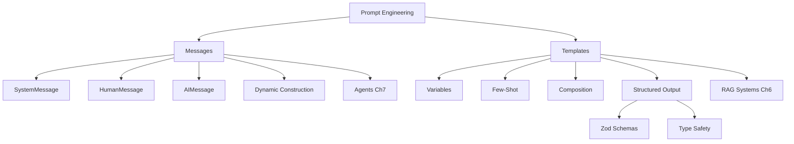

# Chapter 3: Prompts, Messages, and Structured Outputs

In this chapter, you'll learn the three essential techniques for working with LLMs in LangChain.js: **messages** (used by agents), **prompt templates** (used by RAG systems), and **structured outputs** (used everywhere). Understanding these techniques is key, because modern LangChain.js applications choose different approaches depending on the use case. Agents work with message arrays for dynamic tool-calling workflows, RAG systems use templates for consistent document processing, and structured outputs ensure type-safe data extraction.

This chapter prepares you for both **Chapter 6 (RAG Systems)** and **Chapter 7 (Agents & MCP)**.

## Prerequisites

- Completed [Chapter 2](../02-chat-models/README.md)

## 🎯 Learning Objectives

By the end of this chapter, you'll be able to:

- ✅ Understand when to use messages vs templates
- ✅ Construct message arrays for agent workflows
- ✅ Create reusable prompt templates for RAG systems
- ✅ Use variables and dynamic content in prompts
- ✅ Implement few-shot prompting (teaching by example)
- ✅ Combine multiple prompts together
- ✅ Generate structured outputs with Zod schemas
- ✅ Choose the right approach for your use case

---

## 🎯 Decision Framework: Messages vs Templates

**This is the most important section of this chapter!** Before diving into the details, understand when to use each approach:

### ✅ Use MESSAGE ARRAYS when:
- **Building agents** (Chapter 7)
- Working with **dynamic workflows** where messages change based on context
- Handling **multi-step reasoning** and tool calls
- Integrating **MCP tools** (Model Context Protocol)
- Need **full control** over message flow and conversation state
- Building **conversational** applications that adapt to user input

**Example use cases**: Customer support agents, task automation agents, research assistants with tools

**Agents are covered in**: [Chapter 7: Agents & MCP](../07-agents-mcp/README.md)

### ✅ Use TEMPLATES when:
- Building **RAG systems** with `createStuffDocumentsChain()`
- Need **reusable prompt patterns** across your application
- Want **variable substitution** in prompts
- Creating **chains** for document processing
- Ensuring **consistent prompts** across different calls
- Working with **static or semi-static** prompts

**Example use cases**: Document Q&A, content generation, translation systems, data extraction

**RAG systems are covered in**: [Chapter 6: RAG Systems](../06-rag/README.md)

### 📚 Modern LangChain.js Pattern

The modern approach is **"agent-first"** but there may be cases where you still need templates:
- **Agents (message-based)**: Use message arrays for dynamic workflows
- **RAG (template-based)**: Use templates for document processing and retrieval
- **Use the right tool (message or template) for the right job** - learn the options and when to use each one

---

## PART 1: Message-Based Prompting (Agent-First)

Message arrays are the foundation of agent systems in LangChain.js. When you work with agents, you'll use message arrays as input and output.

### 📖 The Conversation Analogy

**Think about a real conversation with context:**

```
System: "You are a helpful coding assistant."
You: "What is a variable?"
AI: "A variable is a container for storing data..."
You: "Can you show me an example?"
AI: "Sure! Here's an example: let name = 'John';"
```

**Each line is a message** with a role (system, human, AI). Message arrays preserve this conversational structure, which is exactly what agents need for multi-step reasoning and tool use.

---

### Example 1: Messages vs Templates - The Big Picture

This foundational example compares both approaches side-by-side and explains when to use each.

**Code**: [`code/01-messages-vs-templates.ts`](./code/01-messages-vs-templates.ts)
**Run**: `tsx 03-prompts-messages-outputs/code/01-messages-vs-templates.ts`

```typescript
import { ChatOpenAI } from "@langchain/openai";
import { HumanMessage, SystemMessage } from "langchain";
import { ChatPromptTemplate } from "@langchain/core/prompts";
import "dotenv/config";

async function main() {
  const model = new ChatOpenAI({
    model: process.env.AI_MODEL,
    configuration: { baseURL: process.env.AI_ENDPOINT },
    apiKey: process.env.AI_API_KEY,
  });

  // APPROACH 1: Messages (Agent-First)
  console.log("APPROACH 1: Message Arrays (Used by Agents)\n");

  const messages = [
    new SystemMessage("You are a helpful translator."),
    new HumanMessage("Translate 'Hello, world!' to French"),
  ];

  const messageResponse = await model.invoke(messages);
  console.log("Response:", messageResponse.content);

  // APPROACH 2: Templates (RAG-First)
  console.log("\nAPPROACH 2: Templates (Used by RAG Systems)\n");

  const template = ChatPromptTemplate.fromMessages([
    ["system", "You are a helpful translator."],
    ["human", "Translate '{text}' to {language}"],
  ]);

  const templateChain = template.pipe(model);
  const templateResponse = await templateChain.invoke({
    text: "Hello, world!",
    language: "French",
  });

  console.log("Response:", templateResponse.content);
}

main().catch(console.error);
```

> **🤖 Try with [GitHub Copilot](https://github.com/features/copilot) Chat:** Want to explore this code further? Open this file in your editor and ask Copilot:
> - "When should I use messages vs templates in LangChain.js?"
> - "How do agents use messages differently from RAG systems?"
> - "Can I convert between message arrays and templates?"

### Expected Output

When you run this example with `tsx 03-prompts-messages-outputs/code/01-messages-vs-templates.ts`, you'll see both approaches produce the same translation, but they work differently under the hood.

### How It Works

**Message Arrays**:
- Direct construction using `new SystemMessage()` and `new HumanMessage()`
- Passed directly to `model.invoke(messages)`
- No templating or variable substitution
- Used by agents in LangChain

**Templates**:
- Created with `ChatPromptTemplate.fromMessages()`
- Uses variables like `{text}` and `{language}`
- Piped to model: `template.pipe(model)`
- Required for RAG systems

> **💡 Tip**: The actual code file [`01-messages-vs-templates.ts`](./code/01-messages-vs-templates.ts) includes comprehensive explanations of when to use each approach and how they integrate with different LangChain systems. Run the file to see the complete decision framework!

---

### Example 2: Dynamic Message Construction

**Prerequisites:** You should be familiar with SystemMessage, HumanMessage, and AIMessage from [Chapter 2](../02-chat-models/README.md).

In this example, you'll learn how to build message arrays programmatically and use few-shot prompting with messages - techniques that are essential for building agents.

**Code**: [`code/02-message-construction.ts`](./code/02-message-construction.ts)
**Run**: `tsx 03-prompts-messages-outputs/code/02-message-construction.ts`

```typescript
import { ChatOpenAI } from "@langchain/openai";
import {
  HumanMessage,
  SystemMessage,
  AIMessage,
  BaseMessage,
} from "langchain";
import "dotenv/config";

async function main() {
  const model = new ChatOpenAI({
    model: process.env.AI_MODEL,
    configuration: { baseURL: process.env.AI_ENDPOINT },
    apiKey: process.env.AI_API_KEY,
  });

  // PATTERN 1: Dynamic Message Construction
  // Build message arrays programmatically based on runtime data
  function createConversation(
    role: string,
    examples: Array<{ question: string; answer: string }>,
    newQuestion: string,
  ): BaseMessage[] {
    // Start with system message
    const messages: BaseMessage[] = [new SystemMessage(`You are a ${role}.`)];

    // Add examples (few-shot pattern using messages)
    examples.forEach(({ question, answer }) => {
      messages.push(new HumanMessage(question));
      messages.push(new AIMessage(answer));
    });

    // Add the new question
    messages.push(new HumanMessage(newQuestion));

    return messages;
  }

  // PATTERN 2: Few-Shot Learning with Messages
  // Teach the AI by showing examples in the message history
  const emojiMessages = createConversation(
    "emoji translator",
    [
      { question: "happy", answer: "😊" },
      { question: "sad", answer: "😢" },
    ],
    "surprised",
  );

  console.log("Messages constructed:", emojiMessages.length);
  const response = await model.invoke(emojiMessages);
  console.log("AI Response:", response.content); // Expected: 😮
}

main().catch(console.error);
```

> **🤖 Try with [GitHub Copilot](https://github.com/features/copilot) Chat:** Want to explore this code further? Open this file in your editor and ask Copilot:
> - "What are all the message types available in LangChain.js?"
> - "How do I build a multi-turn conversation with message arrays?"
> - "Can I serialize and deserialize message arrays for storage?"

### Expected Output

When you run this example with `tsx 03-prompts-messages-outputs/code/02-message-construction.ts`, you'll see:

```
Messages constructed: 5
AI Response: 😮
```

The function built a 5-message array: 1 system message + 2 examples (4 messages) + 1 new question.

### How It Works

**Pattern 1: Dynamic Message Construction**
- The `createConversation()` function builds message arrays programmatically
- You pass in parameters (`role`, `examples`, `newQuestion`) and it constructs the messages
- Returns a `BaseMessage[]` array that can include any message type
- This pattern is essential for agents that need to construct prompts based on runtime data

**Pattern 2: Few-Shot Learning with Messages**
- Instead of using templates, we teach the AI by showing example conversations
- Each example becomes a HumanMessage → AIMessage pair in the array
- The AI learns the pattern from these examples (happy → 😊, sad → 😢)
- When we ask about "surprised", the AI follows the learned pattern → 😮

**Why This Matters for Agents**:
- Agents need to construct messages dynamically based on tool results
- Few-shot examples improve agent decision-making and consistency
- Programmatic message building allows loading conversation history from databases
- These patterns prepare you for Chapter 7's agent workflows

**Key Differences from Chapter 2:**
- Chapter 2: Manually creating individual messages for basic conversations
- Chapter 3: Building message arrays programmatically with functions
- This approach enables agents to adapt their prompts based on context

> **💡 Tip**: The actual code file [`02-message-construction.ts`](./code/02-message-construction.ts) includes additional patterns like message metadata and conversation builders. Run the file to see all variations!

---

### 🔗 Link Forward to Chapter 7

**Everything you've learned about messages prepares you for:**
- [Chapter 7: Agents & MCP](../07-agents-mcp/README.md) - Build agents with message arrays
- Working with Model Context Protocol (MCP) tools
- Creating dynamic workflows that adapt based on context
- Building stateful, multi-step reasoning systems

**Messages are the foundation of modern agent systems in LangChain.js!**

---

## PART 2: Template-Based Prompting (RAG-First)

Templates allow you to create reusable, maintainable prompts with variables. They're essential for RAG systems where you need consistent prompt structures for document processing.

### 📖 The Mail Merge Analogy

**Imagine you need to send 100 personalized emails.**

You could write each one from scratch:
```
Dear John,
Your order #12345 is ready for pickup...

Dear Sarah,
Your order #12346 is ready for pickup...
```

Or you could use **mail merge** with a template:
```
Dear {name},
Your order #{orderId} is ready for pickup...
```

**Prompt templates work exactly the same way!**

Instead of writing similar prompts over and over, you:
- Create a template once with placeholders
- Fill in the specifics each time you use it
- Ensure consistency across your application
- Make testing and updates easier

---

### 🤔 Why Use Prompt Templates?

#### The Problem Without Templates

```typescript
// Hardcoded prompts everywhere - hard to maintain!
await model.invoke("Translate this English text to French: Hello");
await model.invoke("Translate this English text to Spanish: Hello");
await model.invoke("Translate this English text to German: Hello");
```

**Issues**:
- Code duplication
- Hard to update prompts
- Difficult to test
- Inconsistent formatting

#### The Solution With Templates

```typescript
// Create once, reuse everywhere!
const template = ChatPromptTemplate.fromMessages([
  ["system", "You are a translator from {input_language} to {output_language}."],
  ["human", "{text}"],
]);
```

**Benefits**:
- ✅ **Consistency**: Same prompt structure everywhere
- ✅ **Maintainability**: Update once, changes everywhere
- ✅ **Testability**: Easy to test with different inputs
- ✅ **Version control**: Track prompt changes over time
- ✅ **Separation of concerns**: Logic separate from prompts
- ✅ **Required for RAG**: RAG systems expect templates

---

### Example 3: Basic Templates

In this example, you'll create a reusable translation template with variables for input language, output language, and text to be translated.

**Code**: [`code/03-basic-template.ts`](./code/03-basic-template.ts)
**Run**: `tsx 03-prompts-messages-outputs/code/03-basic-template.ts`

```typescript
import { ChatPromptTemplate } from "@langchain/core/prompts";
import { ChatOpenAI } from "@langchain/openai";
import "dotenv/config";

async function main() {
  // Create a reusable template
  const template = ChatPromptTemplate.fromMessages([
    ["system", "You are a helpful assistant that translates {input_language} to {output_language}."],
    ["human", "{text}"],
  ]);

  const model = new ChatOpenAI({
    model: process.env.AI_MODEL,
    configuration: { baseURL: process.env.AI_ENDPOINT },
    apiKey: process.env.AI_API_KEY,
  });

  // Use the template multiple times with different values
  const chain = template.pipe(model);

  const result1 = await chain.invoke({
    input_language: "English",
    output_language: "French",
    text: "Hello, how are you?",
  });

  console.log("French:", result1.content);

  const result2 = await chain.invoke({
    input_language: "English",
    output_language: "Spanish",
    text: "Hello, how are you?",
  });

  console.log("Spanish:", result2.content);
}

main().catch(console.error);
```

> **🤖 Try with [GitHub Copilot](https://github.com/features/copilot) Chat:** Want to explore this code further? Open this file in your editor and ask Copilot:
> - "How does template.pipe(model) create a chain that can be invoked?"
> - "What happens if I forget to provide one of the template variables?"
> - "How can I inspect the final prompt before sending it to the model?"

### Expected Output

When you run this example with `tsx 03-prompts-messages-outputs/code/03-basic-template.ts`, you'll see:

```
French: Bonjour, comment allez-vous ?
Spanish: Hola, ¿cómo estás?
```

### How It Works

**Key Concepts**:
1. `{variable_name}` creates placeholders in the template
2. `ChatPromptTemplate.fromMessages()` defines the structure with system and human messages
3. `template.pipe(model)` creates a chain that connects the template to the model
4. `invoke()` fills in the variables and sends the complete prompt to the AI

**What's happening**:
- We create ONE template with three variables: `{input_language}`, `{output_language}`, and `{text}`
- We use the template twice with different values (French and Spanish)
- Each time, the variables are replaced with actual values
- The complete prompt is sent to the AI model
- We get translations without having to write separate prompts

**Benefits**: If you want to change how translations work (e.g., add "Be formal" to the system message), you update ONE place and it affects all translations.

> **💡 Tip**: The actual code file [`03-basic-template.ts`](./code/03-basic-template.ts) includes an additional translation example (Japanese) for deeper learning. Run the file to see all variations!

---

### Example 4: Template Formats

This example compares different template formats (ChatPromptTemplate vs PromptTemplate) and shows you when to use each approach.

**Code**: [`code/04-template-formats.ts`](./code/04-template-formats.ts)
**Run**: `tsx 03-prompts-messages-outputs/code/04-template-formats.ts`

```typescript
import { ChatPromptTemplate, PromptTemplate } from "@langchain/core/prompts";
import { ChatOpenAI } from "@langchain/openai";
import "dotenv/config";

async function main() {
  const model = new ChatOpenAI({
    model: process.env.AI_MODEL,
    configuration: { baseURL: process.env.AI_ENDPOINT },
    apiKey: process.env.AI_API_KEY,
  });

  // Format 1: ChatPromptTemplate (for chat models)
  console.log("1️⃣  ChatPromptTemplate:\n");

  const chatTemplate = ChatPromptTemplate.fromMessages([
    ["system", "You are a {role} who speaks in {style} style."],
    ["human", "{question}"],
  ]);

  const result1 = await chatTemplate.pipe(model).invoke({
    role: "pirate",
    style: "dramatic",
    question: "What is TypeScript?",
  });

  console.log(result1.content);

  // Format 2: PromptTemplate (simpler, string-based)
  console.log("\n2️⃣  PromptTemplate:\n");

  const stringTemplate = PromptTemplate.fromTemplate(
    "Write a {adjective} {item} about {topic}."
  );

  const prompt = await stringTemplate.format({
    adjective: "funny",
    item: "poem",
    topic: "JavaScript",
  });

  console.log("Generated prompt:", prompt);

  const result2 = await model.invoke(prompt);
  console.log("\nResponse:", result2.content);
}

main().catch(console.error);
```

> **🤖 Try with [GitHub Copilot](https://github.com/features/copilot) Chat:** Want to explore this code further? Open this file in your editor and ask Copilot:
> - "When should I use ChatPromptTemplate vs PromptTemplate?"
> - "How does stringTemplate.format() differ from using pipe and invoke?"
> - "Can I convert a PromptTemplate to work with ChatPromptTemplate?"

### Expected Output

When you run this example with `tsx 03-prompts-messages-outputs/code/04-template-formats.ts`, you'll see:

```
1️⃣  ChatPromptTemplate:

Arr matey! TypeScript be a mighty tool forged by Microsoft...

2️⃣  PromptTemplate:

Generated prompt: Write a funny poem about JavaScript.

Response:
JavaScript, oh JavaScript,
You're quirky and you're quick...
```

### How It Works

**Two Template Types**:

1. **ChatPromptTemplate** (for conversational AI):
   - Uses message arrays: `["system", "..."], ["human", "..."]`
   - Supports system messages to set AI personality
   - Best for chat models and conversations
   - Pipes directly to the model
   - **Required for RAG systems**

2. **PromptTemplate** (for simple text):
   - Uses plain string templates
   - No system/human message distinction
   - Must call `.format()` to get the filled template
   - Then pass the formatted string to the model

**When to use each**:
- Use `ChatPromptTemplate` when you need system messages, multi-turn conversations, or RAG systems
- Use `PromptTemplate` for simple, single-shot prompts without roles

> **💡 Tip**: The actual code file [`04-template-formats.ts`](./code/04-template-formats.ts) includes a complex multi-variable template example for deeper learning. Run the file to see all variations!

---

### Example 5: Few-Shot Prompting with Templates

Here you'll learn how to teach the AI by example using few-shot prompting to convert emotions to emojis based on provided examples.

**Code**: [`code/05-few-shot.ts`](./code/05-few-shot.ts)
**Run**: `tsx 03-prompts-messages-outputs/code/05-few-shot.ts`

[Few-shot prompting](../GLOSSARY.md#few-shot-prompting) means teaching the AI by showing examples.

**Think of it like training a new employee**: Instead of just telling them what to do, you show them examples of good work.

```typescript
import { ChatPromptTemplate, FewShotChatMessagePromptTemplate } from "@langchain/core/prompts";
import { ChatOpenAI } from "@langchain/openai";
import "dotenv/config";

async function main() {
  const model = new ChatOpenAI({
    model: process.env.AI_MODEL,
    configuration: { baseURL: process.env.AI_ENDPOINT },
    apiKey: process.env.AI_API_KEY,
  });

  // Define examples to teach the model
  const examples = [
    { input: "happy", output: "😊" },
    { input: "sad", output: "😢" },
    { input: "excited", output: "🎉" },
  ];

  // Create example template
  const exampleTemplate = ChatPromptTemplate.fromMessages([
    ["human", "{input}"],
    ["ai", "{output}"],
  ]);

  // Create few-shot template
  const fewShotTemplate = new FewShotChatMessagePromptTemplate({
    examplePrompt: exampleTemplate,
    examples: examples,
    inputVariables: [],
  });

  // Combine with the final question
  const finalTemplate = ChatPromptTemplate.fromMessages([
    ["system", "Convert emotions to emojis based on these examples:"],
    fewShotTemplate,
    ["human", "{input}"],
  ]);

  const chain = finalTemplate.pipe(model);

  // Test with new input
  const result = await chain.invoke({ input: "surprised" });
  console.log("surprised →", result.content);

  const result2 = await chain.invoke({ input: "angry" });
  console.log("angry →", result2.content);
}

main().catch(console.error);
```

> **🤖 Try with [GitHub Copilot](https://github.com/features/copilot) Chat:** Want to explore this code further? Open this file in your editor and ask Copilot:
> - "How does FewShotChatMessagePromptTemplate use the examples array?"
> - "How many examples should I provide for effective few-shot prompting?"
> - "Can I dynamically select which examples to include based on the input?"

### Expected Output

When you run this example with `tsx 03-prompts-messages-outputs/code/05-few-shot.ts`, you'll see:

```
surprised → 😮
angry → 😠
```

### How It Works

**What's happening**:
1. **We provide examples** showing the pattern: "happy" → 😊, "sad" → 😢, "excited" → 🎉
2. **The AI learns the pattern** by seeing these input-output pairs
3. **We ask for new emotions** like "surprised" and "angry"
4. **The AI follows the learned pattern** and provides appropriate emojis

**Few-Shot Components**:
- `examples` array: Contains the teaching examples
- `exampleTemplate`: Defines how each example is formatted (human → AI)
- `FewShotChatMessagePromptTemplate`: Injects the examples into the conversation
- Final template: Combines system message + examples + user input

**Benefits of Few-Shot**:
- Teaches the model your desired format without complex instructions
- More reliable than just instructions alone
- Great for structured outputs and consistent formatting
- Reduces need for fine-tuning for many tasks
- **Essential for RAG systems** to guide response formatting

> **💡 Tip**: The actual code file [`05-few-shot.ts`](./code/05-few-shot.ts) includes an additional code comment generator example demonstrating few-shot learning with different patterns. Run the file to see all variations!

---

### Example 6: Template Composition

In this example, you'll learn how to combine multiple template pieces together to create complex, reusable prompts for different educational contexts.

**Code**: [`code/06-composition.ts`](./code/06-composition.ts)
**Run**: `tsx 03-prompts-messages-outputs/code/06-composition.ts`

```typescript
import { ChatPromptTemplate } from "@langchain/core/prompts";
import { ChatOpenAI } from "@langchain/openai";
import "dotenv/config";

async function main() {
  const model = new ChatOpenAI({
    model: process.env.AI_MODEL,
    configuration: { baseURL: process.env.AI_ENDPOINT },
    apiKey: process.env.AI_API_KEY,
  });

  // Create reusable prompt pieces
  const systemTemplate = "You are an expert {domain} educator.";
  const contextTemplate = "Teaching level: {level}\nAudience: {audience}";
  const taskTemplate = "Explain {topic} in simple terms.";

  // Compose them together
  const fullTemplate = ChatPromptTemplate.fromMessages([
    ["system", systemTemplate + "\n\n" + contextTemplate],
    ["human", taskTemplate],
  ]);

  const chain = fullTemplate.pipe(model);

  // Use for different scenarios
  const result1 = await chain.invoke({
    domain: "programming",
    level: "beginner",
    audience: "high school students",
    topic: "variables",
  });

  console.log("🎓 Beginner explanation:\n");
  console.log(result1.content);

  const result2 = await chain.invoke({
    domain: "programming",
    level: "intermediate",
    audience: "college students",
    topic: "closures",
  });

  console.log("\n\n🎓 Intermediate explanation:\n");
  console.log(result2.content);
}

main().catch(console.error);
```

> **🤖 Try with [GitHub Copilot](https://github.com/features/copilot) Chat:** Want to explore this code further? Open this file in your editor and ask Copilot:
> - "How does template.partial() work and when would I use it?"
> - "Can I combine multiple partial templates together?"
> - "What's the benefit of composing prompts vs using one large template?"

### Expected Output

When you run this example with `tsx 03-prompts-messages-outputs/code/06-composition.ts`, you'll see:

```
🎓 Beginner explanation:

Think of a variable as a labeled box where you can store information...


🎓 Intermediate explanation:

Closures are a fundamental concept where a function retains access to variables from its outer scope...
```

### How It Works

**What's happening**:
1. **We create reusable template pieces**: `systemTemplate`, `contextTemplate`, `taskTemplate`
2. **We combine them with string concatenation**: `systemTemplate + "\n\n" + contextTemplate`
3. **We use the same template for different scenarios**: beginner vs intermediate explanations
4. **Variables customize each piece**: `domain`, `level`, `audience`, `topic`

**Benefits of Composition**:
- **Reusable pieces**: Write common parts once, mix and match
- **Consistency**: Same structure across similar prompts
- **Flexibility**: Different combinations for different needs
- **Maintainability**: Update shared pieces in one place
- **Critical for RAG**: Build document processing templates from reusable components

**Real-world use**: Build a library of prompt components (tone, context, task) and compose them based on user needs or application state.

> **💡 Tip**: The actual code file [`06-composition.ts`](./code/06-composition.ts) includes additional examples demonstrating customer service scenarios and partial templates. Run the file to see all variations!

---

## 📋 Structured Outputs with Zod

So far, we've been getting text responses from AI models. But what if you need **structured data** - like JSON objects with specific fields?

### What is Zod?

Before we dive into structured outputs, let's understand the tool we'll be using: **[Zod](../GLOSSARY.md#zod-schema)**.

**[Zod](https://zod.dev/) is a TypeScript-first schema validation library** that lets you define the structure and rules for your data. Think of it as a blueprint that describes exactly what shape your data should have.

**Why use Zod?**
- ✅ **Type Safety**: Automatically generates TypeScript types from your schema
- ✅ **Runtime Validation**: Checks data is valid when your code runs (not just at compile time)
- ✅ **Clear Descriptions**: You can add `.describe()` to help the AI understand each field
- ✅ **Easy to Use**: Simple, readable syntax for defining data structures

**Quick example**:
```typescript
import * as z from "zod";

// Define a schema
const PersonSchema = z.object({
  name: z.string().describe("Person's full name"),
  age: z.number().describe("Age in years"),
  email: z.string().email().describe("Email address"),
});

// TypeScript automatically knows the type!
// type Person = { name: string; age: number; email: string; }
```

With LangChain, Zod schemas tell the AI **exactly what format to return data in** - ensuring you always get structured, validated data instead of free text that you have to parse.

---

### The Form Analogy

**Think about asking someone for their contact information:**

❌ **Without structure**:
```
"Tell me about yourself"
Response: "Well, I'm John, I live somewhere in Seattle,
my email is... let me think... john@something.com"
```

✅ **With structure** (a form):
```
Name: [____]
Email: [____]
Phone: [____]
City: [____]
```

**Structured outputs work the same way!** Instead of parsing free text, you get data in the exact format you need.

### Why Use Structured Outputs?

- **Type Safety**: TypeScript types match AI output
- **Validation**: Ensure data meets requirements
- **Parsing**: No need to parse free text
- **Consistency**: Always get the same format
- **Integration**: Easy to use with databases, APIs, etc.
- **Essential for RAG**: Extract structured data from documents

---

### Example 7: Basic Structured Output

Here you'll use Zod schemas to get typed, structured data from AI instead of free text, ensuring type safety and validation.

**Code**: [`code/07-structured-output.ts`](./code/07-structured-output.ts)
**Run**: `tsx 03-prompts-messages-outputs/code/07-structured-output.ts`

```typescript
import { ChatOpenAI } from "@langchain/openai";
import * as z from "zod";
import "dotenv/config";

async function main() {
  console.log("📋 Structured Output Example\n");

  const model = new ChatOpenAI({
    model: process.env.AI_MODEL,
    configuration: { baseURL: process.env.AI_ENDPOINT },
    apiKey: process.env.AI_API_KEY,
  });

  // Define the structure using Zod schema
  const PersonSchema = z.object({
    name: z.string().describe("The person's full name"),
    age: z.number().describe("The person's age in years"),
    email: z.string().email().describe("The person's email address"),
    occupation: z.string().describe("The person's job or profession"),
  });

  // Create a model that returns structured output
  const structuredModel = model.withStructuredOutput(PersonSchema);

  // Now the AI returns typed data, not just text!
  const result = await structuredModel.invoke(
    "My name is Alice Johnson, I'm 28 years old, work as a software engineer, and you can reach me at alice.j@email.com"
  );

  console.log("✅ Structured Output (typed!):\n");
  console.log(result);
  console.log("\n📝 Accessing fields:");
  console.log(`   Name: ${result.name}`);
  console.log(`   Age: ${result.age}`);
  console.log(`   Email: ${result.email}`);
  console.log(`   Occupation: ${result.occupation}`);
}

main().catch(console.error);
```

> **🤖 Try with [GitHub Copilot](https://github.com/features/copilot) Chat:** Want to explore this code further? Open this file in your editor and ask Copilot:
> - "How does withStructuredOutput() ensure the response matches the schema?"
> - "What happens if the AI can't extract all the required fields?"
> - "Can I make some Zod schema fields optional instead of required?"

### Expected Output

When you run this example with `tsx 03-prompts-messages-outputs/code/07-structured-output.ts`, you'll see:

```
📋 Structured Output Example

✅ Structured Output (typed!):

{
  name: 'Alice Johnson',
  age: 28,
  email: 'alice.j@email.com',
  occupation: 'software engineer'
}

📝 Accessing fields:
   Name: Alice Johnson
   Age: 28
   Email: alice.j@email.com
   Occupation: software engineer
```

### How It Works

**What's happening**:
1. **Define the schema** with Zod: `PersonSchema` specifies exactly what fields we want
2. **Use `.describe()`** to tell the AI what each field represents
3. **Create structured model**: `model.withStructuredOutput(PersonSchema)`
4. **Get typed data**: The AI extracts information and returns it in the exact format we specified
5. **Type-safe access**: TypeScript knows the structure, giving us autocomplete and type checking

**Key Points**:
- `z.object()` defines the structure with field names and types
- `.describe()` tells the AI what each field means (helps extraction accuracy)
- `withStructuredOutput()` ensures the AI returns data in that format
- Result is fully typed in TypeScript - no manual parsing needed!
- Zod validates the data automatically - if the AI returns invalid data, you'll get an error

**Why this is powerful**: No more parsing free text with regex or string splitting. The AI does the extraction and formatting for you!

> **💡 Tip**: The actual code file [`07-structured-output.ts`](./code/07-structured-output.ts) demonstrates the versatility of structured outputs by working with multiple different input formats and edge cases. Run the file to see all variations!

---

### Example 8: Complex Nested Schemas

In this example, you'll extract complex nested company information from text using Zod schemas with arrays, nested objects, and various data types.

**Code**: [`code/08-zod-schemas.ts`](./code/08-zod-schemas.ts)
**Run**: `tsx 03-prompts-messages-outputs/code/08-zod-schemas.ts`

```typescript
import { ChatOpenAI } from "@langchain/openai";
import { ChatPromptTemplate } from "@langchain/core/prompts";
import * as z from "zod";
import "dotenv/config";

async function main() {
  console.log("🏢 Complex Structured Output Example\n");

  const model = new ChatOpenAI({
    model: process.env.AI_MODEL,
    configuration: { baseURL: process.env.AI_ENDPOINT },
    apiKey: process.env.AI_API_KEY,
  });

  // Define a complex nested schema
  const CompanySchema = z.object({
    name: z.string().describe("Company name"),
    founded: z.number().describe("Year the company was founded"),
    headquarters: z.object({
      city: z.string(),
      country: z.string(),
    }).describe("Company headquarters location"),
    products: z.array(z.string()).describe("List of main products or services"),
    employeeCount: z.number().describe("Approximate number of employees"),
    isPublic: z.boolean().describe("Whether the company is publicly traded"),
  });

  // Create structured model
  const structuredModel = model.withStructuredOutput(CompanySchema);

  // Create a prompt template
  const template = ChatPromptTemplate.fromMessages([
    ["system", "Extract company information from the text. If information is not available, make reasonable estimates."],
    ["human", "{text}"],
  ]);

  // Combine template with structured output
  const chain = template.pipe(structuredModel);

  const companyInfo = `
    Microsoft was founded in 1975 and is headquartered in Redmond, Washington.
    The company is publicly traded and has over 220,000 employees worldwide.
    Their main products include Windows, Office, Azure, and Xbox.
  `;

  const result = await chain.invoke({ text: companyInfo });

  console.log("✅ Extracted Company Data:\n");
  console.log(JSON.stringify(result, null, 2));

  console.log("\n📊 Type-safe access:");
  console.log(`   ${result.name} (${result.isPublic ? "Public" : "Private"})`);
  console.log(`   Founded: ${result.founded}`);
  console.log(`   Location: ${result.headquarters.city}, ${result.headquarters.country}`);
  console.log(`   Products: ${result.products.join(", ")}`);
  console.log(`   Employees: ${result.employeeCount.toLocaleString()}`);
}

main().catch(console.error);
```

> **🤖 Try with [GitHub Copilot](https://github.com/features/copilot) Chat:** Want to explore this code further? Open this file in your editor and ask Copilot:
> - "How do I add validation constraints like min/max to Zod schema fields?"
> - "Can I use Zod enums to restrict values to specific options?"
> - "How would I handle arrays of nested objects in a schema?"

### Expected Output

When you run this example with `tsx 03-prompts-messages-outputs/code/08-zod-schemas.ts`, you'll see:

```
🏢 Complex Structured Output Example

✅ Extracted Company Data:

{
  "name": "Microsoft",
  "founded": 1975,
  "headquarters": {
    "city": "Redmond",
    "country": "United States"
  },
  "products": [
    "Windows",
    "Office",
    "Azure",
    "Xbox"
  ],
  "employeeCount": 220000,
  "isPublic": true
}

📊 Type-safe access:
   Microsoft (Public)
   Founded: 1975
   Location: Redmond, United States
   Products: Windows, Office, Azure, Xbox
   Employees: 220,000
```

### How It Works

**What's happening**:
1. **Complex schema with nested objects**: `headquarters` is an object with `city` and `country`
2. **Arrays**: `products` is an array of strings
3. **Multiple data types**: string, number, boolean, object, array
4. **Template integration**: We use `ChatPromptTemplate` with `withStructuredOutput()`
5. **Smart extraction**: The AI reads unstructured text and extracts data into our schema

**Schema Structure**:
```typescript
CompanySchema = {
  name: string,
  founded: number,
  headquarters: {       // Nested object
    city: string,
    country: string
  },
  products: string[],   // Array
  employeeCount: number,
  isPublic: boolean
}
```

**Real-world applications**:
- Extract contact info from emails into structured database records
- Parse resumes into standardized candidate profiles
- Convert natural language forms into API payloads
- **Build RAG systems** that extract structured data from documents
- Transform unstructured content into structured databases

**When to Use Structured Outputs**:
- 📊 **Data extraction** from text or documents
- 🗂️ **Database inserts** with validated data
- 🔄 **API responses** with guaranteed format
- 🎯 **Form filling** from natural language
- ✅ **Classification tasks** with predefined categories
- **RAG systems** that need structured document metadata

> **💡 Tip**: The actual code file [`08-zod-schemas.ts`](./code/08-zod-schemas.ts) includes additional examples extracting data for SpaceX and Netflix, demonstrating schema flexibility with different data structures. Run the file to see all variations!

---

### 🔗 Link Forward to Chapter 6

**Everything you've learned about templates and structured outputs prepares you for:**
- [Chapter 6: RAG Systems](../06-rag/README.md) - Build RAG systems with templates
- Processing documents with consistent prompts
- Extracting structured metadata from documents
- Creating reusable RAG patterns

**Templates are the foundation of RAG systems in LangChain.js!**

---

## 🗺️ Concept Map

This chapter taught you the TWO approaches to prompt engineering in LangChain.js:



*Choose messages for agents, templates for RAG - both are essential for modern LangChain.js applications.*

---

## 🎓 Key Takeaways

### Messages (Agent-First)
- **Direct message construction** - Build conversations programmatically
- **SystemMessage, HumanMessage, AIMessage** - Core message types
- **Multi-turn conversations** - Maintain conversation state
- **Used by agents** - Foundation for agent systems
- **Prepares you for Chapter 7** - Agents & MCP

### Templates (RAG-First)
- **Templates reduce code duplication** - Write once, use everywhere
- **Variables with `{name}` syntax** - Create dynamic prompts
- **ChatPromptTemplate for chat models** - Works with message arrays
- **PromptTemplate for simple cases** - String-based templates
- **Few-shot prompting** - Teach by example for better results
- **Composition** - Combine templates for complex prompts
- **Structured outputs with Zod** - Get typed data, not just text
- **Type safety** - Validate AI responses match your schema
- **Required for RAG** - Used by RAG systems
- **Prepares you for Chapter 6** - RAG Systems

### The Big Picture
- **Know when to use each approach** - Messages for agents, templates for RAG
- **Both are essential** - Modern LangChain.js uses both paradigms
- **Maintainability** - Update prompts in one place
- **Type safety** - Leverage TypeScript throughout

---

## 🏆 Assignment

Ready to practice? Complete the challenges in [assignment.md](./assignment.md)!

The assignment includes:
1. **Few-Shot Format Teacher** - Use few-shot prompting to teach the AI a custom output format
2. **Product Data Extractor** (Bonus) - Build a system that extracts product information with structured outputs

---

## 📚 Additional Resources

- [Prompt Templates Documentation](https://js.langchain.com/docs/modules/prompts/)
- [Few-Shot Prompting Guide](https://js.langchain.com/docs/modules/prompts/few_shot/)
- [Messages Documentation](https://js.langchain.com/docs/concepts/messages)
- [Zod Documentation](https://zod.dev/)

**💡 Want more examples?** Check out the [`samples/`](./samples/) folder for additional code examples including email generation, translation systems, dynamic prompt builders, and template libraries!

---

## 🗺️ Navigation

- **Previous**: [02-chat-models](../02-chat-models/README.md)
- **Next (Templates)**: [06-rag](../06-rag/README.md) - RAG Systems (uses templates)
- **Next (Messages)**: [07-agents-mcp](../07-agents-mcp/README.md) - Agents & MCP (uses messages)
- **Home**: [Course Home](../README.md)

---

## 💬 Questions or stuck?

If you get stuck or have any questions about building AI apps, join:

[](https://aka.ms/foundry/discord)

If you have product feedback or errors while building visit:

[](https://aka.ms/foundry/forum)
