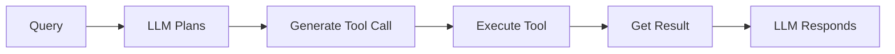

# Chapter 4: Function Calling & Tools

In this chapter, you'll learn how to extend AI capabilities beyond text generation by enabling function calling and tools. You'll discover how LLMs can invoke functions with structured arguments, create type-safe tools using Zod schemas, and build systems where AI can trigger real-world actions like API calls, database queries, or calculations.

**This is a foundational chapter for building AI agents.** Tools are the building blocks that give agents their capabilities—without tools, agents are just text generators. In [Chapter 5: Getting Started with Agents & MCP](../05-agents-mcp/README.md), you'll see how agents use the tools you create here to autonomously make decisions and solve multi-step problems.

## Prerequisites

- Completed [Chapter 3](../03-prompts-messages-outputs/README.md)

## 🎯 Learning Objectives

By the end of this chapter, you'll be able to:

- ✅ Understand what function calling is and why it matters
- ✅ Create tools with Zod schemas for type safety
- ✅ Bind tools to chat models
- ✅ Invoke tools and handle responses
- ✅ Build systems with multiple tools
- ✅ Apply best practices for tool design

---

## 📌 About the Code Examples

The code snippets in this README are simplified for clarity. The actual code files in `code/` and `solution/` folders include:

- ✨ **Enhanced error handling** with comprehensive try-catch blocks
- 🎨 **Detailed console output** with step-by-step explanations and formatting
- 🔒 **Security best practices** including input sanitization and validation
- 💡 **Educational comments** explaining the three-step execution pattern
- 📊 **Additional examples** demonstrating edge cases and best practices

When you run the files, expect more detailed output and additional safeguards than shown in the simplified snippets below.

---

## 📖 The Restaurant Staff Analogy

**Function calling works like a restaurant manager coordinating staff.** The LLM understands requests and delegates to specialists (functions like `prepareMeal()`, `makeSalad()`), but doesn't do the work itself. Instead, it generates structured function calls that your code executes. The LLM describes which functions to call with what parameters; your code does the actual work.

---

## 🎯 What is Function Calling?

[Function calling](../GLOSSARY.md#function-calling) transforms LLMs from text generators into action coordinators. Instead of just producing text, LLMs can trigger real-world operations—checking weather, querying databases, calling APIs, and more.

### The Paradigm Shift

**Before**: LLMs could only generate text. "What's the weather in Seattle?" → "I cannot access real-time weather data..."

**After**: LLMs can request external operations. "What's the weather in Seattle?" → LLM generates `{ function: "getWeather", args: { city: "Seattle" } }`, your code executes it, LLM responds "It's currently 62°F and cloudy in Seattle."

### Understanding the Execution Model

**Critical concept: The LLM never executes functions directly.** Here's what actually happens:

**1. LLM's Role (Planning)**:
- Analyzes user request
- Determines which function(s) to call
- Generates structured function calls with arguments
- Returns this as JSON (doesn't execute anything)

**2. Your Code's Role (Doing)**:
- Receives function call descriptions
- Actually executes the functions
- Gets real results (API calls, calculations, etc.)
- Sends results back to LLM

**3. LLM's Role Again (Communicating)**:
- Incorporates function results into natural response
- Returns helpful answer to user

### Why This Separation Matters

**Security & Control**: Your code decides what functions exist and controls execution. You can reject dangerous operations.

**Example Flow**: "What's the weather in Tokyo and Paris?"
```typescript
// 1. LLM generates (doesn't execute):
{ tool_calls: [
  { name: "getWeather", args: { city: "Tokyo" } },
  { name: "getWeather", args: { city: "Paris" } }
]}

// 2. Your code executes:
const tokyo = await getWeather("Tokyo");   // → "24°C, sunny"
const paris = await getWeather("Paris");   // → "18°C, rainy"

// 3. LLM responds:
"Tokyo is 24°C and sunny. Paris is 18°C and rainy."
```

### Key Characteristics

- ✅ LLM generates function calls (describes what to do)
- ✅ Your code executes functions (does the actual work)
- ✅ You maintain control over security and validation
- ✅ LLM handles reasoning about when to use functions

---

## 🛠️ Creating Tools with Zod

In LangChain.js, [tools](../GLOSSARY.md#tool) are created using the `tool()` function with Zod schemas for type safety.

If you're new to Zod, it's a TypeScript-first schema validation library that lets you define the shape and constraints of your data. Think of it as a way to describe what valid input looks like—for example, "this parameter must be a string" or "this number must be between 1 and 100." Zod validates data at runtime and provides excellent TypeScript type inference, making your code both safer and more maintainable. [Learn more about Zod](https://zod.dev/).

**You want to give your AI real-time calculator capabilities.** Without tools, the AI can only guess at calculations or say "I can't do math." With a calculator tool, the AI can recognize when a calculation is needed and request execution of the actual computation.

### Example 1: Simple Calculator Tool

Let's see how to create a tool using the `tool()` function with a Zod `schema` for type-safe parameters.

**Code**: [`code/01-simple-tool.ts`](./code/01-simple-tool.ts)
**Run**: `tsx 04-function-calling-tools/code/01-simple-tool.ts`

```typescript
import { tool } from "langchain";
import * as z from "zod";
import "dotenv/config";

// Define calculator tool
const calculatorTool = tool(
  async (input) => {
    // Implement the actual function
    const sanitized = input.expression.replace(/[^0-9+\-*/().\s]/g, "");
    try {
      const result = Function(`"use strict"; return (${sanitized})`)();
      return `The result is: ${result}`;
    } catch (error) {
      return `Error evaluating expression: ${error instanceof Error ? error.message : String(error)}`;
    }
  },
  {
    name: "calculator",
    description: "Useful for performing mathematical calculations. Use this when you need to compute numbers.",
    schema: z.object({
      expression: z.string().describe("The mathematical expression to evaluate, e.g., '25 * 4'"),
    }),
  }
);

console.log("Tool created:", calculatorTool.name);
console.log("Schema:", calculatorTool.schema);
```

> **🤖 Try with [GitHub Copilot](https://github.com/features/copilot) Chat:** Want to explore this code further? Open this file in your editor and ask Copilot:
> - "Why do we need to sanitize the input expression before evaluating it?"
> - "How does the Zod schema help with type safety in this calculator tool?"

### Expected Output

When you run this example with `tsx 04-function-calling-tools/code/01-simple-tool.ts`, you'll see:

```
Tool created: calculator
Schema: ZodObject {
  shape: {
    expression: ZodString { ... }
  }
}
```

### How It Works

**What's happening**:
1. **Define the tool implementation**: The async function that performs the calculation
2. **Sanitize input**: Remove potentially dangerous characters
3. **Execute calculation**: Use the mathjs library's `evaluate()` function to safely compute mathematical expressions
4. **Return result**: String describing the result

> **Security Note**: The code examples use the `mathjs` library instead of JavaScript's `Function()` constructor. The mathjs `evaluate()` function is specifically designed for mathematical expressions and provides better security by preventing arbitrary code execution.

**Key Components**:
- **Implementation function**: What the tool actually does (`async (input) => {...}`)
- **Name**: How the LLM refers to the tool (`"calculator"`)
- **Description**: Helps the LLM decide when to use it (tells AI this is for math)
- **Schema**: Zod object defining parameters (`z.object({ expression: z.string() })`)

**Important**: At this stage, we've only *created* the tool. We haven't connected it to an LLM yet - that comes in Example 2!

---

## 🔗 Binding Tools to Models

Use `bindTools()` to make tools available to the LLM.

**You've created a calculator tool, but how does the AI know it exists?** The tool sits in your code, disconnected from the AI. You need to tell the AI "here are the tools you can use" and let the AI decide when to call them. That's where `.bindTools()` comes in—it connects tools to the model so the AI can intelligently choose when to use them.

### Example 2: Binding and Invoking Tools

Let's see how to use `.bindTools()` to make tools available and observe how the AI generates structured `tool_calls`.

**Code**: [`code/02-tool-calling.ts`](./code/02-tool-calling.ts)
**Run**: `tsx 04-function-calling-tools/code/02-tool-calling.ts`

```typescript
import { ChatOpenAI } from "@langchain/openai";
import { tool } from "langchain";
import * as z from "zod";
import "dotenv/config";

const calculatorTool = tool(
  async (input) => {
    // Sanitize input - only allow safe characters (numbers, operators, parentheses)
    const sanitized = input.expression.replace(/[^0-9+\-*/().\s]/g, "");
    // Use Function constructor (safer than eval) with strict mode
    const result = Function(`"use strict"; return (${sanitized})`)();
    return `${result}`;
  },
  {
    name: "calculator",
    description: "Perform mathematical calculations",
    schema: z.object({
      expression: z.string().describe("Math expression to evaluate"),
    }),
  }
);

// Create model and bind tools
const model = new ChatOpenAI({
  model: process.env.AI_MODEL,
  configuration: { baseURL: process.env.AI_ENDPOINT },
  apiKey: process.env.AI_API_KEY
});

const modelWithTools = model.bindTools([calculatorTool]);

// Invoke with a question
const response = await modelWithTools.invoke("What is 25 * 17?");

console.log("Response:", response);
console.log("\nTool calls:", response.tool_calls);

// The LLM returns structured tool calls:
// {
//   "name": "calculator",
//   "args": {
//       "expression": "25 * 17"
//   },
//   "type": "tool_call",
//   "id": "call_abc123"
// }
```

> **🤖 Try with [GitHub Copilot](https://github.com/features/copilot) Chat:** Want to explore this code further? Open this file in your editor and ask Copilot:
> - "What's in the response.tool_calls array and how does it differ from response.content?"
> - "Why does the LLM return structured tool calls instead of executing the function?"

### Expected Output

When you run this example with `tsx 04-function-calling-tools/code/02-tool-calling.ts`, you'll see:

```
🤖 Asking: What is 25 * 17?

Response content: 

Tool calls: [
  {
    "name": "calculator",
    "args": {
      "expression": "25 * 17"
    },
    "type": "tool_call",
    "id": "call_6lyhZzefMJnbOXvplEFsuSsY"
  }
]
```

### How It Works

**What Happens**:
1. **LLM sees the tool description**: When we bind the calculator tool, the LLM learns about it
2. **LLM analyzes the query**: "What is 25 * 17?" → This needs the calculator tool
3. **LLM generates a tool call**: Returns structured data with tool name, arguments, and ID
4. **Your code receives the tool call**: `response.tool_calls[0]` contains the structured call
5. **Next step** (not shown here): You execute the tool with those arguments

**Important**: The LLM doesn't actually calculate anything! It only *describes* which tool to call and with what arguments. Your code must execute the tool (see Example 3).

---

## 🔄 Handling Tool Execution

### Example 3: Complete Tool Call Loop

In this example, you'll see the complete flow: LLM generates tool call, your code executes the tool, and results return to LLM for the final response.

**Code**: [`code/03-tool-execution.ts`](./code/03-tool-execution.ts)
**Run**: `tsx 04-function-calling-tools/code/03-tool-execution.ts`

```typescript
const weatherTool = tool(
  async (input) => {
    // Simulate API call
    const temps = { Seattle: 62, Paris: 18, Tokyo: 24 };
    const temp = temps[input.city] || 72;
    return `Current temperature in ${input.city}: ${temp}°F`;
  },
  {
    name: "getWeather",
    description: "Get current weather for a city",
    schema: z.object({
      city: z.string().describe("City name"),
    }),
  }
);

const modelWithTools = model.bindTools([weatherTool]);

// Step 1: Get tool call from LLM
const response1 = await modelWithTools.invoke("What's the weather in Seattle?");
console.log("Tool call:", response1.tool_calls[0]);

// Step 2: Execute the tool
const toolCall = response1.tool_calls[0];
const toolResult = await weatherTool.invoke(weatherTool.schema.parse(toolCall.args));
console.log("Tool result:", toolResult);

// Step 3: Send result back to LLM
const messages = [
  { role: "user", content: "What's the weather in Seattle?" },
  response1, // LLM's tool call
  { role: "tool", content: toolResult, tool_call_id: toolCall.id },
];

const finalResponse = await model.invoke(messages);
console.log("Final answer:", finalResponse.content);
```

> **🤖 Try with [GitHub Copilot](https://github.com/features/copilot) Chat:** Want to explore this code further? Open this file in your editor and ask Copilot:
> - "Why do we need to send tool results back to the LLM in step 3?"
> - "How would I handle errors that occur during tool execution?"

### Expected Output

When you run this example with `tsx 04-function-calling-tools/code/03-tool-execution.ts`, you'll see:

```
User: What's the weather in Seattle?

Step 1: LLM generates tool call...
  Tool: getWeather
  Args: { city: 'Seattle' }
  ID: call_fuStirimy94aGqS9KM0arXcU

Step 2: Executing tool...
  Result: Current temperature in Seattle: 62°F, partly cloudy

Step 3: Sending result back to LLM...

Final answer: The current temperature in Seattle is 62°F and it's partly cloudy.
```

### How It Works

**The Complete Flow**:
1. **Step 1 - LLM generates tool call**:
   - User asks "What's the weather in Seattle?"
   - LLM decides to use `getWeather` tool with `{ city: "Seattle" }`
2. **Step 2 - Execute the tool**:
   - Your code calls `weatherTool.invoke(weatherTool.schema.parse(toolCall.args))`
   - Tool returns: "Current temperature in Seattle: 62°F"
3. **Step 3 - Send result back to LLM**:
   - Build conversation history: user message + AI tool call + tool result
   - LLM receives the weather data
   - LLM generates natural language response: "The current temperature in Seattle is 62°F and it's partly cloudy."

**Key insight**: This three-step pattern (generate → execute → respond) is the core of function calling!

---

## 🎛️ Multiple Tools

LLMs can choose from multiple tools based on the query.

**You're building an AI assistant that needs different capabilities—math calculations, web searches, and weather lookups.** Instead of creating separate AI instances or complex routing logic, you want one AI that intelligently chooses the right tool for each task. The AI should automatically pick the calculator for "What is 25 * 4?", search for "What's the capital of France?", and weather for "How's the weather in Tokyo?"

### Example 4: Multi-Tool System

Let's see how to bind multiple tools using `.bindTools([tool1, tool2, tool3])` and let the AI choose which one to call.

**Code**: [`code/04-multiple-tools.ts`](./code/04-multiple-tools.ts)
**Run**: `tsx 04-function-calling-tools/code/04-multiple-tools.ts`

```typescript
const calculatorTool = tool(
  async (input) => String(eval(input.expression)),
  {
    name: "calculator",
    description: "Perform mathematical calculations",
    schema: z.object({ expression: z.string() }),
  }
);

const searchTool = tool(
  async (input) => {
    // Simulated search
    const results = {
      "capital of France": "Paris",
      "population of Tokyo": "14 million",
    };
    return results[input.query] || "No results found";
  },
  {
    name: "search",
    description: "Search for factual information",
    schema: z.object({ query: z.string() }),
  }
);

const weatherTool = tool(
  async (input) => `Weather in ${input.city}: 72°F, sunny`,
  {
    name: "getWeather",
    description: "Get current weather",
    schema: z.object({ city: z.string() }),
  }
);

const modelWithTools = model.bindTools([calculatorTool, searchTool, weatherTool]);

// The LLM will choose the appropriate tool
const queries = [
  "What is 125 * 8?",
  "What's the capital of France?",
  "What's the weather in Tokyo?",
];

for (const query of queries) {
  const response = await modelWithTools.invoke(query);
  console.log(`\nQuery: ${query}`);
  console.log("Chosen tool:", response.tool_calls[0]?.name);
  console.log("Args:", response.tool_calls[0]?.args);
}
```

> **🤖 Try with [GitHub Copilot](https://github.com/features/copilot) Chat:** Want to explore this code further? Open this file in your editor and ask Copilot:
> - "How does the LLM decide which tool to use for each query?"
> - "Can I prioritize certain tools over others by adjusting their descriptions?"

### Expected Output

When you run this example with `tsx 04-function-calling-tools/code/04-multiple-tools.ts`, you'll see:

> **⚠️ Note on Tool Calling Behavior:** Tool calling is probabilistic and varies by model. Some models may respond directly for simple queries (like math) instead of calling tools. The weather tool typically calls most consistently. To improve reliability, use more explicit prompts like "Use the calculator tool to compute..." or consider the `tool_choice` parameter.

```
Query: "What is 125 * 8?"
  ℹ️ May respond directly or call calculator tool

Query: "What's the capital of France?"
  ℹ️ May respond directly or call search tool

Query: "What's the weather in Tokyo?"
  ✓ Chose tool: getWeather
  ✓ Args: { city: 'Tokyo' }
```

### How It Works

**What's happening**:
1. **Bind multiple tools**: All three tools (calculator, search, weather) are available to the LLM
2. **LLM reads tool descriptions**:
   - calculator: "Perform mathematical calculations"
   - search: "Search for factual information"
   - getWeather: "Get current weather"
3. **LLM chooses appropriate tool** for each query:
   - Math question → calculator
   - Factual question → search
   - Weather question → getWeather
4. **LLM generates correct arguments** for each tool

**Key insight**: The LLM automatically selects the right tool based on:
- Tool name
- Tool description
- Parameter schema
- The user's question

**Best practice**: Write clear, specific tool descriptions so the LLM can make the right choice!

---

## ✅ Best Practices

### 1. Clear Tool Descriptions

```typescript
// ❌ Poor
description: "Does weather stuff"

// ✅ Good
description: "Get current weather for a specific city. Returns temperature, conditions, and humidity."
```

### 2. Descriptive Parameter Names

```typescript
// ❌ Poor
schema: z.object({
  x: z.string(),
  y: z.number(),
})

// ✅ Good
schema: z.object({
  city: z.string().describe("The city name, e.g., 'Paris' or 'Tokyo'"),
  units: z.enum(["celsius", "fahrenheit"]).describe("Temperature unit to return"),
})
```

### 3. Error Handling

```typescript
const safeTool = tool(
  async (input) => {
    try {
      const result = await dangerousOperation(input);
      return result;
    } catch (error) {
      return `Error: ${error.message}. Please try again with different parameters.`;
    }
  },
  {
    name: "safeTool",
    description: "Performs operation with error handling",
    schema: z.object({ param: z.string() }),
  }
);
```

### 4. Validation

```typescript
const emailTool = tool(
  async (input) => {
    // Zod validates this automatically
    if (!input.email.includes("@")) {
      throw new Error("Invalid email format");
    }
    return `Email sent to ${input.email}`;
  },
  {
    name: "sendEmail",
    description: "Send an email",
    schema: z.object({
      email: z.string().email().describe("Valid email address"),
      subject: z.string().min(1).describe("Email subject"),
      body: z.string().describe("Email body content"),
    }),
  }
);
```

---

## 🗺️ Concept Map

This chapter taught you the complete function calling workflow:



*The LLM plans, your code executes, and the LLM communicates the results.*

---

## 🎓 Key Takeaways

- **Function calling** lets LLMs trigger real-world actions
- **LLMs generate** function calls, but don't execute them
- **Tools** are created with `tool()` and Zod schemas
- **bindTools()** makes tools available to the model
- **Type safety** with Zod prevents errors
- **Clear descriptions** help LLMs choose the right tool
- **Error handling** makes tools robust
- **Multiple tools** enable complex capabilities
- **Tools are the foundation for agents** - In Chapter 5, you'll see how agents use tools to autonomously solve problems

---

## 🏆 Assignment

Ready to practice? Complete the challenges in [assignment.md](./assignment.md)!

The assignment includes:
1. **Weather Tool with Complete Execution Loop** - Build a weather tool and implement the complete 3-step execution pattern
2. **Multi-Tool Travel Assistant** (Bonus) - Build a system with multiple tools where the LLM automatically selects the appropriate tool

---

## 📚 Additional Resources

- [Tool Calling Documentation](https://js.langchain.com/docs/how_to/tool_calling/)
- [Custom Tools Guide](https://js.langchain.com/docs/how_to/custom_tools/)
- [Zod Documentation](https://zod.dev/)

---

## 🗺️ Navigation

- **Previous**: [Chapter 3: Prompts, Messages, and Structured Outputs](../03-prompts-messages-outputs/README.md)
- **Next**: [Chapter 5: Getting Started with Agents & MCP](../05-agents-mcp/README.md)
- **Home**: [Course Home](../README.md)

---

## 💬 Questions or stuck?

If you get stuck or have any questions about building AI apps, join:

[](https://aka.ms/foundry/discord)

If you have product feedback or errors while building visit:

[](https://aka.ms/foundry/forum)
