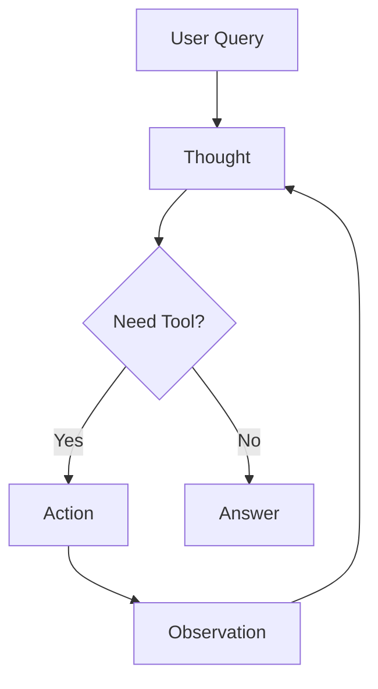

# Chapter 5: Getting Started with Agents & MCP

In this chapter, you'll learn to build AI [agents](../GLOSSARY.md#agent) that can reason about problems, select appropriate tools, and work iteratively towards solutions. You'll understand the [ReAct](../GLOSSARY.md#react-pattern) (Reasoning + Acting) pattern by implementing agent loops step-by-step, discover how agents autonomously choose tools, and explore the [Model Context Protocol (MCP)](../GLOSSARY.md#mcp-model-context-protocol) which is a standard for connecting AI to external services. These skills enable you to build autonomous AI systems that can handle complex, multi-step tasks.

## Prerequisites

- Completed [Chapter 4: Function Calling & Tools](../04-function-calling-tools/README.md)

## 🎯 Learning Objectives

By the end of this chapter, you'll be able to:

- ✅ Understand what AI agents are and how they work
- ✅ Implement the ReAct (Reasoning + Acting) pattern
- ✅ Build agent loops that iterate until solving a problem
- ✅ Give agents multiple tools and let them choose the right one
- ✅ Understand Model Context Protocol (MCP) and its benefits
- ✅ Build multi-step, autonomous AI systems

---

## 📖 The Manager with Specialists Analogy

**Imagine you're a project manager with a team of specialists:**

- 📊 Data Analyst - can query databases
- 🔍 Researcher - can search the web
- 🧮 Accountant - can do calculations
- ✉️ Assistant - can send emails

When someone asks: *"What's our revenue growth this quarter compared to last year?"*

You (the manager) don't do everything yourself. You:
1. **Reason**: "I need data from the database and calculations"
2. **Act**: Ask the Data Analyst for revenue data
3. **Observe**: Review the data received
4. **Reason**: "Now I need to calculate the percentage change"
5. **Act**: Ask the Accountant to do the math
6. **Observe**: Get the calculated result
7. **Reason**: "Now I have the answer"
8. **Respond**: Give the final answer

**AI Agents work the same way!**

They:
- **Think** about what needs to be done (Reasoning)
- **Choose** the right tool (Decision Making)
- **Use** the tool (Acting)
- **Evaluate** the result (Observation)
- **Repeat** until they have the answer
- **Respond** to the user

---

## 🤖 What Are Agents?

### Standard LLM (No Agency or Tools)

```
User: "What's the current weather in Paris?"
LLM: "I cannot access real-time weather data. I can only provide general information..."
```

### Agent with Tools

```
User: "What's the current weather in Paris?"
Agent: [Thinks] "I need to use the weather tool"
Agent: [Uses] getWeather({ city: "Paris" })
Agent: [Observes] "18°C, partly cloudy"
Agent: [Responds] "It's currently 18°C and partly cloudy in Paris"
```

---

## 🧠 The ReAct Pattern

ReAct = **Rea**soning + **Act**ing

Agents follow this iterative loop:

```
1. Thought: What should I do next?
2. Action: Use a specific tool
3. Observation: What did the tool return?
4. (Repeat 1-3 as needed)
5. Final Answer: Respond to the user
```

**Example**:
```
User: "Calculate 25 * 17, then tell me if it's a prime number"

Thought 1: I need to calculate 25 * 17
Action 1: calculator({ expression: "25 * 17" })
Observation 1: 425

Thought 2: I need to check if 425 is prime
Action 2: isPrime({ number: 425 })  // Assume we have an isPrime tool
Observation 2: false (divisible by 5)

Final Answer: "25 * 17 equals 425, which is not a prime number
because it's divisible by 5."
```

**Note**: This example assumes you have both `calculator` and `isPrime` tools available. The agent automatically decides which tool to use for each step.

---

## 🚀 Building Agents with createAgent()

LangChain.js provides `createAgent()` - a high-level API that handles the ReAct (Reasoning + Acting) loop automatically. This is the **recommended approach** for building production agents.

**What createAgent() does for you**:
- ✅ Manages the ReAct loop (Thought → Action → Observation → Repeat)
- ✅ Handles message history automatically
- ✅ Implements iteration limits to prevent infinite loops
- ✅ Provides production-ready error handling
- ✅ Returns clean, structured responses

Let's build agents using `createAgent()`!

---

**You've built tools in Chapter 4, but they require manual orchestration—you decide when to call them.** What if you want the AI to autonomously decide when to use a tool, try multiple approaches if one fails, and iterate until it solves the problem? That's what agents do! They reason, choose tools, and act independently.

### Example 1: Basic Agent with createAgent()

Let's see how to use `createAgent()` to create an autonomous agent that handles the ReAct loop (Thought → Action → Observation) automatically.

**Code**: [`code/01-create-agent-basic.ts`](./code/01-create-agent-basic.ts)
**Run**: `tsx 05-agents-mcp/code/01-create-agent-basic.ts`

```typescript
import { createAgent, HumanMessage, tool } from "langchain";
import { ChatOpenAI } from "@langchain/openai";
import * as z from "zod";
import "dotenv/config";

// Same calculator tool from Example 1
const calculatorTool = tool(
  async (input) => {
    const sanitized = input.expression.replace(/[^0-9+\-*/().\s]/g, "");
    const result = Function(`"use strict"; return (${sanitized})`)();
    return String(result);
  },
  {
    name: "calculator",
    description: "A calculator that can perform basic arithmetic operations.",
    schema: z.object({
      expression: z.string().describe("The mathematical expression to evaluate"),
    }),
  }
);

// Create model
const model = new ChatOpenAI({
  model: process.env.AI_MODEL,
  configuration: { baseURL: process.env.AI_ENDPOINT },
  apiKey: process.env.AI_API_KEY,
});

// Create agent using v1 createAgent() - that's it!
const agent = createAgent({
  model,
  tools: [calculatorTool],
});

// Use the agent with messages array
const query = "What is 125 * 8?";
const response = await agent.invoke({ messages: [new HumanMessage(query)] });

// Get the final answer from the last message
const lastMessage = response.messages[response.messages.length - 1];
console.log(`Agent: ${lastMessage.content}`);
```

> **🤖 Try with [GitHub Copilot](https://github.com/features/copilot) Chat:** Want to explore this code further? Open this file in your editor and ask Copilot:
> - "What does createAgent() do under the hood?"
> - "When should I use createAgent() vs a manual ReAct loop?"
> - "How does createAgent() handle iteration limits?"

### Expected Output

When you run `tsx 05-agents-mcp/code/01-create-agent-basic.ts`:

```
🤖 Agent with createAgent() Example

👤 User: What is 125 * 8?

🤖 Agent: 125 × 8 = 1000

💡 Key Differences from Manual Loop:
   • createAgent() handles the ReAct loop automatically
   • Less code to write
   • Production-ready error handling built-in
   • Same result, simpler API

✅ Under the hood:
   createAgent() implements the ReAct pattern (Thought → Action → Observation)
   and handles all the boilerplate for you.
```

### How It Works

**What's happening behind the scenes**:
1. **Agent receives query**: "What is 125 * 8?"
2. **Reasons**: Determines it needs the calculator tool
3. **Acts**: Executes `calculator({ expression: "125 * 8" })`
4. **Observes**: Gets result "1000"
5. **Responds**: Formats natural language response

**What createAgent() handles for you**:
- ✅ **Tool binding**: Automatically connects tools to the model so it knows which tools are available and how to use them
- ✅ **ReAct loop**: Implements Thought → Action → Observation → Repeat
- ✅ **Message history**: Manages conversation state internally (keeps track of all messages, tool calls, and results so the agent has context)
- ✅ **Iteration limits**: Prevents infinite loops
- ✅ **Error handling**: Graceful failures and retries

**Why use createAgent()**:
- Production-ready out of the box
- Less boilerplate code
- Consistent behavior across agents
- Built-in best practices

---

**You've built a single-tool agent, but real-world assistants need multiple capabilities.** How do you build an agent that can do math, check weather, and search information—automatically choosing the right tool for each query without manual routing code? Give the agent multiple tools and let it decide.

### Example 2: createAgent() with Multiple Tools

Let's see how to give an agent multiple tools using `tools: [tool1, tool2, tool3]` and observe how it autonomously selects the right one.

**Code**: [`code/02-create-agent-multi-tool.ts`](./code/02-create-agent-multi-tool.ts)
**Run**: `tsx 05-agents-mcp/code/02-create-agent-multi-tool.ts`

```typescript
import { createAgent, HumanMessage, tool } from "langchain";
import { ChatOpenAI } from "@langchain/openai";
import * as z from "zod";

// Define multiple tools
const calculatorTool = tool(/* ... */);
const weatherTool = tool(/* ... */);
const searchTool = tool(/* ... */);

// Create agent with all three tools
const agent = createAgent({
  model,
  tools: [calculatorTool, weatherTool, searchTool],
});

// Test with different queries - agent selects the right tool automatically
const queries = [
  "What is 50 * 25?",              // → Uses calculator
  "What's the weather in Tokyo?",  // → Uses getWeather
  "Tell me about LangChain.js",   // → Uses search
];

for (const query of queries) {
  const response = await agent.invoke({ messages: [new HumanMessage(query)] });
  const lastMessage = response.messages[response.messages.length - 1];
  console.log(`User: ${query}`);
  console.log(`Agent: ${lastMessage.content}\n`);
}
```

> **🤖 Try with [GitHub Copilot](https://github.com/features/copilot) Chat:** Want to explore this code further? Open this file in your editor and ask Copilot:
> - "How does the agent decide which tool to use?"
> - "What happens if multiple tools could work for a query?"
> - "Can I prioritize certain tools over others?"

### Expected Output

When you run `tsx 05-agents-mcp/code/02-create-agent-multi-tool.ts`:

```
🎛️  Multi-Tool Agent with createAgent()

👤 User: What is 50 * 25?
🤖 Agent: 50 multiplied by 25 equals 1250.

👤 User: What's the weather in Tokyo?
🤖 Agent: Current weather in Tokyo: 24°C, rainy with occasional thunder

👤 User: Tell me about LangChain.js
🤖 Agent: LangChain.js is a framework for building applications with large
language models (LLMs). It provides tools, agents, chains, and memory systems
to create sophisticated AI applications.

💡 What just happened:
   • The agent automatically selected the right tool for each query
   • Calculator for math (50 * 25)
   • Weather tool for Tokyo weather
   • Search tool for LangChain.js information
   • All with the same agent instance!

✅ Production Pattern:
   This is how you build real-world agents:
   1. Define your tools
   2. Pass them to createAgent()
   3. Let the agent handle tool selection and execution
```

### How It Works

**What's happening**:
1. **Agent receives query**: "What is 50 * 25?"
2. **Reads tool descriptions**: Reviews all available tools
3. **Selects best match**: Calculator tool (description mentions "mathematical calculations")
4. **Executes tool**: Runs calculator with the expression
5. **Returns natural response**: Formats the result in natural language

**Tool Selection Logic**:
- The agent uses tool **names** and **descriptions** to match queries to tools
- More specific descriptions → Better tool selection
- The LLM (GPT-5-mini) decides which tool fits best based on semantic meaning

### How Tool Selection Actually Works

When you give an agent multiple tools, the LLM follows this process:

1. **Reads all tool metadata**: Reviews each tool's **name** and **description**
2. **Analyzes the user query**: Understands what the user is asking for
3. **Semantic matching**: Compares the query meaning with tool descriptions
4. **Selects best match**: Chooses the tool whose description best aligns with the query intent

**Example**:
```
User Query: "What is 50 * 25?"

Tool Options the LLM sees:
- calculator: "Perform mathematical calculations like addition, multiplication..."
- getWeather: "Get current weather information for a city"
- search: "Search the web for information"

LLM reasoning: "The query asks for a multiplication. The calculator tool mentions 'mathematical calculations' and 'multiplication'. This is the best match."

Selected Tool: calculator
```

**Why clear descriptions matter**:
```typescript
// ❌ Vague - LLM might not select correctly
description: "Does math stuff"

// ✅ Specific - LLM knows exactly when to use this
description: "Perform mathematical calculations like addition, multiplication, division, and percentages. Use this when you need to compute numerical results."
```

**Key insight**: You can give your agent dozens of tools, and it will intelligently pick the right one for each task. No manual routing code needed!

---

## 🔧 Advanced Agent Patterns

Now that you understand how to build basic agents with single and multiple tools, let's explore an advanced pattern for production applications: **middleware**. Middleware lets you add behavior like logging, error handling, and dynamic model selection without modifying your tools or agent core logic.

### Example 3: createAgent() with Middleware (Advanced)

This advanced example shows how to use **middleware** with `createAgent()` for production scenarios like dynamic model selection based on conversation complexity and graceful error handling.

**Code**: [`code/03-agent-with-middleware.ts`](./code/03-agent-with-middleware.ts)
**Run**: `tsx 05-agents-mcp/code/03-agent-with-middleware.ts`

**What is middleware?** Middleware intercepts and modifies agent behavior without changing your tools or agent logic. Think of it as "plugins" for your agent.

```typescript
import { createAgent, createMiddleware } from "langchain";

// Middleware 1: Dynamic Model Selection
// Switches to a more capable (and expensive) model for complex conversations
const dynamicModelSelection = createMiddleware({
  name: "DynamicModelSelection",
  wrapModelCall: (request, handler) => {
    const messageCount = request.messages.length;

    // Use advanced model for complex conversations (>10 messages)
    if (messageCount > 10) {
      console.log(`  [Middleware] Switching to advanced model`);
      return handler({
        ...request,
        model: advancedModel,
      });
    }

    return handler(request);
  },
});

// Middleware 2: Custom Error Handling
// Catches tool failures and provides helpful fallback messages
const toolErrorHandler = createMiddleware({
  name: "ToolErrorHandler",
  wrapToolCall: async (request, handler) => {
    try {
      return await handler(request);
    } catch (error) {
      console.error(`  [Middleware] Tool "${request.tool}" failed`);
      // Return graceful fallback instead of crashing
      return {
        content: `I encountered an error: ${error.message}. Let me try a different approach.`
      };
    }
  },
});

// Create agent with both middleware
const agent = createAgent({
  model: basicModel,
  tools: [calculatorTool, searchTool],
  middleware: [dynamicModelSelection, toolErrorHandler]
});
```

> **🤖 Try with [GitHub Copilot](https://github.com/features/copilot) Chat:** Want to explore this code further? Open this file in your editor and ask Copilot:
> - "What other use cases exist for middleware in agents?"
> - "How would I add request logging middleware?"
> - "Can middleware modify tool arguments before execution?"

### Expected Output

When you run `tsx 05-agents-mcp/code/03-agent-with-middleware.ts`:

```
🔧 Agent with Middleware Example

Test 1: Simple calculation
────────────────────────────────────────────────────────────
👤 User: What is 25 * 8?

  [Middleware] Message count: 1
  [Middleware] ✓ Using basic model

🤖 Agent: 25 multiplied by 8 equals 200.


Test 2: Search with error handling
────────────────────────────────────────────────────────────
👤 User: Search for information about error handling

  [Middleware] Message count: 1
  [Middleware] ✓ Using basic model
  [Middleware] ⚠️  Tool "search" failed: Search service temporarily unavailable
  [Middleware] 🔄 Returning fallback message

🤖 Agent: I encountered an error while using the search tool. Let me try
a different approach to answer your question about error handling.

💡 Middleware Benefits:
   • Dynamic model selection → Cost optimization
   • Error handling → Graceful degradation
   • Logging → Easy debugging
   • Flexibility → Customize behavior without changing tools

✅ Production Use Cases:
   • Switch to cheaper models for simple queries
   • Automatic retries with exponential backoff
   • Request/response logging for monitoring
   • User context injection (auth, permissions)
   • Rate limiting and quota management
```

### How It Works

**Middleware Flow**:
```
User Query
    ↓
[Middleware: Dynamic Model Selection] → Chooses right model
    ↓
Agent Decision (which tool?)
    ↓
[Middleware: Error Handler] → Wraps tool execution
    ↓
Tool Execution → May fail here
    ↓
[Middleware: Error Handler] → Catches errors, returns fallback
    ↓
Agent Response
```

**Two Middleware Types**:

1. **wrapModelCall** - Intercepts calls TO the model
   - Dynamic model selection based on conversation length
   - Request logging and monitoring
   - Context injection (user permissions, session data)

2. **wrapToolCall** - Intercepts tool executions
   - Error handling and retries
   - Tool result transformation
   - Permission checks before tool execution

**Production Benefits**:
- ✅ **Cost Optimization**: Use cheap models for simple tasks, expensive for complex
- ✅ **Resilience**: Graceful error handling prevents agent crashes
- ✅ **Observability**: Log all requests for debugging and monitoring
- ✅ **Flexibility**: Add behavior without modifying tools or agent core logic

**When to use middleware**:
- Production agents that need reliability
- Multi-tenant applications (different users, different permissions)
- Cost-sensitive applications
- Systems requiring audit logs

---

## 🌐 Connecting to MCP Servers

**You've built agents with manually created tools, but what about connecting to external services?** You could write custom integrations for GitHub, Teams, databases, etc., but that's tedious. What if services exposed their capabilities through a standard protocol, like USB-C? That's what MCP (Model Context Protocol) provides—a standardized way for agents to connect to external tools.

### Example 4: Agent with MCP Server Integration (Context7)

Let's see how to use `MultiServerMCPClient` to connect to an MCP server and use its tools with `createAgent()`—same pattern as Examples 1-3, but tools come from an external service.

**Code**: [`code/04-mcp-integration.ts`](./code/04-mcp-integration.ts)
**Run**: `tsx 05-agents-mcp/code/04-mcp-integration.ts`

**Prerequisites**:
- Install MCP adapter: `npm install @langchain/mcp-adapters`
- Optional: Context7 API key for higher rate limits (get at [context7.com](https://context7.com))

**About Context7**:
Context7 is a documentation MCP server that solves the problem of outdated training data by delivering current docs directly to your agent. It provides:
- `resolve-library-id`: Converts library names (e.g., "React") to Context7 IDs
- `get-library-docs`: Retrieves documentation with optional topic filtering

This example demonstrates connecting to Context7 via HTTP transport:

```typescript
import { MultiServerMCPClient } from "@langchain/mcp-adapters";
import { ChatOpenAI } from "@langchain/openai";
import { createAgent, HumanMessage } from "langchain";
import "dotenv/config";

// Create MCP client with HTTP transport to Context7
const mcpClient = new MultiServerMCPClient({
  context7: {
    transport: "http",
    url: "https://mcp.context7.com/mcp"  // Public Context7 endpoint
    // Optional: Add API key for higher rate limits
    // headers: { "Authorization": `Bearer ${process.env.CONTEXT7_API_KEY}` }
  }
});

try {
  // 1. Get all available tools from Context7
  console.log("🔧 Fetching tools from Context7 MCP server...");
  const tools = await mcpClient.getTools();

  console.log(`✅ Retrieved ${tools.length} tools from Context7:`);
  tools.forEach(tool => {
    console.log(`   • ${tool.name}: ${tool.description}`);
  });

  // 2. Create model
  const model = new ChatOpenAI({
    model: process.env.AI_MODEL,
    configuration: { baseURL: process.env.AI_ENDPOINT },
    apiKey: process.env.AI_API_KEY
  });

  // 3. Create agent with MCP tools - same createAgent() pattern as Examples 1-3!
  const agent = createAgent({
    model,
    tools  // Tools from MCP server - that's the only difference!
  });

  // 4. Use the agent to get documentation
  const query = "How do I use React useState hook? Get the latest documentation.";
  console.log(`👤 User: ${query}\n`);

  const response = await agent.invoke({ messages: [new HumanMessage(query)] });
  const lastMessage = response.messages[response.messages.length - 1];

  console.log(`🤖 Agent: ${lastMessage.content}\n`);

  console.log("💡 Key Concepts:");
  console.log("   • MCP provides standardized access to external tools");
  console.log("   • MultiServerMCPClient connects to one or more MCP servers");
  console.log("   • HTTP transport works with remote servers like Context7");
  console.log("   • Tools from MCP servers work seamlessly with createAgent()");
  console.log("   • Same createAgent() pattern as Examples 1-3, different tool source!");
  console.log("   • No manual loop needed - createAgent() handles the ReAct pattern");

} catch (error) {
  console.error("❌ Error connecting to Context7 MCP server:", error);
} finally {
  // Close the MCP client connection to allow the script to exit
  await mcpClient.close();
  console.log("\n✅ MCP client connection closed");
}
```

> **🤖 Try with [GitHub Copilot](https://github.com/features/copilot) Chat:** Want to explore this code further? Open this file in your editor and ask Copilot:
> - "How does MultiServerMCPClient differ from manually creating tools?"
> - "What happens if the MCP server is unavailable?"
> - "Can I connect to multiple MCP servers simultaneously?"

### How It Works

**What's Different from Previous Examples**:
1. **Tool Source**: Instead of creating tools manually, you get them from an MCP server
2. **Tool Discovery**: `mcpClient.getTools()` fetches all available tools from the server
3. **Tool Execution**: The MCP client handles communication with the remote server
4. **Same createAgent() Pattern**: The agent works identically - only the tool source changed!

**Benefits of MCP Integration**:
- ✅ **No custom integration code** - MCP handles the connection
- ✅ **Dynamic tool discovery** - Server can add/remove tools without code changes
- ✅ **Standard protocol** - Works with any MCP-compliant server
- ✅ **Production-ready** - HTTP transport scales for remote deployments

**Setting Up Context7**:

To run this example with Context7, you have two options:

1. **Use the Public Context7 Server** (Easiest):
   - Public endpoint: `https://mcp.context7.com/mcp`
   - No setup required - just uncomment the code and run!
   - Free tier with rate limits
   - For higher limits, get an API key at [context7.com](https://context7.com)

2. **Run Context7 Locally**:
   ```bash
   # Run Context7 server on port 3000
   npx -y @upstash/context7-mcp --transport http --port 3000
   ```
   Then use `http://localhost:3000` as your MCP URL

**Configuration**:

Add to your `.env` file:
```bash
# Use public endpoint (default)
MCP_SERVER_URL=https://mcp.context7.com/mcp

# Or use local endpoint
# MCP_SERVER_URL=http://localhost:3000

# Optional: Add API key for higher rate limits
CONTEXT7_API_KEY=your_api_key_here
```

**Multiple Servers**:

You can connect to multiple MCP servers simultaneously:
```typescript
const mcpClient = new MultiServerMCPClient({
  context7: {
    transport: "http",
    url: "https://mcp.context7.com/mcp"
  },
  github: {
    transport: "http",
    url: "https://api.github.com/mcp"  // Example
  }
});
```

**Learn More**:
- Context7 on GitHub: [mcp/upstash/context7](https://github.com/mcp/upstash/context7)
- MCP Registry: [github.com/mcp](https://github.com/mcp)
- MCP for Beginners: [microsoft/mcp-for-beginners](https://github.com/microsoft/mcp-for-beginners)

---

## 🔗 From Manual Tools to MCP

In the previous examples, you created tools (calculator, weather, search) by writing the implementation code yourself. This works great for custom tools specific to your application.

**But what about connecting to existing services?** Imagine needing tools for:
- GitHub (create issues, search code, manage PRs)
- Teams (send messages, read channels)
- Outlook Calendar (check availability, create events)
- Your company database (query data, get schemas)

Writing custom integrations for each service means dealing with different APIs, authentication methods, and data formats. This is where **Model Context Protocol (MCP)** comes in.

**The key insight**: In Examples 1-3, you built the tool *implementations*. With MCP, you connect to tool *providers* that expose their capabilities through a standard protocol. Same `createAgent()` pattern, different tool source!

> **📘 Note for This Course**: The examples in this chapter use both manual tools (Examples 1-3) and MCP integration (Example 4). Manual tools are perfect for custom application logic, while MCP is ideal for connecting to external services. MCP is production-ready in LangChain.js via `@langchain/mcp-adapters`.

---

## 🌐 Model Context Protocol (MCP)

### The USB-C for AI Applications

**Imagine this scenario**: You build an AI assistant. It needs to:
- Check your Calendar
- Query your company's database
- Send Teams messages
- Read from Notion

**The old way**: Write custom integrations for each service. Different APIs, different auth, different data formats. Multiply this by 50+ services your company uses = chaos.

**The MCP way**: Services expose their capabilities through a standard protocol, like how every device uses USB-C. Your AI agent connects once, gets access to everything.

### What is MCP?

**Model Context Protocol (MCP)** is an open standard that lets AI applications connect to external tools and data sources through a universal interface.

Think of it as **"USB-C for AI"**:
- **Before USB-C**: Different cables for everything (iPhone cable, Android cable, laptop charger...)
- **After USB-C**: One cable, works everywhere
- **Before MCP**: Custom code for every tool integration
- **After MCP**: One protocol, works with any tool

### Real-World Examples

**For Developers**:
```
Your AI Agent → MCP → [GitHub API, Jira, Figma, PostgreSQL, ...]
```

**For Users**:
- "Check my calendar and find a 30-minute slot this week" → AI connects to Exchange Calendar via MCP
- "Summarize our latest product feedback" → AI connects to your database via MCP
- "Create a Jira ticket for this bug" → AI connects to Jira via MCP

### Why MCP Matters

| Without MCP | With MCP |
|-------------|----------|
| Write custom integration for each service | Connect once using MCP standard |
| Maintain separate authentication for each | Unified authentication approach |
| Different data formats everywhere | Standardized tool interface |
| Weeks to add new services | Hours to add new services |

---

## 🔌 How MCP Works

### Architecture

```
┌──────────────┐
│   Your AI    │ "Find my next meeting"
│   Agent      │
└──────┬───────┘
       │
       │ Uses MCP Protocol
       ▼
┌──────────────┐
│ MCP Client   │ Connects to MCP servers
└──────┬───────┘
       │
       ├─────► 📅 Calendar Server (provides: getEvents, createEvent)
       │
       ├─────► 📧 Email Server (provides: sendEmail, searchEmails)
       │
       └─────► 🗄️  Database Server (provides: queryDb, getSchema)
```

### MCP Servers = Tool Providers

An **MCP Server** is a program that exposes tools through the MCP protocol:

```typescript
// Example: A simple MCP server exposes a calculator
{
  "tools": [
    {
      "name": "calculate",
      "description": "Perform math calculations",
      "parameters": { "expression": "string" }
    }
  ]
}
```

Your agent connects to this server and can now use the calculator tool!

### Transport Types

MCP supports three ways to connect to servers:

1. **stdio** (Standard Input/Output) - For local subprocess communication
   ```typescript
   // Server runs as a local process
   {
     transport: "stdio",
     command: "node",
     args: ["/path/to/server.js"]
   }
   ```
   **Use when**: Running servers on your machine (development, local tools). Ideal for simple setups.

2. **SSE** (Server-Sent Events) - For HTTP servers with real-time streaming
   ```typescript
   // Server runs on a URL with SSE support
   {
     transport: "sse",
     url: "http://localhost:8000/mcp"
   }
   ```
   **Use when**: Need real-time streaming updates from remote servers. Optimized for streaming communication.

3. **Streamable HTTP** - For independent server processes
   ```typescript
   // Server runs on a URL with HTTP support
   {
     transport: "http",
     url: "https://api.mycompany.com/mcp"
   }
   ```
   **Use when**: Connecting to production APIs, cloud services, or shared servers that support remote connections.

---

## 🎯 MCP in Practice

### Getting Started with MCP

**What you can do now**:
1. **Build agents with manual tools** - Use the patterns from Examples 1 & 2 above (great for learning)
2. **Use MCP in LangChain.js** - MCP support is available via `@langchain/mcp-adapters`
3. **Explore MCP servers** - Visit [modelcontextprotocol.io](https://modelcontextprotocol.io) to see available servers
4. **Build custom MCP servers** - Create your own using `@modelcontextprotocol/sdk`

### Working with MCP in LangChain.js

**Installation**:
```bash
npm install @langchain/mcp-adapters
```

**Basic Usage**:
```typescript
import { MultiServerMCPClient } from "@langchain/mcp-adapters";
import { ChatOpenAI } from "@langchain/openai";

// 1. Connect to MCP servers
const client = new MultiServerMCPClient({
  // Math server running locally
  math: {
    transport: "stdio",
    command: "node",
    args: ["/path/to/math_server.js"]
  },
  // Weather server running remotely
  weather: {
    transport: "sse",
    url: "http://localhost:8000/mcp"
  }
});

// 2. Get all available tools from all servers
const tools = await client.getTools();
// Returns tools from both math and weather servers

// 3. Use tools with your agent
const model = new ChatOpenAI({
  model: process.env.AI_MODEL,
  configuration: { baseURL: process.env.AI_ENDPOINT },
  apiKey: process.env.AI_API_KEY
});
const modelWithTools = model.bindTools(tools);

// Agent can now use any tool from any connected MCP server
const response = await modelWithTools.invoke(
  "What's 25 * 4 and what's the weather like?"
);
```

**Key Characteristics**:
- `MultiServerMCPClient` is **stateless by default** - creates fresh sessions per tool invocation
- For **persistent context** between calls, use `client.session()` to maintain state
- Connect to multiple MCP servers simultaneously
- Tools from all servers are available to your agent

### Building Custom MCP Servers

Want to create your own MCP server? Use the `@modelcontextprotocol/sdk`:

```typescript
import { Server } from "@modelcontextprotocol/sdk/server/index.js";
import { ListToolsRequestSchema, CallToolRequestSchema } from "@modelcontextprotocol/sdk/types.js";

// Create MCP server
const server = new Server({ name: "my-calculator", version: "1.0.0" });

// Define available tools
server.setRequestHandler(ListToolsRequestSchema, async () => ({
  tools: [
    {
      name: "calculate",
      description: "Perform mathematical calculations",
      inputSchema: {
        type: "object",
        properties: {
          expression: { type: "string", description: "Math expression to evaluate" }
        },
        required: ["expression"]
      }
    }
  ]
}));

// Handle tool execution
server.setRequestHandler(CallToolRequestSchema, async (request) => {
  if (request.params.name === "calculate") {
    const { expression } = request.params.arguments;
    const result = eval(expression); // In production, sanitize input!
    return { content: [{ type: "text", text: String(result) }] };
  }
  throw new Error(`Unknown tool: ${request.params.name}`);
});
```

**Key Components**:
- `ListToolsRequestSchema` - Defines what tools your server provides
- `CallToolRequestSchema` - Handles tool execution requests
- Standard input/output schemas ensure compatibility with all MCP clients

### Benefits for Your AI Applications

- ✅ **Plug-and-play tools**: Connect to new services in minutes
- ✅ **Consistent interface**: Same pattern for all tools
- ✅ **Community ecosystem**: Use tools others have built
- ✅ **Future-proof**: As MCP adoption grows, more tools become available

### Next Steps with MCP

The MCP ecosystem is growing rapidly:
- Check out the [MCP for Beginners](https://github.com/microsoft/mcp-for-beginners) course
- Visit the [GitHub MCP Registry](https://github.com/mcp) to explore available servers
- Use MCP servers and tools with [GitHub Copilot](https://docs.github.com/en/copilot/how-tos/provide-context/use-mcp/extend-copilot-chat-with-mcp)
- Check out the [LangChain MCP documentation](https://docs.langchain.com/oss/javascript/langchain/mcp)
- Build your own MCP server for custom tools
- Combine agent patterns from this chapter with MCP servers for production applications

---

## 🗺️ Concept Map

This chapter taught you how agents use the ReAct pattern for autonomous reasoning:



*Agents iterate (Think → Act → Observe) until they solve the problem.*

---

## 🎓 Key Takeaways

- **Agents make autonomous decisions** - They choose which tools to use and when
- **ReAct pattern is the core**: Reason → Act → Observe → Repeat until solved
- **Manual agent loops teach fundamentals** - Understanding the pattern helps you use higher-level abstractions
- **Tool descriptions matter** - Clear descriptions help agents pick the right tool
- **MCP is the future of AI tool integration** - Like USB-C for AI applications
- **MCP provides standardization** - One protocol, many services
- **Start simple, scale up** - Learn with manual loops, graduate to production frameworks

---

## 🏆 Assignment

Ready to practice? Complete the challenges in [assignment.md](./assignment.md)!

The assignment includes:
1. **Research Agent with ReAct Loop** - Build an agent from scratch that uses the ReAct pattern to answer questions
2. **Multi-Step Planning Agent** (Bonus) - Build an agent with multiple specialized tools that requires multi-step reasoning

---

## 📚 Additional Resources

- [LangChain Agents Documentation](https://docs.langchain.com/oss/javascript/langchain/agents)
- [Model Context Protocol](https://modelcontextprotocol.io/)
- [MCP LangChain Integration](https://docs.langchain.com/oss/javascript/langchain/mcp)
- [ReAct Paper](https://arxiv.org/abs/2210.03629)

**💡 Want to see manual agent implementations?** Check out the [`samples/`](./samples/) folder for:
- **Manual ReAct loop examples** - See how agents work under the hood without `createAgent()`
- **Step-by-step agent patterns** - Custom loop logic and detailed debugging
- These are great for understanding fundamentals before using `createAgent()`

---

## 🚀 What's Next?

Great work! You've learned the fundamentals of building autonomous AI agents:

- ✅ Chat models and conversations
- ✅ Prompt engineering and templates
- ✅ Function calling and tool integration
- ✅ Autonomous agents with the ReAct pattern
- ✅ Model Context Protocol (MCP) for tool integration

### Building on What You've Learned

**Your agents can now use tools, but what about searching through documents?** In the next chapters, you'll learn:

1. **Chapter 6: Documents, Embeddings & Semantic Search** - Learn how to process documents and create retrieval tools
2. **Chapter 7: Building Agentic RAG Systems** - Combine agents with retrieval to build intelligent question-answering systems

**The power of this flow**: You'll create retrieval tools (Chapter 6) that your agents can intelligently use (Chapter 5) to decide when and how to search your knowledge base (Chapter 7). This is the **agentic RAG pattern** - letting agents make intelligent decisions about retrieval rather than always searching.

### Project Ideas (So Far)

With what you've learned, you can build:
- 🔧 **DevOps helper** - Agents with GitHub, Jira, and deployment tools via MCP
- 📊 **Data analyzer** - Agent with database query tools and calculations
- 🌐 **Web automation** - Agents that use web search and API tools
- 🤖 **Multi-tool assistant** - Agents that coordinate multiple services via MCP

After completing Chapters 6 & 7, you'll add document search and intelligent retrieval to these capabilities!

---

## 🗺️ Navigation

- **Previous**: [Chapter 4: Function Calling & Tools](../04-function-calling-tools/README.md)
- **Next**: [Chapter 6: Documents, Embeddings & Semantic Search](../06-documents-embeddings-semantic-search/README.md)
- **Home**: [Course Home](../README.md)

---

## 💬 Questions or stuck?

If you get stuck or have any questions about building AI apps, join:

[](https://aka.ms/foundry/discord)

If you have product feedback or errors while building visit:

[](https://aka.ms/foundry/forum)

---

## 🐛 Troubleshooting

Common issues you might encounter when building agents:

### "TypeError: Cannot read property 'tool_calls' of undefined"

**Cause**: The model response doesn't have a `tool_calls` property

**Fix**: Verify that you called `bindTools()` on your model:
```typescript
// ❌ Wrong - forgot to bind tools
const response = await model.invoke(query);

// ✅ Correct - tools are bound
const modelWithTools = model.bindTools([calculatorTool]);
const response = await modelWithTools.invoke(query);
```

### Agent loops forever or hits maxIterations

**Cause**: Agent doesn't have a stopping condition or tools don't return useful results

**Fixes**:
1. Check your stopping condition:
```typescript
if (!response.tool_calls || response.tool_calls.length === 0) {
  // Agent has finished - no more tools needed
  break;
}
```

2. Lower `maxIterations` to fail fast during development:
```typescript
const maxIterations = 3; // Start small, increase if needed
```

3. Ensure tools return meaningful results - vague outputs confuse the agent

### "Tool 'calculator' not found" error

**Cause**: Tool name mismatch between what LLM generates and what you defined

**Fix**: Verify the tool name exactly matches:
```typescript
const calculatorTool = tool(/* ... */, {
  name: "calculator", // Must match exactly
  // ...
});

// LLM will generate:
{ name: "calculator", args: { ... } } // Must match your definition
```

### Agent makes wrong tool choices

**Cause**: Tool descriptions aren't clear enough

**Fix**: Improve tool descriptions with specific use cases:
```typescript
// ❌ Vague
description: "Does calculations"

// ✅ Clear
description: "Perform mathematical calculations like addition, multiplication, percentages. Use this when you need to compute numbers."
```

### "Unexpected token in JSON" when parsing tool arguments

**Cause**: The model generated invalid JSON in tool arguments

**Fix**: Add error handling around tool invocation:
```typescript
try {
  const toolResult = await calculatorTool.invoke(toolCall);
  // ... use result
} catch (error) {
  console.error(`Tool ${toolCall.name} failed:`, error);
  // Add error message to conversation history
  messages.push(
    new ToolMessage({
      content: `Error: ${error.message}`,
      tool_call_id: toolCall.id || ""
    })
  );
}
```

### Agent gets stuck repeating the same tool

**Cause**: Tool doesn't provide enough information for agent to progress

**Fix**: Ensure tool results are descriptive:
```typescript
// ❌ Not helpful
return "42";

// ✅ Descriptive
return "The calculation result is 42. This is the answer to 6 * 7.";
```
