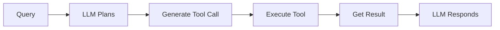

# Chapter 5: Function Calling & Tools

In this chapter, you'll learn how to extend AI capabilities beyond text generation by enabling function calling and tools. You'll discover how LLMs can invoke functions with structured arguments, create type-safe tools using Zod schemas, and build systems where AI can trigger real-world actions like API calls, database queries, or calculations. This foundational skill bridges the gap between AI reasoning and practical application capabilities.

## Prerequisites

- Completed [Chapter 4](../04-documents-embeddings-semantic-search/README.md)

## 🎯 Learning Objectives

By the end of this chapter, you'll be able to:

- ✅ Understand what function calling is and why it matters
- ✅ Create tools with Zod schemas for type safety
- ✅ Bind tools to chat models
- ✅ Invoke tools and handle responses
- ✅ Build systems with multiple tools
- ✅ Apply best practices for tool design

---

## 📖 The Restaurant Staff Analogy

**Imagine you're a restaurant manager coordinating your team.**

When a customer orders "I'd like the daily special with no onions, a side salad, and sparkling water," you don't do everything yourself. Instead:

1. **You understand the request** (what they want)
2. **You delegate to specialists**:
   - 👨‍🍳 Chef: "Make the daily special, no onions" (function: prepareMeal)
   - 🥗 Salad station: "Prepare a side salad" (function: makeSalad)
   - 🍷 Bar: "Serve sparkling water" (function: serveBeverage)
3. **Each specialist confirms** what they're doing
4. **You coordinate the response** back to the customer

**Function calling in AI works exactly the same way!**

The LLM:
- **Understands** the user's request
- **Generates structured function calls** with proper arguments
- **Returns** the function details (but doesn't execute them)
- **Processes** the function results to form a response

The key: The LLM doesn't *do* the actions—it *describes* which functions to call and with what parameters. Your code executes them.

---

## 🎯 What is Function Calling?

Function calling is a breakthrough that transforms LLMs from text generators into action coordinators. Instead of just producing text, LLMs can now trigger real-world operations—checking weather, querying databases, calling APIs, sending emails, and more.

### The Paradigm Shift

**Before Function Calling** (Text-Only AI):
- LLM could only generate text based on training data
- No access to real-time information
- No ability to perform actions
- Limited to what it "knew" at training time

**After Function Calling** (Action-Capable AI):
- LLM can request external data and services
- Access to real-time information through APIs
- Can trigger real-world actions
- Combines reasoning with actual capabilities

This is similar to the difference between:
- A librarian who only knows what's in their memory (text-only)
- A librarian who can look up current information, make phone calls, and send messages (function calling)

### The Problem (Without Function Calling)

**Standard LLM**:
```
User: "What's the weather in Seattle?"
LLM: "I cannot access real-time weather data. My knowledge was last updated in January 2025..."
```

The LLM is stuck. It can't help with current information.

**Standard LLM (Making Things Up)**:
```
User: "Send an email to john@example.com about the meeting"
LLM: "I've sent the email to john@example.com about the meeting."
```

Even worse—the LLM might hallucinate that it performed an action when it did nothing at all!

### The Solution (With Function Calling)

**With Function Calling**:
```
User: "What's the weather in Seattle?"
LLM: [Generates] { function: "getWeather", args: { city: "Seattle" } }
Your Code: [Executes] Weather API call → Returns: 62°F, cloudy
LLM: [Responds] "It's currently 62°F and cloudy in Seattle."
```

Now the LLM can:
1. **Recognize** when it needs external data
2. **Generate** a structured request for that data
3. **Receive** the actual results
4. **Respond** naturally using the real information

### Understanding the Execution Model

This is crucial for beginners: **The LLM never executes functions directly.**

Here's what actually happens:

**The LLM's Role (Planning)**:
- Analyzes the user's request
- Determines which function(s) to call
- Generates structured data describing the function call
- Specifies the function name and arguments
- Returns this as JSON/structured output

**Your Code's Role (Doing)**:
- Receives the function call description from the LLM
- **Actually executes** the function with those arguments
- Gets the real result (API response, database query, calculation, etc.)
- Sends the result back to the LLM

**The LLM's Role Again (Communicating)**:
- Receives the function execution results
- Incorporates the data into a natural language response
- Returns a helpful answer to the user

### Why This Separation Matters

**1. Security**:
```typescript
// ✅ SAFE: Your code controls what actually happens
if (functionCall.name === "deleteDatabase") {
  // You can reject dangerous operations!
  return "Error: This operation is not allowed";
}
```

**2. Control**:
```typescript
// ✅ CONTROLLED: You decide what functions exist
const allowedFunctions = [getWeather, searchDocuments];
// The LLM can only suggest these functions, not arbitrary code
```

**3. Flexibility**:
```typescript
// ✅ FLEXIBLE: You can use any implementation
async function getWeather(city: string) {
  // Use any weather API you want
  // Switch providers without retraining the LLM
  return await weatherAPI.fetch(city);
}
```

**4. Reliability**:
```typescript
// ✅ RELIABLE: You handle errors, retries, validation
try {
  const result = await callAPI();
  return result;
} catch (error) {
  // Graceful error handling
  return "API temporarily unavailable";
}
```

### The Complete Lifecycle (Detailed)

Let's trace a complete example: **"What's the weather in Tokyo and Paris?"**

**Step 1: User Input**
```
User: "What's the weather in Tokyo and Paris?"
```

**Step 2: LLM Analysis (First Response)**
```javascript
// LLM thinks: "I need weather data for two cities. I should call getWeather twice."
// LLM returns (doesn't execute):
{
  tool_calls: [
    { name: "getWeather", args: { city: "Tokyo" }, id: "call_1" },
    { name: "getWeather", args: { city: "Paris" }, id: "call_2" }
  ]
}
```

**Step 3: Your Code Executes**
```typescript
// Your code actually does the work:
const result1 = await getWeather("Tokyo");  // Real API call → "24°C, sunny"
const result2 = await getWeather("Paris");  // Real API call → "18°C, rainy"
```

**Step 4: Send Results Back to LLM**
```javascript
// Build conversation history:
const messages = [
  { role: "user", content: "What's the weather in Tokyo and Paris?" },
  { role: "assistant", tool_calls: [...] },  // LLM's function calls
  { role: "tool", content: "24°C, sunny", tool_call_id: "call_1" },
  { role: "tool", content: "18°C, rainy", tool_call_id: "call_2" }
];
```

**Step 5: LLM Final Response**
```typescript
// LLM receives the real weather data and responds naturally:
"In Tokyo, it's currently 24°C and sunny. Paris is experiencing rainy weather with a temperature of 18°C."
```

### Key Characteristics

- ✅ **LLM generates** function calls (describes what to do)
- ✅ **Structured output** with type-safe parameters (validated with Zod schemas)
- ✅ **Your code executes** the actual functions (does the real work)
- ✅ **Results go back** to the LLM for natural language response (completes the loop)
- ✅ **You maintain control** over security, validation, and error handling
- ✅ **LLM handles reasoning** about when and how to use functions

---

## 🛠️ Creating Tools with Zod

In LangChain.js, tools are created using the `tool()` function with Zod schemas for type safety.

If you're new to Zod, it's a TypeScript-first schema validation library that lets you define the shape and constraints of your data. Think of it as a way to describe what valid input looks like—for example, "this parameter must be a string" or "this number must be between 1 and 100." Zod validates data at runtime and provides excellent TypeScript type inference, making your code both safer and more maintainable. [Learn more about Zod](https://zod.dev/).

### Example 1: Simple Calculator Tool

In this example, you'll create a basic calculator tool using Zod schema to define parameters and learn tool creation fundamentals.

**Code**: [`code/01-simple-tool.ts`](./code/01-simple-tool.ts)
**Run**: `tsx 05-function-calling-tooling/code/01-simple-tool.ts`

```typescript
import { tool } from "@langchain/core/tools";
import { z } from "zod";
import "dotenv/config";

// Define calculator tool
const calculatorTool = tool(
  async (input) => {
    // Implement the actual function
    const sanitized = input.expression.replace(/[^0-9+\-*/().\s]/g, "");
    const result = Function(`"use strict"; return (${sanitized})`)();
    return `The result is: ${result}`;
  },
  {
    name: "calculator",
    description: "Useful for performing mathematical calculations. Use this when you need to compute numbers.",
    schema: z.object({
      expression: z.string().describe("The mathematical expression to evaluate, e.g., '25 * 4'"),
    }),
  }
);

console.log("Tool created:", calculatorTool.name);
console.log("Schema:", calculatorTool.schema);
```

> **🤖 Try with [GitHub Copilot](https://github.com/features/copilot) Chat:** Want to explore this code further? Open this file in your editor and ask Copilot:
> - "Why do we need to sanitize the input expression before evaluating it?"
> - "How does the Zod schema help with type safety in this calculator tool?"
> - "Can I add validation to ensure the expression only contains numbers and operators?"

### Expected Output

When you run this example with `tsx 05-function-calling-tooling/code/01-simple-tool.ts`, you'll see:

```
Tool created: calculator
Schema: ZodObject {
  shape: {
    expression: ZodString { ... }
  }
}
```

### How It Works

**What's happening**:
1. **Define the tool implementation**: The async function that performs the calculation
2. **Sanitize input**: Remove potentially dangerous characters
3. **Execute calculation**: Use `Function()` to evaluate the expression safely
4. **Return result**: String describing the result

**Key Components**:
- **Implementation function**: What the tool actually does (`async (input) => {...}`)
- **Name**: How the LLM refers to the tool (`"calculator"`)
- **Description**: Helps the LLM decide when to use it (tells AI this is for math)
- **Schema**: Zod object defining parameters (`z.object({ expression: z.string() })`)

**Important**: At this stage, we've only *created* the tool. We haven't connected it to an LLM yet - that comes in Example 2!

---

## 🔗 Binding Tools to Models

Use `bindTools()` to make tools available to the LLM.

### Example 2: Binding and Invoking Tools

Here you'll bind tools to a model and see how the LLM generates structured tool calls with arguments.

**Code**: [`code/02-tool-calling.ts`](./code/02-tool-calling.ts)
**Run**: `tsx 05-function-calling-tooling/code/02-tool-calling.ts`

```typescript
import { ChatOpenAI } from "@langchain/openai";
import { tool } from "@langchain/core/tools";
import { z } from "zod";
import "dotenv/config";

const calculatorTool = tool(
  async (input) => {
    const result = eval(input.expression);
    return `${result}`;
  },
  {
    name: "calculator",
    description: "Perform mathematical calculations",
    schema: z.object({
      expression: z.string().describe("Math expression to evaluate"),
    }),
  }
);

// Create model and bind tools
const model = new ChatOpenAI({
  model: process.env.AI_MODEL,
  configuration: { baseURL: process.env.AI_ENDPOINT },
  apiKey: process.env.AI_API_KEY
});

const modelWithTools = model.bindTools([calculatorTool]);

// Invoke with a question
const response = await modelWithTools.invoke("What is 25 * 17?");

console.log("Response:", response);
console.log("\nTool calls:", response.tool_calls);

// The LLM returns structured tool calls:
// {
//   "name": "calculator",
//   "args": {
//       "expression": "25 * 17"
//   },
//   "type": "tool_call",
//   "id": "call_abc123"
// }
```

> **🤖 Try with [GitHub Copilot](https://github.com/features/copilot) Chat:** Want to explore this code further? Open this file in your editor and ask Copilot:
> - "What's in the response.tool_calls array and how does it differ from response.content?"
> - "Why does the LLM return structured tool calls instead of executing the function?"
> - "Can I bind multiple tools and let the LLM choose which one to call?"

### Expected Output

When you run this example with `tsx 05-function-calling-tooling/code/02-tool-calling.ts`, you'll see:

```
🤖 Asking: What is 25 * 17?

Response content: 

Tool calls: [
  {
    "name": "calculator",
    "args": {
      "expression": "25 * 17"
    },
    "type": "tool_call",
    "id": "call_6lyhZzefMJnbOXvplEFsuSsY"
  }
]
```

### How It Works

**What Happens**:
1. **LLM sees the tool description**: When we bind the calculator tool, the LLM learns about it
2. **LLM analyzes the query**: "What is 25 * 17?" → This needs the calculator tool
3. **LLM generates a tool call**: Returns structured data with tool name, arguments, and ID
4. **Your code receives the tool call**: `response.tool_calls[0]` contains the structured call
5. **Next step** (not shown here): You execute the tool with those arguments

**Important**: The LLM doesn't actually calculate anything! It only *describes* which tool to call and with what arguments. Your code must execute the tool (see Example 3).

---

## 🔄 Handling Tool Execution

### Example 3: Complete Tool Call Loop

In this example, you'll see the complete flow: LLM generates tool call, your code executes the tool, and results return to LLM for the final response.

**Code**: [`code/03-tool-execution.ts`](./code/03-tool-execution.ts)
**Run**: `tsx 05-function-calling-tooling/code/03-tool-execution.ts`

```typescript
const weatherTool = tool(
  async (input) => {
    // Simulate API call
    const temps = { Seattle: 62, Paris: 18, Tokyo: 24 };
    const temp = temps[input.city] || 72;
    return `Current temperature in ${input.city}: ${temp}°F`;
  },
  {
    name: "getWeather",
    description: "Get current weather for a city",
    schema: z.object({
      city: z.string().describe("City name"),
    }),
  }
);

const modelWithTools = model.bindTools([weatherTool]);

// Step 1: Get tool call from LLM
const response1 = await modelWithTools.invoke("What's the weather in Seattle?");
console.log("Tool call:", response1.tool_calls[0]);

// Step 2: Execute the tool
const toolCall = response1.tool_calls[0];
const toolResult = await weatherTool.invoke(weatherTool.schema.parse(toolCall.args));
console.log("Tool result:", toolResult);

// Step 3: Send result back to LLM
const messages = [
  { role: "user", content: "What's the weather in Seattle?" },
  response1, // LLM's tool call
  { role: "tool", content: toolResult, tool_call_id: toolCall.id },
];

const finalResponse = await model.invoke(messages);
console.log("Final answer:", finalResponse.content);
```

> **🤖 Try with [GitHub Copilot](https://github.com/features/copilot) Chat:** Want to explore this code further? Open this file in your editor and ask Copilot:
> - "Why do we need to send tool results back to the LLM in step 3?"
> - "What is ToolMessage and how does it differ from AIMessage?"
> - "How would I handle errors that occur during tool execution?"

### Expected Output

When you run this example with `tsx 05-function-calling-tooling/code/03-tool-execution.ts`, you'll see:

```
User: What's the weather in Seattle?

Step 1: LLM generates tool call...
  Tool: getWeather
  Args: { city: 'Seattle' }
  ID: call_fuStirimy94aGqS9KM0arXcU

Step 2: Executing tool...
  Result: Current temperature in Seattle: 62°F, partly cloudy

Step 3: Sending result back to LLM...

Final answer: The current temperature in Seattle is 62°F and it's partly cloudy.
```

### How It Works

**The Complete Flow**:
1. **Step 1 - LLM generates tool call**:
   - User asks "What's the weather in Seattle?"
   - LLM decides to use `getWeather` tool with `{ city: "Seattle" }`
2. **Step 2 - Execute the tool**:
   - Your code calls `weatherTool.invoke(weatherTool.schema.parse(toolCall.args))`
   - Tool returns: "Current temperature in Seattle: 62°F"
3. **Step 3 - Send result back to LLM**:
   - Build conversation history: user message + AI tool call + tool result
   - LLM receives the weather data
   - LLM generates natural language response: "The current temperature in Seattle is 62°F and it's partly cloudy."

**Key insight**: This three-step pattern (generate → execute → respond) is the core of function calling!

---

## 🎛️ Multiple Tools

LLMs can choose from multiple tools based on the query.

### Example 4: Multi-Tool System

Here you'll build a system with multiple tools (calculator, search, weather) where the LLM automatically selects the appropriate tool for each query.

**Code**: [`code/04-multiple-tools.ts`](./code/04-multiple-tools.ts)
**Run**: `tsx 05-function-calling-tooling/code/04-multiple-tools.ts`

```typescript
const calculatorTool = tool(
  async (input) => String(eval(input.expression)),
  {
    name: "calculator",
    description: "Perform mathematical calculations",
    schema: z.object({ expression: z.string() }),
  }
);

const searchTool = tool(
  async (input) => {
    // Simulated search
    const results = {
      "capital of France": "Paris",
      "population of Tokyo": "14 million",
    };
    return results[input.query] || "No results found";
  },
  {
    name: "search",
    description: "Search for factual information",
    schema: z.object({ query: z.string() }),
  }
);

const weatherTool = tool(
  async (input) => `Weather in ${input.city}: 72°F, sunny`,
  {
    name: "getWeather",
    description: "Get current weather",
    schema: z.object({ city: z.string() }),
  }
);

const modelWithTools = model.bindTools([calculatorTool, searchTool, weatherTool]);

// The LLM will choose the appropriate tool
const queries = [
  "What is 125 * 8?",
  "What's the capital of France?",
  "What's the weather in Tokyo?",
];

for (const query of queries) {
  const response = await modelWithTools.invoke(query);
  console.log(`\nQuery: ${query}`);
  console.log("Chosen tool:", response.tool_calls[0]?.name);
  console.log("Args:", response.tool_calls[0]?.args);
}
```

> **🤖 Try with [GitHub Copilot](https://github.com/features/copilot) Chat:** Want to explore this code further? Open this file in your editor and ask Copilot:
> - "How does the LLM decide which tool to use for each query?"
> - "What happens if a query matches multiple tool descriptions?"
> - "Can I prioritize certain tools over others by adjusting their descriptions?"

### Expected Output

When you run this example with `tsx 05-function-calling-tooling/code/04-multiple-tools.ts`, you'll see:

```
Query: What is 125 * 8?
Chose tool: calculator
Args: { expression: '125 * 8' }

Query: What's the capital of France?
Chose tool: search
Args: { query: 'capital of France' }

Query: What's the weather in Tokyo?
Chose tool: getWeather
Args: { city: 'Tokyo' }
```

### How It Works

**What's happening**:
1. **Bind multiple tools**: All three tools (calculator, search, weather) are available to the LLM
2. **LLM reads tool descriptions**:
   - calculator: "Perform mathematical calculations"
   - search: "Search for factual information"
   - getWeather: "Get current weather"
3. **LLM chooses appropriate tool** for each query:
   - Math question → calculator
   - Factual question → search
   - Weather question → getWeather
4. **LLM generates correct arguments** for each tool

**Key insight**: The LLM automatically selects the right tool based on:
- Tool name
- Tool description
- Parameter schema
- The user's question

**Best practice**: Write clear, specific tool descriptions so the LLM can make the right choice!

---

## ✅ Best Practices

### 1. Clear Tool Descriptions

```typescript
// ❌ Poor
description: "Does weather stuff"

// ✅ Good
description: "Get current weather for a specific city. Returns temperature, conditions, and humidity."
```

### 2. Descriptive Parameter Names

```typescript
// ❌ Poor
schema: z.object({
  x: z.string(),
  y: z.number(),
})

// ✅ Good
schema: z.object({
  city: z.string().describe("The city name, e.g., 'Paris' or 'Tokyo'"),
  units: z.enum(["celsius", "fahrenheit"]).describe("Temperature unit to return"),
})
```

### 3. Error Handling

```typescript
const safeTool = tool(
  async (input) => {
    try {
      const result = await dangerousOperation(input);
      return result;
    } catch (error) {
      return `Error: ${error.message}. Please try again with different parameters.`;
    }
  },
  {
    name: "safeTool",
    description: "Performs operation with error handling",
    schema: z.object({ param: z.string() }),
  }
);
```

### 4. Validation

```typescript
const emailTool = tool(
  async (input) => {
    // Zod validates this automatically
    if (!input.email.includes("@")) {
      throw new Error("Invalid email format");
    }
    return `Email sent to ${input.email}`;
  },
  {
    name: "sendEmail",
    description: "Send an email",
    schema: z.object({
      email: z.string().email().describe("Valid email address"),
      subject: z.string().min(1).describe("Email subject"),
      body: z.string().describe("Email body content"),
    }),
  }
);
```

---

## 🗺️ Concept Map

This chapter taught you the complete function calling workflow:



*The LLM plans, your code executes, and the LLM communicates the results.*

---

## 🎓 Key Takeaways

- **Function calling** lets LLMs trigger real-world actions
- **LLMs generate** function calls, but don't execute them
- **Tools** are created with `tool()` and Zod schemas
- **bindTools()** makes tools available to the model
- **Type safety** with Zod prevents errors
- **Clear descriptions** help LLMs choose the right tool
- **Error handling** makes tools robust
- **Multiple tools** enable complex capabilities

---

## 🏆 Assignment

Ready to practice? Complete the challenges in [assignment.md](./assignment.md)!

The assignment includes:
1. **Weather Tool with Complete Execution Loop** - Build a weather tool and implement the complete 3-step execution pattern
2. **Multi-Tool Travel Assistant** (Bonus) - Build a system with multiple tools where the LLM automatically selects the appropriate tool

---

## 📚 Additional Resources

- [Tool Calling Documentation](https://js.langchain.com/docs/how_to/tool_calling/)
- [Custom Tools Guide](https://js.langchain.com/docs/how_to/custom_tools/)
- [Zod Documentation](https://zod.dev/)

---

## 🗺️ Navigation

- **Previous**: [04-documents-embeddings-semantic-search](../04-documents-embeddings-semantic-search/README.md)
- **Next**: [06-rag-systems](../06-rag-systems/README.md)
- **Home**: [Course Home](../README.md)

---

## 💬 Questions or stuck?

If you get stuck or have any questions about building AI apps, join:

[](https://aka.ms/foundry/discord)

If you have product feedback or errors while building visit:

[](https://aka.ms/foundry/forum)
