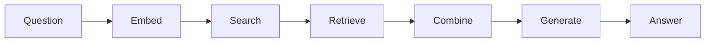

# Chapter 6: Building RAG Systems

In this chapter, you'll learn to build RAG (Retrieval Augmented Generation) systems that combine document retrieval with AI generation to answer questions accurately using your own data. You'll learn the RAG architecture and explore different retrieval strategies that can be used. RAG systems can be used in AI applications to provide accurate, sourced answers from custom knowledge bases.

## Prerequisites

- Completed [Chapter 5](../05-function-calling-tools/README.md)

## 🎯 Learning Objectives

By the end of this chapter, you'll be able to:

- ✅ Understand the RAG (Retrieval Augmented Generation) architecture
- ✅ Build a question-answering system over custom documents
- ✅ Implement different retrieval strategies
- ✅ Handle context and citations properly

---

## 📖 The Open-Book Exam Analogy

**Imagine two types of exams:**

**Closed-Book Exam (Standard LLM)**:
- ❌ Student relies only on memorized knowledge
- ❌ Can't look up specific facts
- ❌ May give wrong answers confidently
- ❌ Knowledge cutoff (stops learning at training time)

**Open-Book Exam (RAG System)**:

- Student can reference textbook during exam
- Looks up exact information as needed
- Combines knowledge with current resources
- More accurate, can cite sources

**RAG = Retrieval Augmented Generation**

Instead of relying solely on the LLM's training, RAG:
1. **Retrieves** relevant documents from your database
2. **Augments** the prompt with that context
3. **Generates** an answer based on both

---

## 🏗️ RAG Architecture

```
User Question
    ↓
Convert to Embedding
    ↓
Search Vector Store (find relevant docs)
    ↓
Retrieved Documents + Question → LLM
    ↓
Answer with Citations
```

### Why RAG?

RAG solves a fundamental problem: **How do you give an LLM access to information it wasn't trained on?**

### When to Use RAG vs Fine-Tuning vs Prompt Engineering

**Quick Decision Tree**:

1. **Does it fit in a prompt?** → Prompt Engineering
2. **Adding information or changing behavior?** → RAG or Fine-Tuning
3. **Updates frequently?** → RAG
4. **Need citations?** → RAG

#### Prompt Engineering
- **Use when**: Small data (< 8K tokens), static content
- **Example**: FAQ bot with 20 questions
- **Limitations**: Can't handle large datasets or search

#### RAG (Retrieval Augmented Generation)
- **Use when**: Large knowledge base, frequent updates, need citations
- **Example**: Customer support with 10,000 product manuals
- **Benefits**: Scalable, up-to-date, cost-effective, provides source attribution
- **Limitations**: Retrieval quality matters, adds latency

#### Fine-Tuning
- **Use when**: Teaching new patterns, changing behavior/style
- **Example**: Code generation in company-specific style
- **Limitations**: Expensive, time-consuming, static knowledge

**For most use cases involving large document collections, RAG is the right choice.**

---

## 💻 Building Your First RAG System

Before we build a RAG system, let's make sure RAG is the right choice! Let's see the decision framework in action.

### Example 1: Choosing the Right Approach (RAG vs Alternatives)

This example demonstrates the decision framework we just learned—comparing Prompt Engineering, RAG, and Fine-Tuning side by side to understand when each approach makes sense.

**Code**: [`code/01-when-to-use-rag.ts`](./code/01-when-to-use-rag.ts)
**Run**: `tsx 06-rag-systems/code/01-when-to-use-rag.ts`

This demo shows three real-world scenarios:

1. **Scenario 1: Small FAQ Bot** → Uses **Prompt Engineering** (5 Q&As fit in prompt)
2. **Scenario 2: Large Documentation Bot** → Uses **RAG** (1000s of docs, needs search)
3. **Scenario 3: Code Style Enforcer** → Uses **Fine-Tuning** (teaching patterns, not facts)

```typescript
import { ChatOpenAI } from "@langchain/openai";
import { OpenAIEmbeddings } from "@langchain/openai";
import { MemoryVectorStore } from "langchain/vectorstores/memory";
import { Document } from "langchain/document";
import { ChatPromptTemplate } from "@langchain/core/prompts";
import { createStuffDocumentsChain } from "langchain/chains/combine_documents";
import { createRetrievalChain } from "langchain/chains/retrieval";
import "dotenv/config";

async function main() {
  console.log("🎯 When to Use RAG: Decision Framework Demo\n");
  console.log("=".repeat(80) + "\n");

  const model = new ChatOpenAI({
    model: process.env.AI_MODEL,
    configuration: { baseURL: process.env.AI_ENDPOINT },
    apiKey: process.env.AI_API_KEY
  });

  // Scenario 1: Small FAQ (Prompt Engineering)
  console.log("📋 SCENARIO 1: Small FAQ Bot");
  console.log("─".repeat(80));
  console.log("\nProblem: Answer 5 common questions about a product");
  console.log("Data size: 5 questions/answers (fits easily in prompt)");
  console.log("Update frequency: Rarely changes");
  console.log("\n✅ BEST APPROACH: Prompt Engineering\n");

  const faqContext = `
Product FAQ:
Q: What is the return policy?
A: 30-day money-back guarantee, no questions asked.

Q: How long is shipping?
A: 2-3 business days for standard, 1 day for express.

Q: Is there a warranty?
A: Yes, 1-year manufacturer warranty on all products.

Q: Do you ship internationally?
A: Yes, we ship to over 100 countries worldwide.

Q: What payment methods do you accept?
A: We accept all major credit cards, PayPal, and Apple Pay.
`;

  const faqPrompt = ChatPromptTemplate.fromMessages([
    ["system", "You are a helpful customer service assistant. Answer questions based on this FAQ:\n\n{context}"],
    ["human", "{question}"],
  ]);

  const faqChain = faqPrompt.pipe(model);

  const faqQuestion = "What's your return policy?";
  console.log(`Question: "${faqQuestion}"\n`);

  const faqResponse = await faqChain.invoke({
    context: faqContext,
    question: faqQuestion,
  });

  console.log("Answer:", faqResponse.content);

  console.log("\n💡 Why Prompt Engineering works here:");
  console.log("   • Small dataset (5 Q&As) fits easily in prompt");
  console.log("   • No search needed - all context is relevant");
  console.log("   • Simple to maintain - just update the string");
  console.log("   • Fast and cost-effective");

  console.log("\n" + "=".repeat(80) + "\n");

  // Scenario 2: Large Knowledge Base (RAG)
  console.log("📚 SCENARIO 2: Company Documentation Bot");
  console.log("─".repeat(80));
  console.log("\nProblem: Answer questions from 1,000+ documentation pages");
  console.log("Data size: Too large to fit in prompt (exceeds context window)");
  console.log("Update frequency: Documentation changes frequently");
  console.log("\n✅ BEST APPROACH: RAG (Retrieval Augmented Generation)\n");

  // Simulate a large knowledge base
  const docs = [
    new Document({
      pageContent: "The API authentication uses OAuth 2.0 with bearer tokens. Tokens expire after 24 hours.",
      metadata: { source: "api-auth.md", category: "API" },
    }),
    new Document({
      pageContent: "API rate limiting is 100 requests per minute per user. Exceeding this returns a 429 status code.",
      metadata: { source: "api-limits.md", category: "API" },
    }),
    // ... (abbreviated for brevity - see full code file)
  ];

  console.log("Creating vector store from documents...");
  const embeddings = new OpenAIEmbeddings({
    model: process.env.AI_EMBEDDING_MODEL,
    configuration: { baseURL: process.env.AI_ENDPOINT },
    apiKey: process.env.AI_API_KEY
  });

  const vectorStore = await MemoryVectorStore.fromDocuments(docs, embeddings);
  const retriever = vectorStore.asRetriever({ k: 2 });

  const ragPrompt = ChatPromptTemplate.fromMessages([
    ["system", "You are a helpful documentation assistant. Answer questions based on the following context:\n\n{context}"],
    ["human", "{input}"],
  ]);

  const combineDocsChain = await createStuffDocumentsChain({
    llm: model,
    prompt: ragPrompt,
  });

  const ragChain = await createRetrievalChain({
    retriever,
    combineDocsChain,
  });

  const ragQuestion = "How does API authentication work?";
  console.log(`\nQuestion: "${ragQuestion}"\n`);

  const ragResponse = await ragChain.invoke({
    input: ragQuestion,
  });

  console.log("Answer:", ragResponse.answer);
  console.log("\nRetrieved documents:");
  ragResponse.context.forEach((doc: Document, i: number) => {
    console.log(`  ${i + 1}. [${doc.metadata.source}] ${doc.pageContent.substring(0, 80)}...`);
  });

  console.log("\n💡 Why RAG works here:");
  console.log("   • Large dataset (1000s of docs) - can't fit in prompt");
  console.log("   • Search capability - finds relevant 2 docs out of thousands");
  console.log("   • Easy to update - just add/remove documents from vector store");
  console.log("   • Source attribution - know which docs were used");
  console.log("   • Scalable - works with millions of documents");
}

main().catch(console.error);
```

> **🤖 Try with [GitHub Copilot](https://github.com/features/copilot) Chat:** Want to explore this code further? Open this file in your editor and ask Copilot:
> - "How do I decide between RAG and fine-tuning for my specific use case?"
> - "What are the cost implications of using RAG vs prompt engineering?"
> - "Can I combine RAG with fine-tuning for the best of both approaches?"

### Expected Output

When you run this example with `tsx 06-rag-systems/code/01-when-to-use-rag.ts`, you'll see:

```
🎯 When to Use RAG: Decision Framework Demo
==================================================================================

📋 SCENARIO 1: Small FAQ Bot
────────────────────────────────────────────────────────────────────────────────

Problem: Answer 5 common questions about a product
Data size: 5 questions/answers (fits easily in prompt)
Update frequency: Rarely changes

✅ BEST APPROACH: Prompt Engineering

Question: "What's your return policy?"

Answer: We offer a 30-day money-back guarantee with no questions asked.

💡 Why Prompt Engineering works here:
   • Small dataset (5 Q&As) fits easily in prompt
   • No search needed - all context is relevant
   • Simple to maintain - just update the string
   • Fast and cost-effective

==================================================================================

📚 SCENARIO 2: Company Documentation Bot
────────────────────────────────────────────────────────────────────────────────

Problem: Answer questions from 1,000+ documentation pages
Data size: Too large to fit in prompt (exceeds context window)
Update frequency: Documentation changes frequently

✅ BEST APPROACH: RAG (Retrieval Augmented Generation)

Creating vector store from documents...

Question: "How does API authentication work?"

Answer: The API uses OAuth 2.0 authentication with bearer tokens. These tokens expire
after 24 hours and are subject to rate limiting of 100 requests per minute per user.

Retrieved documents:
  1. [api-auth.md] The API authentication uses OAuth 2.0 with bearer tokens...
  2. [api-limits.md] API rate limiting is 100 requests per minute per user...

💡 Why RAG works here:
   • Large dataset (1000s of docs) - can't fit in prompt
   • Search capability - finds relevant 2 docs out of thousands
   • Easy to update - just add/remove documents from vector store
   • Source attribution - know which docs were used
   • Scalable - works with millions of documents
```

### How It Works

This example demonstrates the **decision framework** from our enhanced conceptual content:

1. **Step 1: Data Size Check**
   - Scenario 1: < 8K tokens → Prompt Engineering
   - Scenario 2: > 8K tokens → RAG or Fine-Tuning

2. **Step 2: Goal Check**
   - Scenario 1 & 2: Add information → RAG or Prompt Engineering
   - Scenario 3: Change behavior → Fine-Tuning

3. **Step 3: Update Frequency**
   - Scenario 1: Rarely → Prompt Engineering works
   - Scenario 2: Frequently → Definitely RAG

4. **Step 4: Source Attribution**
   - Scenario 2: Need citations → RAG

**Key Insight**: The same code demonstrates why RAG is powerful—it scales to millions of documents while providing source attribution, something prompt engineering and fine-tuning can't do.

---

### Example 2: Simple RAG

In this example, you'll build a complete RAG system that retrieves relevant documents from a vector store and uses them to answer questions accurately.

**Code**: [`code/02-simple-rag.ts`](./code/02-simple-rag.ts)
**Run**: `tsx 06-rag-systems/code/02-simple-rag.ts`

```typescript
import { ChatOpenAI } from "@langchain/openai";
import { OpenAIEmbeddings } from "@langchain/openai";
import { MemoryVectorStore } from "langchain/vectorstores/memory";
import { Document } from "langchain/document";
import { ChatPromptTemplate } from "@langchain/core/prompts";
import { createStuffDocumentsChain } from "langchain/chains/combine_documents";
import { createRetrievalChain } from "langchain/chains/retrieval";
import "dotenv/config";

// Setup
const model = new ChatOpenAI({
  model: process.env.AI_MODEL,
  configuration: { baseURL: process.env.AI_ENDPOINT },
  apiKey: process.env.AI_API_KEY
});

const embeddings = new OpenAIEmbeddings({
  model: process.env.AI_EMBEDDING_MODEL,
  configuration: { baseURL: process.env.AI_ENDPOINT },
  apiKey: process.env.AI_API_KEY
});

// Create knowledge base
const docs = [
  new Document({
    pageContent: "LangChain.js was released in 2023 and is a JavaScript port of the Python LangChain library.",
  }),
  new Document({
    pageContent: "RAG systems combine retrieval with generation to provide accurate, sourced answers.",
  }),
];

// Create vector store
const vectorStore = await MemoryVectorStore.fromDocuments(docs, embeddings);

// Create retriever
const retriever = vectorStore.asRetriever({ k: 2 });

// Create prompt
const prompt = ChatPromptTemplate.fromMessages([
  ["system", "Answer based on the following context:\n\n{context}"],
  ["human", "{input}"],
]);

// Create RAG chain
const combineDocsChain = await createStuffDocumentsChain({ llm: model, prompt });
const ragChain = await createRetrievalChain({ retriever, combineDocsChain });

// Ask questions
const response = await ragChain.invoke({
  input: "When was LangChain.js released?",
});

console.log("Answer:", response.answer);
console.log("Source docs:", response.context.length);
```

> **🤖 Try with [GitHub Copilot](https://github.com/features/copilot) Chat:** Want to explore this code further? Open this file in your editor and ask Copilot:
> - "What does createRetrievalChain do and how does it combine retrieval with generation?"
> - "How can I customize the number of documents retrieved with the k parameter?"
> - "What's the difference between createStuffDocumentsChain and other document chain types?"

### Expected Output

When you run this example with `tsx 06-rag-systems/code/02-simple-rag.ts`, you'll see:

```
Answer: LangChain.js was released in 2022.
Source docs: 2
```

### How It Works

**The RAG Flow**:
1. **Create knowledge base**: Two documents about LangChain.js and RAG
2. **Embed documents**: Convert documents to vectors and store in MemoryVectorStore
3. **User asks question**: "When was LangChain.js released?"
4. **Retrieve**: Retriever finds the 2 most relevant documents
5. **Generate**: LLM receives context + question and generates answer
6. **Result**: Accurate answer based on the retrieved documents

**Key components**:
- `createRetrievalChain`: Combines retrieval + generation
- `createStuffDocumentsChain`: "Stuffs" retrieved docs into the prompt
- `response.answer`: The AI's answer
- `response.context`: The retrieved documents used

**Why it works**: The LLM has access to specific information (2022 release date) that it wouldn't know from training alone!

---

## 🎯 Retrieval Strategies

### 1. Similarity Search (Default)

```typescript
const retriever = vectorStore.asRetriever({ k: 4 });
```

### 2. MMR (Maximum Marginal Relevance)

Balances relevance with diversity:

```typescript
const retriever = vectorStore.asRetriever({
  searchType: "mmr",
  searchKwargs: { fetchK: 20, lambda: 0.5 },
});
```

### 3. Similarity with Score Threshold

Only return docs above a similarity score:

```typescript
const retriever = vectorStore.asRetriever({
  searchType: "similarity_score_threshold",
  searchKwargs: { scoreThreshold: 0.8 },
});
```

---

## 🔬 Advanced RAG Patterns (Optional)

Once you've mastered basic RAG, explore these advanced patterns:

- **Multi-Query RAG**: Generate multiple search queries for better retrieval
- **Contextual Compression**: Compress retrieved docs to include only relevant parts
- **Hybrid Search**: Combine semantic search with keyword search

See the [LangChain.js documentation](https://js.langchain.com/docs/modules/data_connection/retrievers/) for implementation details.

---

## 🗺️ Concept Map

This chapter taught you how to build RAG systems:



*RAG retrieves relevant context, then generates accurate answers with citations.*

---

## 🎓 Key Takeaways

- ✅ **RAG = Retrieval + Generation**: Find relevant docs, then generate answers
- ✅ **Multiple retrieval strategies**: Similarity, MMR, score threshold
- ✅ **Source attribution**: Know where answers come from
- ✅ **No fine-tuning needed**: Works with any documents
- ✅ **Scalable architecture**: Works with millions of documents

---

## 🏆 Assignment

Ready to practice? Complete the challenges in [assignment.md](./assignment.md)!

The assignment includes:
1. **Personal Knowledge Base Q&A** - Build a RAG system over your own documents
2. **Conversational RAG** (Bonus) - Build a RAG system that maintains conversation history

---

## 📚 Additional Resources

- [RAG Documentation](https://js.langchain.com/docs/tutorials/rag)
- [Retrieval Strategies](https://js.langchain.com/docs/modules/data_connection/retrievers/)

**💡 Want more examples?** Check out the [`samples/`](./samples/) folder for additional code examples including multi-source RAG, citation generation, and hybrid search techniques!

---

## 🗺️ Navigation

- **Previous**: [05-function-calling-tools](../05-function-calling-tools/README.md)
- **Next**: [07-agents-mcp](../07-agents-mcp/README.md)
- **Home**: [Course Home](../README.md)

---

## 💬 Questions or stuck?

If you get stuck or have any questions about building AI apps, join:

[](https://aka.ms/foundry/discord)

If you have product feedback or errors while building visit:

[](https://aka.ms/foundry/forum)
