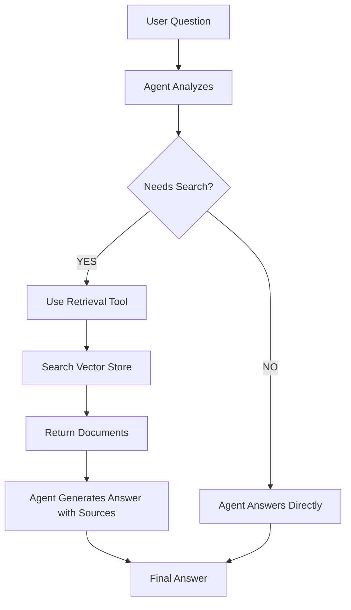

# Chapter 7: Building Agentic RAG Systems

In this chapter, you'll learn to build **Agentic RAG** systems where AI agents intelligently decide when and how to search your documents to answer questions. Unlike traditional RAG that always searches regardless of need, agentic RAG gives your AI the autonomy to determine whether retrieval is necessary—answering directly when it has the knowledge, or searching your documents when additional context is needed.

You'll combine everything you've learned to build intelligent question-answering systems that provide accurate, sourced answers from custom knowledge bases. You'll continue using:

- Tools from [Chapter 4: Function Calling & Tools](../04-function-calling-tools/README.md)
- Agents from [Chapter 5: Getting Started with Agents & MCP](../05-agents-mcp/README.md)
- Document retrieval from [Chapter 6: Documents, Embeddings & Semantic Search](../06-documents-embeddings-semantic-search/README.md)

## Prerequisites

- Completed [Chapter 4: Function Calling & Tools](../04-function-calling-tools/README.md)
- Completed [Chapter 5: Getting Started with Agents & MCP](../05-agents-mcp/README.md)
- Completed [Chapter 6: Documents, Embeddings & Semantic Search](../06-documents-embeddings-semantic-search/README.md)

## 🎯 Learning Objectives

By the end of this chapter, you'll be able to:

- ✅ Understand the difference between Agentic RAG and Traditional RAG
- ✅ Build agents that decide when to search vs answer directly
- ✅ Create retrieval tools from vector stores
- ✅ Implement intelligent document search with agent decision-making
- ✅ Handle context and citations in agentic systems
- ✅ Apply the decision framework (RAG vs Prompt Engineering)

---

## 📖 The Smart Student Analogy

**Imagine three types of students taking an exam:**

**Closed-Book Exam (Standard LLM)**:
- ❌ Student relies only on memorized knowledge
- ❌ Can't look up specific facts
- ❌ May give wrong answers confidently
- ❌ Knowledge cutoff (stops learning at training time)

**Open-Book Exam with No Strategy (Traditional RAG)**:
- ✅ Student can reference textbook during exam
- ❌ Looks up the textbook for EVERY question, even "What is 2+2?"
- ❌ Wastes time searching when they already know the answer
- ✅ More accurate, can cite sources
- ❌ Slower and more expensive due to unnecessary searches

**Smart Open-Book Exam (Agentic RAG)**:
- ✅ Student can reference textbook during exam
- ✅ **Decides** when to look things up vs answering from knowledge
- ✅ "What is 2+2?" → Answers directly (no search needed)
- ✅ "What was our company's Q3 revenue?" → Searches documents
- ✅ Fast for simple questions, thorough for complex ones
- ✅ More accurate, can cite sources when needed

**This is the power of Agentic RAG!** The agent makes intelligent decisions about when retrieval is necessary.

---

## 🤖 Agentic RAG vs Traditional RAG

### The Key Difference

**Traditional RAG**:
```
User Question → ALWAYS Search → Retrieve Docs → Generate Answer
```
Every question triggers a search, even if the agent already knows the answer.

**Agentic RAG**:
```
User Question → Agent Decides → Search if needed → Generate Answer
                     ↓
              Answer directly if possible
```
The agent uses reasoning to determine whether retrieval is necessary.

### Example: The Difference in Action

**Question 1**: "What is 2 + 2?"

**Traditional RAG**:
1. Searches vector store for "2 + 2"
2. Retrieves irrelevant documents
3. Answers: "4" (wasted a search)

**Agentic RAG**:
1. Agent thinks: "This is basic math, I don't need to search"
2. Answers immediately: "4" (no unnecessary search)

**Question 2**: "What was our company's revenue in Q3 2024?"

**Traditional RAG**:
1. Searches vector store
2. Retrieves relevant financial documents
3. Answers: "$1.2M" (good use of search)

**Agentic RAG**:
1. Agent thinks: "I need specific company data, I should search"
2. Uses retrieval tool to find financial documents
3. Answers: "$1.2M based on Q3 financial report" (same good result)

### Benefits of Agentic RAG

| Benefit | Traditional RAG | Agentic RAG |
|---------|-----------------|-------------|
| **Efficiency** | Searches every time | Only searches when needed |
| **Speed** | Slow for simple questions | Fast for simple, thorough for complex |
| **Cost** | Embedding + search cost on every query | Lower cost - searches only when necessary |
| **Intelligence** | Rigid, predictable | Adaptive, makes decisions |
| **Complexity** | Simple pipeline | Requires agent loop |

### When to Use Each Approach

**Use Traditional RAG when**:
- Every question requires searching your documents
- Example: "Search our legal database for cases about X"
- You want predictable, simple behavior

**Use Agentic RAG when**:
- Questions mix general knowledge and custom data
- Example: "What is the capital of France and what's our Paris office address?"
  - Agent answers capital from general knowledge (Paris)
  - Agent searches documents for office address
- You want optimal performance and cost

**For most applications, Agentic RAG is the better choice** because it combines flexibility with efficiency.

---

## 🏗️ Agentic RAG Architecture

```
User Question
    ↓
Agent Analyzes Question
    ↓
    ├─→ [Needs Search?] YES → Use Retrieval Tool
    │                            ↓
    │                        Convert Query to Embedding
    │                            ↓
    │                        Search Vector Store
    │                            ↓
    │                        Retrieved Documents → Agent
    │                            ↓
    │                        Agent Generates Answer (with citations)
    │
    └─→ [Needs Search?] NO  → Agent Answers Directly
                                (using general knowledge)
```

**Key Components**:
1. **Agent**: Makes decisions about when to search
2. **Retrieval Tool**: Searches the vector store when needed
3. **Vector Store**: Contains your document embeddings
4. **Intelligent Decision**: Agent decides search vs direct answer

### Why Agentic RAG?

Agentic RAG solves two fundamental problems:

1. **How do you give an LLM access to information it wasn't trained on?**
   - Answer: Provide a retrieval tool that searches your documents

2. **How do you avoid unnecessary searches when the LLM already knows the answer?**
   - Answer: Let the agent decide when retrieval is needed

### When to Use RAG vs Prompt Engineering

**Quick Decision Tree**:

1. **Does it fit in a prompt?** → Use Prompt Engineering
2. **Large knowledge base that doesn't fit?** → Use RAG
3. **Updates frequently?** → Use RAG
4. **Need source citations?** → Use RAG

#### Prompt Engineering
- **Use when**: Small data (< 8K tokens), static content
- **Example**: FAQ bot with 20 questions
- **Benefits**: Simple, fast, no additional infrastructure
- **Limitations**: Can't handle large datasets, no search capability

#### RAG (Retrieval Augmented Generation)
- **Use when**: Large knowledge base, frequent updates, need citations
- **Example**: Customer support with 10,000 product manuals
- **Benefits**: Scalable, up-to-date, cost-effective, provides source attribution
- **Limitations**: Requires vector store setup, adds latency, retrieval quality matters

**For most use cases involving document collections, RAG is the right choice because it scales beyond prompt limits and provides accurate, cited information.**

---

## 💻 Building Your First RAG System

Before we build a RAG system, let's make sure RAG is the right choice! Let's see the decision framework in action.

### Example 1: Choosing the Right Approach (RAG vs Alternatives)

This example demonstrates the decision framework we just learned, comparing Prompt Engineering and RAG side by side to understand when each approach makes sense.

**Code**: [`code/01-when-to-use-rag.ts`](./code/01-when-to-use-rag.ts)
**Run**: `tsx 07-agentic-rag-systems/code/01-when-to-use-rag.ts`

This demo shows two real-world scenarios:

1. **Scenario 1: Small FAQ Bot** → Uses **Prompt Engineering** (5 Q&As fit in prompt)
2. **Scenario 2: Large Documentation Bot** → Uses **Agentic RAG** (1000s of docs, agent decides when to search)

```typescript
import { ChatOpenAI } from "@langchain/openai";
import { OpenAIEmbeddings } from "@langchain/openai";
import { MemoryVectorStore } from "@langchain/classic/vectorstores/memory";
import { Document } from "@langchain/core/documents";
import { ChatPromptTemplate } from "@langchain/core/prompts";
import { createAgent, HumanMessage, tool } from "langchain";
import * as z from "zod";
import "dotenv/config";

async function main() {
  console.log("🎯 When to Use RAG: Decision Framework Demo\n");
  console.log("=".repeat(80) + "\n");

  const model = new ChatOpenAI({
    model: process.env.AI_MODEL,
    configuration: { baseURL: process.env.AI_ENDPOINT },
    apiKey: process.env.AI_API_KEY
  });

  // Scenario 1: Small FAQ (Prompt Engineering)
  console.log("📋 SCENARIO 1: Small FAQ Bot");
  console.log("─".repeat(80));
  console.log("\nProblem: Answer 5 common questions about a product");
  console.log("Data size: 5 questions/answers (fits easily in prompt)");
  console.log("Update frequency: Rarely changes");
  console.log("\n✅ BEST APPROACH: Prompt Engineering\n");

  const faqContext = `
Product FAQ:
Q: What is the return policy?
A: 30-day money-back guarantee, no questions asked.

Q: How long is shipping?
A: 2-3 business days for standard, 1 day for express.

Q: Is there a warranty?
A: Yes, 1-year manufacturer warranty on all products.

Q: Do you ship internationally?
A: Yes, we ship to over 100 countries worldwide.

Q: What payment methods do you accept?
A: We accept all major credit cards, PayPal, and Apple Pay.
`;

  const faqPrompt = ChatPromptTemplate.fromMessages([
    ["system", "You are a helpful customer service assistant. Answer questions based on this FAQ:\n\n{context}"],
    ["human", "{question}"],
  ]);

  const faqChain = faqPrompt.pipe(model);

  const faqQuestion = "What's your return policy?";
  console.log(`Question: "${faqQuestion}"\n`);

  const faqResponse = await faqChain.invoke({
    context: faqContext,
    question: faqQuestion,
  });

  console.log("Answer:", faqResponse.content);

  console.log("\n💡 Why Prompt Engineering works here:");
  console.log("   • Small dataset (5 Q&As) fits easily in prompt");
  console.log("   • No search needed - all context is relevant");
  console.log("   • Simple to maintain - just update the string");
  console.log("   • Fast and cost-effective");

  console.log("\n" + "=".repeat(80) + "\n");

  // Scenario 2: Large Knowledge Base (Agentic RAG)
  console.log("📚 SCENARIO 2: Company Documentation Bot");
  console.log("─".repeat(80));
  console.log("\nProblem: Answer questions from 1,000+ documentation pages");
  console.log("Data size: Too large to fit in prompt (exceeds context window)");
  console.log("Update frequency: Documentation changes frequently");
  console.log("\n✅ BEST APPROACH: Agentic RAG (Agent + Retrieval Tool)\n");

  // Simulate a large knowledge base
  const docs = [
    new Document({
      pageContent: "The API authentication uses OAuth 2.0 with bearer tokens. Tokens expire after 24 hours.",
      metadata: { source: "api-auth.md", category: "API" },
    }),
    new Document({
      pageContent: "API rate limiting is 100 requests per minute per user. Exceeding this returns a 429 status code.",
      metadata: { source: "api-limits.md", category: "API" },
    }),
    // ... (abbreviated for brevity - see full code file)
  ];

  console.log("Creating vector store from documents...");
  const embeddings = new OpenAIEmbeddings({
    model: process.env.AI_EMBEDDING_MODEL,
    configuration: { baseURL: process.env.AI_ENDPOINT },
    apiKey: process.env.AI_API_KEY
  });

  const vectorStore = await MemoryVectorStore.fromDocuments(docs, embeddings);

  // Create retrieval tool from vector store
  const retrievalTool = tool(
    async (input) => {
      const results = await vectorStore.similaritySearch(input.query, 2);
      return results
        .map((doc, i) => `[${doc.metadata.source}]: ${doc.pageContent}`)
        .join("\n\n");
    },
    {
      name: "searchDocs",
      description: "Search company documentation for technical information about APIs, authentication, rate limits, etc.",
      schema: z.object({
        query: z.string().describe("The search query")
      })
    }
  );

  // Create agent with retrieval tool
  const agent = createAgent({
    model,
    tools: [retrievalTool]
  });

  const ragQuestion = "How does API authentication work?";
  console.log(`\nQuestion: "${ragQuestion}"\n`);

  const ragResponse = await agent.invoke({
    messages: [new HumanMessage(ragQuestion)]
  });

  const lastMessage = ragResponse.messages[ragResponse.messages.length - 1];
  console.log("Answer:", lastMessage.content);

  // Check if retrieval tool was used
  const toolUse = ragResponse.messages.find(msg => msg.tool_calls?.length > 0);
  if (toolUse) {
    console.log("\n✅ Agent decided to search documents");
    console.log("   Retrieved relevant documentation about OAuth 2.0 and bearer tokens");
  }

  console.log("\n💡 Why Agentic RAG works here:");
  console.log("   • Large dataset (1000s of docs) - can't fit in prompt");
  console.log("   • Agent decides when to search vs answer directly");
  console.log("   • Search capability - finds relevant 2 docs out of thousands");
  console.log("   • Easy to update - just add/remove documents from vector store");
  console.log("   • Source attribution - know which docs were used");
  console.log("   • Scalable - works with millions of documents");
  console.log("   • Intelligent - only searches when necessary");
}

main().catch(console.error);
```

> **🤖 Try with [GitHub Copilot](https://github.com/features/copilot) Chat:** Want to explore this code further? Open this file in your editor and ask Copilot:
> - "What are the cost implications of using RAG vs prompt engineering?"
> - "How does agent decision-making improve efficiency in agentic RAG?"
> - "What factors should I consider when choosing between RAG and prompt engineering?"

### Expected Output

When you run this example with `tsx 07-agentic-rag-systems/code/01-when-to-use-rag.ts`, you'll see:

```
🎯 When to Use RAG: Decision Framework Demo
==================================================================================

📋 SCENARIO 1: Small FAQ Bot
────────────────────────────────────────────────────────────────────────────────

Problem: Answer 5 common questions about a product
Data size: 5 questions/answers (fits easily in prompt)
Update frequency: Rarely changes

✅ BEST APPROACH: Prompt Engineering

Question: "What's your return policy?"

Answer: We offer a 30-day money-back guarantee with no questions asked.

💡 Why Prompt Engineering works here:
   • Small dataset (5 Q&As) fits easily in prompt
   • No search needed - all context is relevant
   • Simple to maintain - just update the string
   • Fast and cost-effective

==================================================================================

📚 SCENARIO 2: Company Documentation Bot
────────────────────────────────────────────────────────────────────────────────

Problem: Answer questions from 1,000+ documentation pages
Data size: Too large to fit in prompt (exceeds context window)
Update frequency: Documentation changes frequently

✅ BEST APPROACH: RAG (Retrieval Augmented Generation)

Creating vector store from documents...

Question: "How does API authentication work?"

Answer: The API uses OAuth 2.0 authentication with bearer tokens. These tokens expire
after 24 hours and are subject to rate limiting of 100 requests per minute per user.

Retrieved documents:
  1. [api-auth.md] The API authentication uses OAuth 2.0 with bearer tokens...
  2. [api-limits.md] API rate limiting is 100 requests per minute per user...

💡 Why RAG works here:
   • Large dataset (1000s of docs) - can't fit in prompt
   • Search capability - finds relevant 2 docs out of thousands
   • Easy to update - just add/remove documents from vector store
   • Source attribution - know which docs were used
   • Scalable - works with millions of documents
```

### How It Works

This example demonstrates the **decision framework** and shows how each approach is implemented:

1. **Step 1: Data Size Check**
   - Scenario 1: < 8K tokens → Prompt Engineering (simple string in prompt)
   - Scenario 2: > 8K tokens → Agentic RAG (agent + retrieval tool)

2. **Step 2: Goal Check**
   - Scenario 1 & 2: Add information → RAG or Prompt Engineering
   - Both scenarios add information, but Scenario 2 needs search capability

3. **Step 3: Update Frequency**
   - Scenario 1: Rarely → Prompt Engineering works (just update the string)
   - Scenario 2: Frequently → Agentic RAG (update vector store)

4. **Step 4: Intelligent Retrieval**
   - Scenario 2: Agent decides when to search documents vs answer directly
   - Provides source attribution when using retrieved information

**Key Insights**:
- **Prompt Engineering** (Scenario 1): Simple, fast, works for small datasets
- **Agentic RAG** (Scenario 2): Intelligent, scalable, works with millions of documents
- **Agent makes decisions**: Only searches when needed, answers directly when possible
- **Source attribution**: Know which documents were used for answers

---

### Example 1a: Traditional RAG (Always-Search Pattern)

Before we build an agentic RAG system, let's understand the **traditional RAG pattern** to see what agents improve upon. Traditional RAG uses a simple chain that **always searches** documents for every query - even when it's not necessary.

**Code**: [`code/01a-traditional-rag.ts`](./code/01a-traditional-rag.ts)
**Run**: `tsx 07-agentic-rag-systems/code/01a-traditional-rag.ts`

**Traditional RAG Pattern**:
1. User asks a question (ANY question)
2. System ALWAYS searches the vector store
3. System passes retrieved documents + question to LLM
4. LLM generates answer based on retrieved context

**The Problem**:
```
Question: "What is the capital of France?"
Traditional RAG: 🔍 Searching documents... (wastes time and API calls)
Agent: I can answer this directly - it's Paris! (no search needed)
```

This example demonstrates:
- Using `createRetrievalChain()` for traditional "always-search" RAG
- How the system searches even for general knowledge questions
- Comparing costs: traditional RAG vs agentic approach
- When traditional RAG makes sense (queries always need document search)

**Key Insight**: Traditional RAG is simple and predictable, but inefficient. It searches every time, even when answering "What is 2+2?". This wastes API calls, time, and money on unnecessary retrieval operations.

---

### Example 2: Agentic RAG with Retrieval Tool

Now let's build an **agentic RAG system** where the agent intelligently decides when to search your documents vs answering directly. This demonstrates the core pattern: creating a retrieval tool from a vector store and letting the agent choose when to use it.

**Code**: [`code/02-agentic-rag.ts`](./code/02-agentic-rag.ts)
**Run**: `tsx 07-agentic-rag-systems/code/02-agentic-rag.ts`

> **📝 Note**: The code snippet below is simplified for clarity. The actual code file includes more documents, tests multiple questions that show when the agent searches vs answers directly, and provides detailed console output showing the agent's decision-making process.

```typescript
import { ChatOpenAI } from "@langchain/openai";
import { OpenAIEmbeddings } from "@langchain/openai";
import { MemoryVectorStore } from "@langchain/classic/vectorstores/memory";
import { Document } from "@langchain/core/documents";
import { createAgent, HumanMessage, tool } from "langchain";
import * as z from "zod";
import "dotenv/config";

// Setup
const model = new ChatOpenAI({
  model: process.env.AI_MODEL,
  configuration: { baseURL: process.env.AI_ENDPOINT },
  apiKey: process.env.AI_API_KEY
});

const embeddings = new OpenAIEmbeddings({
  model: process.env.AI_EMBEDDING_MODEL,
  configuration: { baseURL: process.env.AI_ENDPOINT },
  apiKey: process.env.AI_API_KEY
});

// Create knowledge base
const docs = [
  new Document({
    pageContent: "Our company was founded in 2020 by Jane Smith and John Doe.",
    metadata: { source: "company-history.md" }
  }),
  new Document({
    pageContent: "Our main office is located at 123 Tech Street, San Francisco, CA 94105.",
    metadata: { source: "office-locations.md" }
  }),
  new Document({
    pageContent: "We achieved $5.2M in revenue in Q3 2024, a 35% increase over Q2.",
    metadata: { source: "financials-q3-2024.md" }
  }),
];

// Create vector store
const vectorStore = await MemoryVectorStore.fromDocuments(docs, embeddings);

// 🔑 KEY PATTERN: Create a retrieval tool from the vector store
const retrievalTool = tool(
  async (input) => {
    // Search the vector store
    const results = await vectorStore.similaritySearch(input.query, 2);

    // Format results with sources
    const formattedResults = results
      .map((doc, i) => `[${doc.metadata.source}]: ${doc.pageContent}`)
      .join("\n\n");

    return formattedResults || "No relevant documents found.";
  },
  {
    name: "searchCompanyDocs",
    description: "Search company documents for specific information about our company history, office locations, financials, policies, etc. Use this when you need factual information about our company that isn't general knowledge.",
    schema: z.object({
      query: z.string().describe("The search query to find relevant company documents")
    })
  }
);

// Create agent with retrieval tool
const agent = createAgent({
  model,
  tools: [retrievalTool]
});

// Test with different questions to see agent decision-making
const questions = [
  "What is 2 + 2?",                                 // Agent answers directly
  "Where is our main office located?",              // Agent uses retrieval tool
  "What's the capital of France?",                  // Agent answers directly
  "What was our Q3 2024 revenue?",                  // Agent uses retrieval tool
];

for (const question of questions) {
  console.log(`\n👤 User: ${question}`);

  const response = await agent.invoke({
    messages: [new HumanMessage(question)]
  });

  const lastMessage = response.messages[response.messages.length - 1];
  console.log(`🤖 Agent: ${lastMessage.content}`);

  // Show if agent used the retrieval tool
  const usedRetrieval = response.messages.some(
    msg => msg.tool_calls && msg.tool_calls.length > 0
  );
  console.log(`   📊 Used retrieval: ${usedRetrieval ? "YES" : "NO"}`);
}
```

> **🤖 Try with [GitHub Copilot](https://github.com/features/copilot) Chat:** Want to explore this code further? Open this file in your editor and ask Copilot:
> - "How does the agent decide when to use the retrieval tool vs answering directly?"
> - "Can I customize the number of documents retrieved with similaritySearch?"
> - "How would I add metadata filtering to the retrieval tool?"

### Expected Output

When you run this example with `tsx 07-agentic-rag-systems/code/02-agentic-rag.ts`, you'll see:

```
👤 User: What is 2 + 2?
🤖 Agent: 2 + 2 equals 4.
   📊 Used retrieval: NO

👤 User: Where is our main office located?
🤖 Agent: Our main office is located at 123 Tech Street, San Francisco, CA 94105.
   📊 Used retrieval: YES
   📄 Source: [office-locations.md]

👤 User: What's the capital of France?
🤖 Agent: The capital of France is Paris.
   📊 Used retrieval: NO

👤 User: What was our Q3 2024 revenue?
🤖 Agent: We achieved $5.2M in revenue in Q3 2024, which was a 35% increase over Q2.
   📊 Used retrieval: YES
   📄 Source: [financials-q3-2024.md]
```

### How It Works

**The Agentic RAG Flow**:

1. **Create knowledge base**: Documents about company information
2. **Embed documents**: Convert to vectors and store in MemoryVectorStore
3. **Create retrieval tool**: Wrap vector search in a tool that the agent can use
4. **Create agent**: Use `createAgent()` with the retrieval tool
5. **Agent decides**: For each question, the agent decides whether to search or answer directly
   - "What is 2 + 2?" → Agent answers from general knowledge (no search)
   - "Where is our main office?" → Agent uses retrieval tool (searches documents)

**Key Pattern - Creating a Retrieval Tool**:

```typescript
const retrievalTool = tool(
  async (input) => {
    // 1. Search vector store
    const results = await vectorStore.similaritySearch(input.query, 2);

    // 2. Format results
    return results.map(doc => `[${doc.metadata.source}]: ${doc.pageContent}`).join("\n\n");
  },
  {
    name: "searchCompanyDocs",
    description: "Search company documents...",  // This tells the agent when to use it
    schema: z.object({
      query: z.string()
    })
  }
);
```

**Why this works**:
- ✅ **Agent makes decisions**: Chooses when retrieval is needed based on the question
- ✅ **Efficient**: Only searches when necessary (saves cost and latency)
- ✅ **Flexible**: Handles both general knowledge and custom document questions
- ✅ **Source attribution**: Includes document sources when retrieving information

---

## 🎯 Retrieval Strategies

### 1. Similarity Search (Default)

```typescript
const retriever = vectorStore.asRetriever({ k: 4 });
```

### 2. MMR (Maximum Marginal Relevance)

Balances relevance with diversity ([MMR](../GLOSSARY.md#mmr-maximum-marginal-relevance)):

```typescript
const retriever = vectorStore.asRetriever({
  searchType: "mmr",
  searchKwargs: { fetchK: 20, lambda: 0.5 },
});
```

### 3. Similarity with Score Threshold

Only return docs above a similarity score:

```typescript
const retriever = vectorStore.asRetriever({
  searchType: "similarity_score_threshold",
  searchKwargs: { scoreThreshold: 0.8 },
});
```

---

## 🔬 Advanced RAG Patterns (Optional)

Once you've mastered basic RAG, explore these advanced patterns:

- **Multi-Query RAG**: Generate multiple search queries for better retrieval
- **Contextual Compression**: Compress retrieved docs to include only relevant parts
- **Hybrid Search**: Combine semantic search with keyword search

See the [LangChain.js documentation](https://js.langchain.com/docs/modules/data_connection/retrievers/) for implementation details.

---

## 🗺️ Concept Map

This chapter taught you how to build **Agentic RAG** systems:



*Agents decide when to retrieve, making RAG intelligent and efficient.*

---

## 🎓 Key Takeaways

- ✅ **Agentic RAG = Agent + Retrieval Tool**: The agent decides when to search your documents
- ✅ **Efficiency matters**: Only search when necessary (saves cost and latency)
- ✅ **Create retrieval tools**: Wrap vector search in a tool with good descriptions
- ✅ **Agent decision-making**: The agent chooses between general knowledge and document search
- ✅ **Source attribution**: Know where answers come from when using retrieval
- ✅ **Multiple retrieval strategies**: Similarity, MMR, score threshold still apply
- ✅ **Scalable and intelligent**: Handles millions of documents with smart search decisions
- ✅ **Best of both worlds**: Fast for simple questions, thorough for complex ones

---

## 🏆 Assignment

Ready to practice? Complete the challenges in [assignment.md](./assignment.md)!

The assignment includes:
1. **Personal Knowledge Base Q&A** - Build a RAG system over your own documents
2. **Conversational RAG** (Bonus) - Build a RAG system that maintains conversation history

---

## 📚 Additional Resources

- [RAG Documentation](https://js.langchain.com/docs/tutorials/rag)
- [Retrieval Strategies](https://js.langchain.com/docs/modules/data_connection/retrievers/)

**💡 Want more examples?** Check out the [`samples/`](./samples/) folder for additional code examples including multi-source RAG, citation generation, and hybrid search techniques!

---

## 🗺️ Navigation

- **Previous**: [Chapter 6: Documents, Embeddings & Semantic Search](../06-documents-embeddings-semantic-search/README.md)
- **Home**: [Course Home](../README.md)

---

## 💬 Questions or stuck?

If you get stuck or have any questions about building AI apps, join:

[](https://aka.ms/foundry/discord)

If you have product feedback or errors while building visit:

[](https://aka.ms/foundry/forum)
