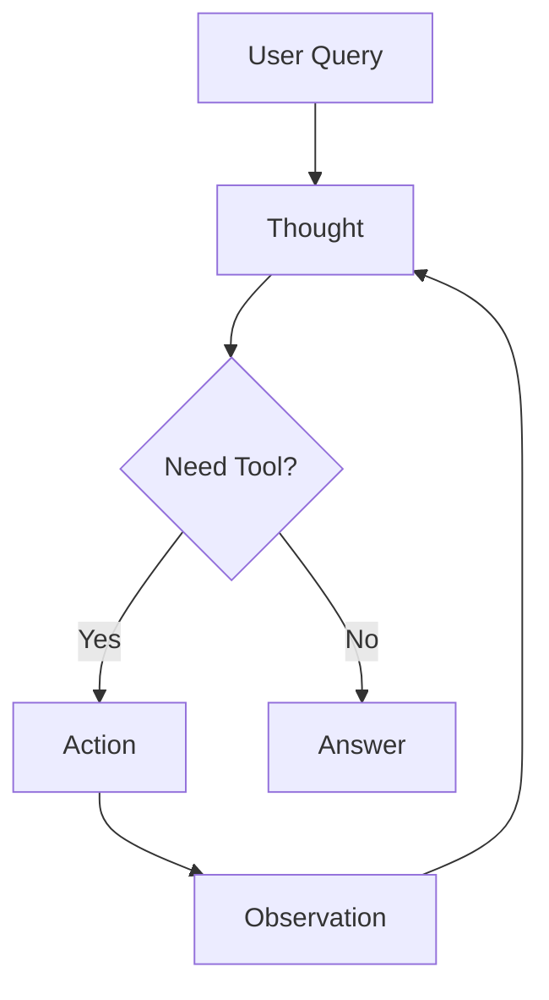

# Chapter 7: Getting Started with Agents & MCP

In this chapter, you'll learn to build AI [agents](../GLOSSARY.md#agent) that can reason about problems, select appropriate tools, and work iteratively towards solutions. You'll understand the [ReAct](../GLOSSARY.md#react-pattern) (Reasoning + Acting) pattern by implementing agent loops step-by-step, discover how agents autonomously choose tools, and explore the [Model Context Protocol (MCP)](../GLOSSARY.md#mcp-model-context-protocol) which is a standard for connecting AI to external services. These skills enable you to build autonomous AI systems that can handle complex, multi-step tasks.

## Prerequisites

- Completed [Chapter 6](../06-rag-systems/README.md)

## 🎯 Learning Objectives

By the end of this chapter, you'll be able to:

- ✅ Understand what AI agents are and how they work
- ✅ Implement the ReAct (Reasoning + Acting) pattern
- ✅ Build agent loops that iterate until solving a problem
- ✅ Give agents multiple tools and let them choose the right one
- ✅ Understand Model Context Protocol (MCP) and its benefits
- ✅ Build multi-step, autonomous AI systems

---

## 📖 The Manager with Specialists Analogy

**Imagine you're a project manager with a team of specialists:**

- 📊 Data Analyst - can query databases
- 🔍 Researcher - can search the web
- 🧮 Accountant - can do calculations
- ✉️ Assistant - can send emails

When someone asks: *"What's our revenue growth this quarter compared to last year?"*

You (the manager) don't do everything yourself. You:
1. **Reason**: "I need data from the database and calculations"
2. **Act**: Ask the Data Analyst for revenue data
3. **Observe**: Review the data received
4. **Reason**: "Now I need to calculate the percentage change"
5. **Act**: Ask the Accountant to do the math
6. **Observe**: Get the calculated result
7. **Reason**: "Now I have the answer"
8. **Respond**: Give the final answer

**AI Agents work the same way!**

They:
- **Think** about what needs to be done (Reasoning)
- **Choose** the right tool (Decision Making)
- **Use** the tool (Acting)
- **Evaluate** the result (Observation)
- **Repeat** until they have the answer
- **Respond** to the user

---

## 🤖 What Are Agents?

### Standard LLM (No Agency or Tools)

```
User: "What's the current weather in Paris?"
LLM: "I cannot access real-time weather data. I can only provide general information..."
```

### Agent with Tools

```
User: "What's the current weather in Paris?"
Agent: [Thinks] "I need to use the weather tool"
Agent: [Uses] getWeather({ city: "Paris" })
Agent: [Observes] "18°C, partly cloudy"
Agent: [Responds] "It's currently 18°C and partly cloudy in Paris"
```

---

## 🧠 The ReAct Pattern

ReAct = **Rea**soning + **Act**ing

Agents follow this iterative loop:

```
1. Thought: What should I do next?
2. Action: Use a specific tool
3. Observation: What did the tool return?
4. (Repeat 1-3 as needed)
5. Final Answer: Respond to the user
```

**Example**:
```
User: "Calculate 25 * 17, then tell me if it's a prime number"

Thought 1: I need to calculate 25 * 17
Action 1: calculator({ expression: "25 * 17" })
Observation 1: 425

Thought 2: I need to check if 425 is prime
Action 2: isPrime({ number: 425 })  // Assume we have an isPrime tool
Observation 2: false (divisible by 5)

Final Answer: "25 * 17 equals 425, which is not a prime number
because it's divisible by 5."
```

**Note**: This example assumes you have both `calculator` and `isPrime` tools available. The agent automatically decides which tool to use for each step.

---

## 👤 Building Your First Agent

Let's build an agent step-by-step to understand how it works under the hood.

### Example 1: Basic Agent with ReAct Loop

In this example, you'll build an agent from scratch using a manual ReAct (Reasoning + Acting) loop to understand the complete iteration cycle: agent reasons, uses a tool, observes results, and repeats until it has an answer.

**Code**: [`code/01-basic-agent.ts`](./code/01-basic-agent.ts)
**Run**: `tsx 07-agents-mcp/code/01-basic-agent.ts`

This example shows the core agent pattern manually implemented:

```typescript
import { ChatOpenAI } from "@langchain/openai";
import { tool } from "langchain";
import * as z from "zod";
import { HumanMessage, AIMessage, ToolMessage } from "langchain";
import "dotenv/config";

// Create a calculator tool
const calculatorTool = tool(
  async (input) => {
    const sanitized = input.expression.replace(/[^0-9+\-*/().\s]/g, "");
    const result = Function(`"use strict"; return (${sanitized})`)();
    return String(result);
  },
  {
    name: "calculator",
    description: "Perform mathematical calculations",
    schema: z.object({ expression: z.string().describe("Math expression") }),
  }
);

// Create model with tools
const model = new ChatOpenAI({
  model: process.env.AI_MODEL,
  configuration: { baseURL: process.env.AI_ENDPOINT },
  apiKey: process.env.AI_API_KEY
});

const modelWithTools = model.bindTools([calculatorTool]);

// Agent loop - The ReAct pattern in action!
const query = "What is 125 * 8?";
let messages = [new HumanMessage(query)];
let iteration = 1;
const maxIterations = 3; // Prevent infinite loops - [agent loop](../GLOSSARY.md#agent-loop) stops after 3 attempts

while (iteration <= maxIterations) {
  console.log(`Iteration ${iteration}:`);

  // 1. Reasoning: Model decides what to do
  const response = await modelWithTools.invoke(messages);

  // 2. Check if done (no more tool calls needed)
  if (!response.tool_calls || response.tool_calls.length === 0) {
    console.log(`Final Answer: ${response.content}`);
    break;
  }

  // 3. Acting: Execute the tool
  const toolCall = response.tool_calls[0];
  console.log(`Thought: I should use the ${toolCall.name} tool`);
  console.log(`Action: ${toolCall.name}(${JSON.stringify(toolCall.args)})`);

  const toolResult = await calculatorTool.invoke(calculatorTool.schema.parse(toolCall.args));
  console.log(`Observation: ${toolResult}`);

  // 4. Add results to conversation history
  // We need to add TWO messages:
  // - AIMessage: What the agent decided to do (which tool to call)
  // - [ToolMessage](../GLOSSARY.md#toolmessage): What the tool actually returned (the result)
  // This history helps the agent remember what it's already tried
  messages.push(
    new AIMessage({ content: response.content, tool_calls: response.tool_calls }),
    new ToolMessage({ content: String(toolResult), tool_call_id: toolCall.id || "" })
  );

  iteration++;
}
```

> **🤖 Try with [GitHub Copilot](https://github.com/features/copilot) Chat:** Want to explore this code further? Open this file in your editor and ask Copilot:
> - "How does the ReAct pattern enable autonomous decision-making?"
> - "Why does the agent loop have a maximum iteration limit?"
> - "What happens if the agent can't answer the question?"

### Expected Output

When you run this example with `tsx 07-agents-mcp/code/01-basic-agent.ts`, you'll see:

```
🤖 Basic Agent Demo

================================================================================

User: What is 125 * 8?

Iteration 1:
  Thought: I should use the calculator tool
  Action: calculator({"expression":"125 * 8"})
  Observation: 1000

Iteration 2:
  Final Answer: 125 multiplied by 8 equals 1000.

================================================================================

💡 Key Concepts:
   • Agent follows ReAct pattern: Reason → Act → Observe
   • Tools extend agent capabilities
   • Agent iterates until it has an answer
```

**Notice**: The agent only needed 2 iterations:
1. **Iteration 1**: Used the calculator tool and got the result (1000)
2. **Iteration 2**: Had all the information needed, so provided the final answer

If the task required multiple tools (e.g., "calculate and then convert to Euros"), you'd see more iterations.

### How It Works

**What's Happening**:
1. **Agent receives a question** ("What is 125 * 8?")
2. **Loop begins**: Agent reasons about what to do
3. **If it needs a tool**: Execute tool and observe result
4. **Add to history**: Feed the result back to the agent (both what it decided AND what the tool returned)
5. **Repeat**: Agent reasons again with new information
6. **Done**: Agent has enough info to answer (no more `tool_calls`)

**Why add both messages?**
- `AIMessage`: Stores what the agent *decided* to do (which tool, with what arguments)
- `ToolMessage`: Stores what the tool *actually returned* (the result)

This conversation history allows the agent to remember what it's already tried and build on previous results.

**For Production**: This manual approach helps you understand how agents work. In production, LangChain provides higher-level abstractions like `AgentExecutor` that handle the loop for you.

---

## 🔧 Agent with Multiple Tools

### Example 2: Multi-Tool Agent

Here you'll see how agents automatically select the appropriate tool when given multiple options (calculator, weather, search), demonstrating the agent's ability to match queries to tools based on descriptions.

**Code**: [`code/02-multi-tool-agent.ts`](./code/02-multi-tool-agent.ts)
**Run**: `tsx 07-agents-mcp/code/02-multi-tool-agent.ts`

When you give an agent multiple tools, it automatically selects the right one for each query.

**What this example shows**: How agents *choose* the right tool from multiple options. This demonstrates tool selection logic without the full agent loop (we covered the complete loop in Example 1).

```typescript
// Define multiple specialized tools
const calculatorTool = tool(
  async (input) => {
    // In production, sanitize input like Example 1
    const sanitized = input.expression.replace(/[^0-9+\-*/().\s]/g, "");
    return String(Function(`"use strict"; return (${sanitized})`)());
  },
  {
    name: "calculator",
    description: "Perform mathematical calculations",
    schema: z.object({ expression: z.string() }),
  }
);

const weatherTool = tool(
  async (input) => {
    const weather = {
      Seattle: "62°F, cloudy",
      Paris: "18°C, sunny",
      Tokyo: "24°C, rainy"
    };
    return weather[input.city] || "Weather data unavailable";
  },
  {
    name: "getWeather",
    description: "Get current weather for a city",
    schema: z.object({ city: z.string() }),
  }
);

const searchTool = tool(
  async (input) => `Search results for "${input.query}": [Simulated results]`,
  {
    name: "search",
    description: "Search for information on the web",
    schema: z.object({ query: z.string() }),
  }
);

// Bind all tools to the model
const model = new ChatOpenAI({
  model: process.env.AI_MODEL,
  configuration: { baseURL: process.env.AI_ENDPOINT },
  apiKey: process.env.AI_API_KEY
});
const modelWithTools = model.bindTools([calculatorTool, weatherTool, searchTool]);

// Test with different queries
const queries = [
  "What is 50 * 25?",              // → Uses calculator
  "What's the weather in Tokyo?",  // → Uses getWeather
  "Search for TypeScript info",    // → Uses search
];

for (const query of queries) {
  const response = await modelWithTools.invoke(query);

  if (response.tool_calls && response.tool_calls.length > 0) {
    const toolCall = response.tool_calls[0];
    console.log(`Query: "${query}"`);
    console.log(`→ Agent chose: ${toolCall.name}`);
    console.log(`→ With args: ${JSON.stringify(toolCall.args)}`);
  }
}
```

> **🤖 Try with [GitHub Copilot](https://github.com/features/copilot) Chat:** Want to explore this code further? Open this file in your editor and ask Copilot:
> - "How does the agent choose between multiple available tools?"
> - "What role do tool descriptions play in tool selection?"
> - "Can I create custom logic for tool selection instead of letting the LLM decide?"

### Expected Output

When you run `tsx 07-agents-mcp/code/02-multi-tool-agent.ts`:

```
🎛️ Multi-Tool Agent Demo

================================================================================

Query: "What is 50 * 25?"
  → Agent chose: calculator
  → With args: {"expression":"50 * 25"}
────────────────────────────────────────────────────────────────────────────────

Query: "What's the weather in Tokyo?"
  → Agent chose: getWeather
  → With args: {"city":"Tokyo"}
────────────────────────────────────────────────────────────────────────────────

Query: "Search for information about TypeScript"
  → Agent chose: search
  → With args: {"query":"information about TypeScript"}
────────────────────────────────────────────────────────────────────────────────

💡 Key Concepts:
   • Agents automatically select appropriate tools
   • Tool descriptions guide selection
   • Multiple specialized tools enable complex tasks
```

**What's happening**: The agent reads each tool's `description` field and chooses the best match:
- Math question → calculator (description mentions "mathematical calculations")
- Weather question → getWeather (description mentions "weather for a city")
- General question → search (description mentions "search for information")

**To build a complete agent**: Wrap this tool selection logic in the agent loop pattern from Example 1. The loop would execute the chosen tool, observe results, and iterate if needed.

**Key Insight**: The agent reads tool descriptions and automatically picks the right tool for each task. This is why clear, descriptive tool names and descriptions are crucial!

---

## 🌐 Connecting to MCP Servers

### Example 3: Agent with MCP Server Integration (Context7)

In this example, you'll see how to connect a LangChain.js agent to **Context7** - an [MCP server](../GLOSSARY.md#mcp-server) that provides current, version-specific documentation for libraries and frameworks. This demonstrates using HTTP transport to connect to a real-world MCP service.

**Code**: [`code/03-mcp-integration.ts`](./code/03-mcp-integration.ts)
**Run**: `tsx 07-agents-mcp/code/03-mcp-integration.ts`

**Prerequisites**:
- Install MCP adapter: `npm install @langchain/mcp-adapters`
- Optional: Context7 API key for higher rate limits (get at [context7.com](https://context7.com))

**About Context7**:
Context7 is a documentation MCP server that solves the problem of outdated training data by delivering current docs directly to your agent. It provides:
- `resolve-library-id`: Converts library names (e.g., "React") to Context7 IDs
- `get-library-docs`: Retrieves documentation with optional topic filtering

This example demonstrates connecting to Context7 via HTTP transport:

```typescript
import { MultiServerMCPClient } from "@langchain/mcp-adapters";
import { ChatOpenAI } from "@langchain/openai";
import { HumanMessage, AIMessage, ToolMessage } from "langchain";
import "dotenv/config";

// Create MCP client with HTTP transport to Context7
const mcpClient = new MultiServerMCPClient({
  context7: {
    transport: "http",
    url: "https://mcp.context7.com/mcp"  // Public Context7 endpoint
    // Optional: Add API key for higher rate limits
    // headers: { "Authorization": `Bearer ${process.env.CONTEXT7_API_KEY}` }
  }
});

try {
  // 1. Get all available tools from Context7
  console.log("🔧 Fetching tools from Context7 MCP server...");
  const tools = await mcpClient.getTools();

  console.log(`✅ Retrieved ${tools.length} tools from Context7:`);
  tools.forEach(tool => {
    console.log(`   • ${tool.name}: ${tool.description}`);
  });

  // Create a map of tool names to tools for easy lookup
  const toolsByName = new Map(tools.map(tool => [tool.name, tool]));

  // 2. Create agent with Context7 documentation tools
  const model = new ChatOpenAI({
    model: process.env.AI_MODEL,
    configuration: { baseURL: process.env.AI_ENDPOINT },
    apiKey: process.env.AI_API_KEY
  });

  const modelWithTools = model.bindTools(tools);

  // 3. Use the agent to get documentation
  const query = "How do I use React useState hook? Get the latest documentation.";
  console.log(`User: ${query}\n`);

  let messages = [new HumanMessage(query)];
  let iteration = 1;
  const maxIterations = 5; // Context7 may need multiple calls

  while (iteration <= maxIterations) {
    console.log(`Iteration ${iteration}:`);

    const response = await modelWithTools.invoke(messages);

    if (!response.tool_calls || response.tool_calls.length === 0) {
      console.log(`  Final Answer: ${response.content}\n`);
      break;
    }

    // Execute Context7 tool
    const toolCall = response.tool_calls[0];
    console.log(`  Thought: I should use the ${toolCall.name} tool`);
    console.log(`  Action: ${toolCall.name}(${JSON.stringify(toolCall.args)})`);

    // Find the tool and invoke it directly
    const tool = toolsByName.get(toolCall.name);
    if (!tool) {
      throw new Error(`Tool ${toolCall.name} not found`);
    }

    const toolResult = await tool.invoke(toolCall.args);
    console.log(`  Observation: ${typeof toolResult === 'string' ? toolResult.substring(0, 150) + '...' : toolResult}\n`);

    messages.push(
      new AIMessage({ content: response.content, tool_calls: response.tool_calls }),
      new ToolMessage({ content: String(toolResult), tool_call_id: toolCall.id || "" })
    );

    iteration++;
  }

  console.log("💡 Key Concepts:");
  console.log("   • MCP provides standardized access to external tools");
  console.log("   • MultiServerMCPClient connects to one or more MCP servers");
  console.log("   • HTTP transport works with remote servers like Context7");
  console.log("   • Tools from MCP servers work like manually created tools");
  console.log("   • Same agent pattern as Examples 1 & 2, different tool source");

} catch (error) {
  console.error("❌ Error connecting to Context7 MCP server:", error);
} finally {
  // Close the MCP client connection to allow the script to exit
  await mcpClient.close();
  console.log("\n✅ MCP client connection closed");
}
```

> **🤖 Try with [GitHub Copilot](https://github.com/features/copilot) Chat:** Want to explore this code further? Open this file in your editor and ask Copilot:
> - "How does MultiServerMCPClient differ from manually creating tools?"
> - "What happens if the MCP server is unavailable?"
> - "Can I connect to multiple MCP servers simultaneously?"

### How It Works

**What's Different from Examples 1 & 2**:
1. **Tool Source**: Instead of creating tools manually, you get them from an MCP server
2. **Tool Discovery**: `mcpClient.getTools()` fetches all available tools from the server
3. **Tool Execution**: The MCP client handles communication with the remote server
4. **Same Pattern**: The agent loop is identical to Example 1 - only the tool source changed!

**Benefits of MCP Integration**:
- ✅ **No custom integration code** - MCP handles the connection
- ✅ **Dynamic tool discovery** - Server can add/remove tools without code changes
- ✅ **Standard protocol** - Works with any MCP-compliant server
- ✅ **Production-ready** - HTTP transport scales for remote deployments

**Setting Up Context7**:

To run this example with Context7, you have two options:

1. **Use the Public Context7 Server** (Easiest):
   - Public endpoint: `https://mcp.context7.com/mcp`
   - No setup required - just uncomment the code and run!
   - Free tier with rate limits
   - For higher limits, get an API key at [context7.com](https://context7.com)

2. **Run Context7 Locally**:
   ```bash
   # Run Context7 server on port 3000
   npx -y @upstash/context7-mcp --transport http --port 3000
   ```
   Then use `http://localhost:3000` as your MCP URL

**Configuration**:

Add to your `.env` file:
```bash
# Use public endpoint (default)
MCP_SERVER_URL=https://mcp.context7.com/mcp

# Or use local endpoint
# MCP_SERVER_URL=http://localhost:3000

# Optional: Add API key for higher rate limits
CONTEXT7_API_KEY=your_api_key_here
```

**Multiple Servers**:

You can connect to multiple MCP servers simultaneously:
```typescript
const mcpClient = new MultiServerMCPClient({
  context7: {
    transport: "http",
    url: "https://mcp.context7.com/mcp"
  },
  github: {
    transport: "http",
    url: "https://api.github.com/mcp"  // Example
  }
});
```

**Learn More**:
- Context7 on GitHub: [mcp/upstash/context7](https://github.com/mcp/upstash/context7)
- MCP Registry: [github.com/mcp](https://github.com/mcp)
- MCP for Beginners: [microsoft/mcp-for-beginners](https://github.com/microsoft/mcp-for-beginners)

---

## 🔗 From Manual Tools to MCP

In Examples 1 and 2, you manually created tools (calculator, weather, search) by writing the implementation code yourself. This works great for learning and for custom tools specific to your application.

**But what about connecting to existing services?** Imagine needing tools for:
- GitHub (create issues, search code, manage PRs)
- Teams (send messages, read channels)
- Outlook Calendar (check availability, create events)
- Your company database (query data, get schemas)

Writing custom integrations for each service means dealing with different APIs, authentication methods, and data formats. This is where **Model Context Protocol (MCP)** comes in.

**The key insight**: In Examples 1 & 2, you built the tool *implementations*. With MCP, you connect to tool *providers* that expose their capabilities through a standard protocol. Same agent loop, different tool source!

> **📘 Note for This Course**: The examples in this chapter (1 & 2) use manual tools because they're perfect for learning agent concepts without additional complexity. MCP is production-ready in LangChain.js via `@langchain/mcp-adapters`, but requires MCP servers to be running. The sections below explain MCP concepts and API usage so you understand how to integrate it when you're ready to connect to external services.

---

## 🌐 Model Context Protocol (MCP)

### The USB-C for AI Applications

**Imagine this scenario**: You build an AI assistant. It needs to:
- Check your Calendar
- Query your company's database
- Send Teams messages
- Read from Notion

**The old way**: Write custom integrations for each service. Different APIs, different auth, different data formats. Multiply this by 50+ services your company uses = chaos.

**The MCP way**: Services expose their capabilities through a standard protocol, like how every device uses USB-C. Your AI agent connects once, gets access to everything.

### What is MCP?

**Model Context Protocol (MCP)** is an open standard that lets AI applications connect to external tools and data sources through a universal interface.

Think of it as **"USB-C for AI"**:
- **Before USB-C**: Different cables for everything (iPhone cable, Android cable, laptop charger...)
- **After USB-C**: One cable, works everywhere
- **Before MCP**: Custom code for every tool integration
- **After MCP**: One protocol, works with any tool

### Real-World Examples

**For Developers**:
```
Your AI Agent → MCP → [GitHub API, Jira, Figma, PostgreSQL, ...]
```

**For Users**:
- "Check my calendar and find a 30-minute slot this week" → AI connects to Exchange Calendar via MCP
- "Summarize our latest product feedback" → AI connects to your database via MCP
- "Create a Jira ticket for this bug" → AI connects to Jira via MCP

### Why MCP Matters

| Without MCP | With MCP |
|-------------|----------|
| Write custom integration for each service | Connect once using MCP standard |
| Maintain separate authentication for each | Unified authentication approach |
| Different data formats everywhere | Standardized tool interface |
| Weeks to add new services | Hours to add new services |

---

## 🔌 How MCP Works

### Architecture

```
┌──────────────┐
│   Your AI    │ "Find my next meeting"
│   Agent      │
└──────┬───────┘
       │
       │ Uses MCP Protocol
       ▼
┌──────────────┐
│ MCP Client   │ Connects to MCP servers
└──────┬───────┘
       │
       ├─────► 📅 Calendar Server (provides: getEvents, createEvent)
       │
       ├─────► 📧 Email Server (provides: sendEmail, searchEmails)
       │
       └─────► 🗄️  Database Server (provides: queryDb, getSchema)
```

### MCP Servers = Tool Providers

An **MCP Server** is a program that exposes tools through the MCP protocol:

```typescript
// Example: A simple MCP server exposes a calculator
{
  "tools": [
    {
      "name": "calculate",
      "description": "Perform math calculations",
      "parameters": { "expression": "string" }
    }
  ]
}
```

Your agent connects to this server and can now use the calculator tool!

### Transport Types

MCP supports three ways to connect to servers:

1. **stdio** (Standard Input/Output) - For local subprocess communication
   ```typescript
   // Server runs as a local process
   {
     transport: "stdio",
     command: "node",
     args: ["/path/to/server.js"]
   }
   ```
   **Use when**: Running servers on your machine (development, local tools). Ideal for simple setups.

2. **SSE** (Server-Sent Events) - For HTTP servers with real-time streaming
   ```typescript
   // Server runs on a URL with SSE support
   {
     transport: "sse",
     url: "http://localhost:8000/mcp"
   }
   ```
   **Use when**: Need real-time streaming updates from remote servers. Optimized for streaming communication.

3. **Streamable HTTP** - For independent server processes
   ```typescript
   // Server runs on a URL with HTTP support
   {
     transport: "http",
     url: "https://api.mycompany.com/mcp"
   }
   ```
   **Use when**: Connecting to production APIs, cloud services, or shared servers that support remote connections.

---

## 🎯 MCP in Practice

### Getting Started with MCP

**What you can do now**:
1. **Build agents with manual tools** - Use the patterns from Examples 1 & 2 above (great for learning)
2. **Use MCP in LangChain.js** - MCP support is available via `@langchain/mcp-adapters`
3. **Explore MCP servers** - Visit [modelcontextprotocol.io](https://modelcontextprotocol.io) to see available servers
4. **Build custom MCP servers** - Create your own using `@modelcontextprotocol/sdk`

### Working with MCP in LangChain.js

**Installation**:
```bash
npm install @langchain/mcp-adapters
```

**Basic Usage**:
```typescript
import { MultiServerMCPClient } from "@langchain/mcp-adapters";
import { ChatOpenAI } from "@langchain/openai";

// 1. Connect to MCP servers
const client = new MultiServerMCPClient({
  // Math server running locally
  math: {
    transport: "stdio",
    command: "node",
    args: ["/path/to/math_server.js"]
  },
  // Weather server running remotely
  weather: {
    transport: "sse",
    url: "http://localhost:8000/mcp"
  }
});

// 2. Get all available tools from all servers
const tools = await client.getTools();
// Returns tools from both math and weather servers

// 3. Use tools with your agent
const model = new ChatOpenAI({
  model: process.env.AI_MODEL,
  configuration: { baseURL: process.env.AI_ENDPOINT },
  apiKey: process.env.AI_API_KEY
});
const modelWithTools = model.bindTools(tools);

// Agent can now use any tool from any connected MCP server
const response = await modelWithTools.invoke(
  "What's 25 * 4 and what's the weather like?"
);
```

**Key Characteristics**:
- `MultiServerMCPClient` is **stateless by default** - creates fresh sessions per tool invocation
- For **persistent context** between calls, use `client.session()` to maintain state
- Connect to multiple MCP servers simultaneously
- Tools from all servers are available to your agent

### Building Custom MCP Servers

Want to create your own MCP server? Use the `@modelcontextprotocol/sdk`:

```typescript
import { Server } from "@modelcontextprotocol/sdk/server/index.js";
import { ListToolsRequestSchema, CallToolRequestSchema } from "@modelcontextprotocol/sdk/types.js";

// Create MCP server
const server = new Server({ name: "my-calculator", version: "1.0.0" });

// Define available tools
server.setRequestHandler(ListToolsRequestSchema, async () => ({
  tools: [
    {
      name: "calculate",
      description: "Perform mathematical calculations",
      inputSchema: {
        type: "object",
        properties: {
          expression: { type: "string", description: "Math expression to evaluate" }
        },
        required: ["expression"]
      }
    }
  ]
}));

// Handle tool execution
server.setRequestHandler(CallToolRequestSchema, async (request) => {
  if (request.params.name === "calculate") {
    const { expression } = request.params.arguments;
    const result = eval(expression); // In production, sanitize input!
    return { content: [{ type: "text", text: String(result) }] };
  }
  throw new Error(`Unknown tool: ${request.params.name}`);
});
```

**Key Components**:
- `ListToolsRequestSchema` - Defines what tools your server provides
- `CallToolRequestSchema` - Handles tool execution requests
- Standard input/output schemas ensure compatibility with all MCP clients

### Benefits for Your AI Applications

- ✅ **Plug-and-play tools**: Connect to new services in minutes
- ✅ **Consistent interface**: Same pattern for all tools
- ✅ **Community ecosystem**: Use tools others have built
- ✅ **Future-proof**: As MCP adoption grows, more tools become available

### Next Steps with MCP

The MCP ecosystem is growing rapidly:
- Check out the [MCP for Beginners](https://github.com/microsoft/mcp-for-beginners) course
- Visit the [GitHub MCP Registry](https://github.com/mcp) to explore available servers
- Use MCP servers and tools with [GitHub Copilot](https://docs.github.com/en/copilot/how-tos/provide-context/use-mcp/extend-copilot-chat-with-mcp)
- Check out the [LangChain MCP documentation](https://docs.langchain.com/oss/javascript/langchain/mcp)
- Build your own MCP server for custom tools
- Combine agent patterns from this chapter with MCP servers for production applications

---

## 🗺️ Concept Map

This chapter taught you how agents use the ReAct pattern for autonomous reasoning:



*Agents iterate (Think → Act → Observe) until they solve the problem.*

---

## 🎓 Key Takeaways

- **Agents make autonomous decisions** - They choose which tools to use and when
- **ReAct pattern is the core**: Reason → Act → Observe → Repeat until solved
- **Manual agent loops teach fundamentals** - Understanding the pattern helps you use higher-level abstractions
- **Tool descriptions matter** - Clear descriptions help agents pick the right tool
- **MCP is the future of AI tool integration** - Like USB-C for AI applications
- **MCP provides standardization** - One protocol, many services
- **Start simple, scale up** - Learn with manual loops, graduate to production frameworks

---

## 🏆 Assignment

Ready to practice? Complete the challenges in [assignment.md](./assignment.md)!

The assignment includes:
1. **Research Agent with ReAct Loop** - Build an agent from scratch that uses the ReAct pattern to answer questions
2. **Multi-Step Planning Agent** (Bonus) - Build an agent with multiple specialized tools that requires multi-step reasoning

---

## 📚 Additional Resources

- [LangChain Agents Documentation](https://docs.langchain.com/oss/javascript/langchain/agents)
- [Model Context Protocol](https://modelcontextprotocol.io/)
- [MCP LangChain Integration](https://docs.langchain.com/oss/javascript/langchain/mcp)
- [ReAct Paper](https://arxiv.org/abs/2210.03629)

---

## 🚀 What's Next?

Congratulations! You've completed the core LangChain.js course. You've learned:

- ✅ Chat models and conversations
- ✅ Prompt engineering and templates
- ✅ Documents, embeddings, and semantic search
- ✅ Function calling and tool integration
- ✅ RAG systems
- ✅ Autonomous agents and MCP

### Applying What You've Learned

You now have the foundation to build production AI applications! Here's how to continue:

**For Production Agents**:
- Use `AgentExecutor` from LangChain - it handles the agent loop for you
- Consider LangGraph for complex, stateful agents with branching logic
- Check out the `future/` folder in this repository for advanced LangGraph content

**Next Steps**:
1. **Build a real project** - Apply these concepts to solve a problem you care about
2. **Explore advanced patterns** - LangGraph, memory management, streaming responses
3. **Join the community** - Share what you build, ask questions, help others

**Project Ideas**:
- 🤖 **Personal assistant** - Combine RAG (your docs) + agents (web search, calendar)
- 📊 **Data analyzer** - Agent with database tools + visualization
- 📝 **Content generator** - RAG + multi-step editing with agents
- 🔧 **DevOps helper** - Agents with GitHub, Jira, and deployment tools

### Keep Learning

The AI field moves fast! Stay updated by:
- Following [LangChain.js releases](https://github.com/langchain-ai/langchainjs)
- Joining the [Azure AI Foundry Discord](https://aka.ms/foundry/discord)
- Exploring new MCP servers as they become available
- Experimenting with different models and providers

**You're ready to build amazing AI applications!** 🎉

---

## 🗺️ Navigation

- **Previous**: [06-rag-systems](../06-rag-systems/README.md)
- **Home**: [Course Home](../README.md)

---

## 💬 Questions or stuck?

If you get stuck or have any questions about building AI apps, join:

[](https://aka.ms/foundry/discord)

If you have product feedback or errors while building visit:

[](https://aka.ms/foundry/forum)

---

## 🐛 Troubleshooting

Common issues you might encounter when building agents:

### "TypeError: Cannot read property 'tool_calls' of undefined"

**Cause**: The model response doesn't have a `tool_calls` property

**Fix**: Verify that you called `bindTools()` on your model:
```typescript
// ❌ Wrong - forgot to bind tools
const response = await model.invoke(query);

// ✅ Correct - tools are bound
const modelWithTools = model.bindTools([calculatorTool]);
const response = await modelWithTools.invoke(query);
```

### Agent loops forever or hits maxIterations

**Cause**: Agent doesn't have a stopping condition or tools don't return useful results

**Fixes**:
1. Check your stopping condition:
```typescript
if (!response.tool_calls || response.tool_calls.length === 0) {
  // Agent has finished - no more tools needed
  break;
}
```

2. Lower `maxIterations` to fail fast during development:
```typescript
const maxIterations = 3; // Start small, increase if needed
```

3. Ensure tools return meaningful results - vague outputs confuse the agent

### "Tool 'calculator' not found" error

**Cause**: Tool name mismatch between what LLM generates and what you defined

**Fix**: Verify the tool name exactly matches:
```typescript
const calculatorTool = tool(/* ... */, {
  name: "calculator", // Must match exactly
  // ...
});

// LLM will generate:
{ name: "calculator", args: { ... } } // Must match your definition
```

### Agent makes wrong tool choices

**Cause**: Tool descriptions aren't clear enough

**Fix**: Improve tool descriptions with specific use cases:
```typescript
// ❌ Vague
description: "Does calculations"

// ✅ Clear
description: "Perform mathematical calculations like addition, multiplication, percentages. Use this when you need to compute numbers."
```

### "Unexpected token in JSON" when parsing tool arguments

**Cause**: The model generated invalid JSON in tool arguments

**Fix**: Add error handling around tool invocation:
```typescript
try {
  const toolResult = await calculatorTool.invoke(toolCall);
  // ... use result
} catch (error) {
  console.error(`Tool ${toolCall.name} failed:`, error);
  // Add error message to conversation history
  messages.push(
    new ToolMessage({
      content: `Error: ${error.message}`,
      tool_call_id: toolCall.id || ""
    })
  );
}
```

### Agent gets stuck repeating the same tool

**Cause**: Tool doesn't provide enough information for agent to progress

**Fix**: Ensure tool results are descriptive:
```typescript
// ❌ Not helpful
return "42";

// ✅ Descriptive
return "The calculation result is 42. This is the answer to 6 * 7.";
```
